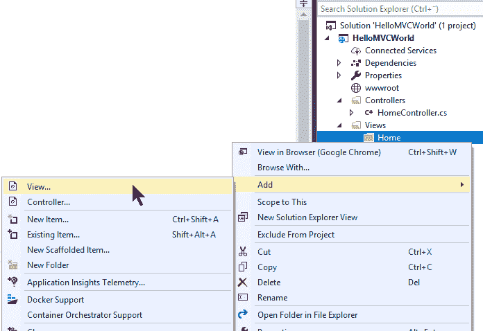
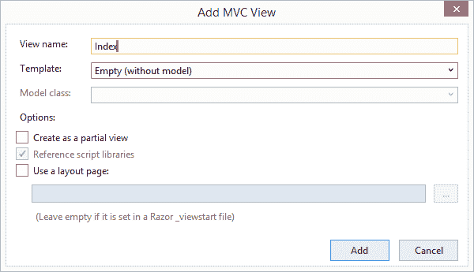

# 创建视图

> 原文：<https://asp.mvc-tutorial.com/getting-started/creating-a-view/>

如果您已经阅读了以前的文章，现在您应该有一个非常基本的 ASP.NET MVC 项目，能够输出一个简单的“Hello world”消息。该文本直接在控制器中生成，并以纯文本的形式返回给浏览器，但是很明显，除了最基本的任务之外，这种方法并不实用。我们想要的当然是用 HTML 和其他 web 技术创建的动态页面。为此，我们需要视图，它是控制器返回的模型的可视化表示。

因为我们已经创建了一个控制器(名为 **HomeController** ，现在我们应该为它创建一个**视图**，而不是仅仅返回一段文本。正如我们在上一篇文章中看到的，控制器通常位于一个名为“控制器”的文件夹中，所以我们也应该有一个名为“视图”的文件夹。就像我们在上一篇文章中所做的那样，在解决方案浏览器中右键单击项目并选择**添加**->-**新文件夹**。习惯上每个控制器有一个文件夹，所以在新的 Views 文件夹中，让我们创建一个名为 **Home** 的文件夹，来包含我们为 HomeController 创建的视图。准备就绪后，我们现在准备在新文件夹中创建一个视图:



你会看到一个对话框，里面有很多选项。它们都非常相关，我们将在本教程的后面讨论它们中的大部分，但是现在，让我们只为我们的项目添加一个简单的视图。您可以通过复制我在这张屏幕截图中使用的选项来做到这一点:



点击**添加**，我们终于得到了全新的视图。其中的代码如下所示:

<input type="hidden" name="IL_IN_ARTICLE">

```
@{
    Layout = null;
}

<!DOCTYPE html>

<html>
<head>
    <meta name="viewport" content="width=device-width" />
    <title>Index</title>
</head>
<body>

</body>
</html>
```

这基本上只是一些空白文档的标准 HTML，基于 Razor 语法，顶部只有一点点与 MVC 相关的代码，我们将在接下来的一章中讲到。现在，忽略它，使用 HTML，希望你已经知道并理解了。

现在，让我们对 HTML 做一个小小的修改，向世界显示一个问候——它当然应该在标签之间，像这样:

```
<body>

    <span style="font-size: 18pt;">Hello, <b>MVC</b> world!</span>

</body>
```

我们只需要再做一件事:在前一篇文章中，我们修改了`Index()`方法，返回一段简单的文本而不是视图。现在我们想使用一个视图，我们需要把它改回来，所以打开 HomeController 并修改`Index()`方法，如下所示:

```
public IActionResult Index()
{
    return View();
}
```

现在一切都应该就绪了，所以只需按下 **F5** 运行项目，希望您将在浏览器中看到我们新的、可爱的视图，而不是我们在上一篇文章中看到的那段无聊的纯文本。

### 它是如何工作的？

由于 ASP.NET MVC 框架中的默认路由机制，根 URL 被自动路由到 HomeController 的 **Index()** 方法(现在不要担心路由，我们很快就会谈到它们)。通过调用`View()`方法，搜索多个位置以找到具有匹配名称的视图，在本例中为\[project root]\ Views \[controller 的名称]\Index.cshtml。然后解释该视图(因为它很可能包含 Razor 代码)，然后作为输出返回给浏览器。

## 摘要

我们现在已经成功地组合了一个**控制器**和一个**视图**来生成一个实际的网页。这可能看起来仍然像是巫毒教或巫术，但在试图完全掌握所有概念之前，请继续阅读本教程，感受一下它是如何工作的，以及这个框架有多强大。

不过，为了充分利用 ASP.NET MVC，你需要了解更多关于视图的知识——这只是一个介绍，让你开始运行。在接下来的一章中，我们将更深入地探讨视图的主题。

* * *