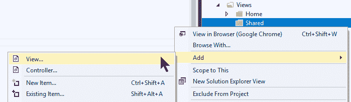
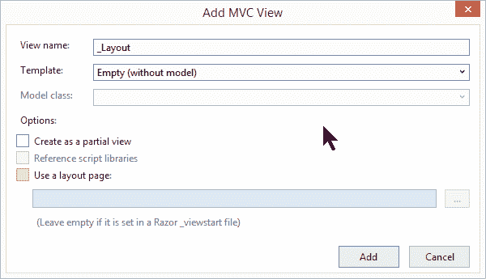

# 布局文件

> 原文：<https://asp.mvc-tutorial.com/layout/layout-files/>

正如本章介绍中所讨论的，一个**布局**文件允许你在你的项目中跨多个网页重用公共标记。这是通过在一个布局文件中指定所有的公共内容，然后在所有的子页中引用这个文件来实现的(当然，除非您不想让它们使用公共布局)。

在 ASP.NET MVC 中，布局文件看起来就像一个普通的视图，它们也使用相同的扩展名(。cshtml)。它可能看起来像这样:

**_Layout.cshtml**

```
<!DOCTYPE html>
<html>
<head>    
    <title>Layout</title>
</head>
<body>

    @RenderBody()

</body>
</html>
```

请注意，除了 **RenderBody()** Razor 方法之外，它几乎就是一个普通的 HTML 文件。这一部分在布局文件中是必需的，因为它指定了使用该布局的页面内容应该放置的位置。使用该布局的文件可能如下所示:

**LayoutTest.cshtml**

<input type="hidden" name="IL_IN_ARTICLE">

```
@{
    Layout = "~/Views/Shared/_Layout.cshtml";
}

<p>Hello, world!</p>
```

同样，魔术发生在 Razor 部分，在那里我们指定要使用的布局。ASP.NET MVC 现在会在每次使用 **LayoutTest** 视图时合并这两个文件，当页面返回到浏览器时会产生类似这样的结果:

**结果**

```
<!DOCTYPE html>
<html>
<head>    
    <title>Layout</title>
</head>
<body>

<p>Hello, world!</p>

</body>
</html>
```

## 向 MVC 项目添加布局

在上一篇文章中，我们已经讨论了如何将视图添加到项目中。幸运的是，正如我现在将要演示的，向您的项目添加布局视图也很容易，但是我希望您首先了解几个准则:

*   布局通常放置在**视图**文件夹的子文件夹中，名为**共享**。如果您没有指定布局文件的完整路径，这是 ASP.NET 将自动搜索的位置之一。
*   布局视图的文件名通常以下划线为前缀，表示这不是一个常规视图。如果你计划只使用一个布局，可以简单地称之为 **_Layout.cshtml** -否则，使用一个名字来表示这个布局的用途，例如 _*authenticateduserlayout . cshtml*。

记住这一点，让我们为我们的项目添加一个布局(我假设您已经有一个包含共享文件夹的 Views 文件夹，如果没有，您可以添加它，如本教程前面所述):



在对话框中，您基本上只需要填写名称，并确保未选中部分/布局选项:



现在将创建一个名为 _Layout.cshtml 的文件，它由基本 html 和顶部的一个空布局语句组成。您需要做的就是添加您自己的标记，然后记住在您想要插入页面内容的地方添加对 **RenderBody()** 方法的调用，如下所示:

```
@{
    Layout = null;
}

<!DOCTYPE html>

<html>
<head>
    <meta name="viewport" content="width=device-width" />
    <title>_Layout</title>
</head>
<body>
</body>
</html>
```

设置好之后，您现在可以从您的一个页面中引用您的布局，就像我们在本文前面展示的那样:

```
@{
    Layout = "~/Views/Shared/_Layout.cshtml";
}

<p>Hello, world!</p>
```

## 摘要

布局允许您在一个地方指定公共标记，并在多个页面中重用它。ASP.NET MVC 支持多种布局，如果你需要的话，你当然可以决定是全部还是部分页面应该使用特定的布局。还有一些与布局相关的技巧我还没有向您展示，您将在接下来的文章中看到，所以请继续阅读。

* * *