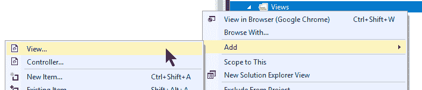
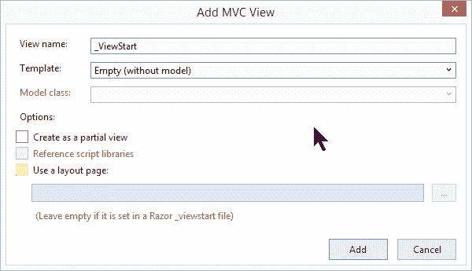
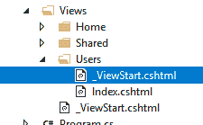

# 视图开始文件

> 原文：<https://asp.mvc-tutorial.com/layout/the-viewstart-file/>

在上一篇文章中，我们学习了如何定义创建一个布局视图，它可以在多个视图中重用。每当通过 Layout 属性引用布局时，布局就会应用于视图，如下所示:

```
@{
    Layout = "~/Views/Shared/_Layout.cshtml";
}
```

在正常情况下，您必须对所有想要使用这种布局的页面都这样做——这很酷，因为它给了您使用多种布局的灵活性，甚至可以让页面不使用共享布局。然而，对于许多项目，您可能只有一个公共布局，或者至少有一个您在大多数情况下使用的布局。幸运的是，有一种简单的方法来指定默认布局，除非您在页面中特别地覆盖它，否则将使用它:ViewStart 文件。

## 什么是 ViewStart 文件？

ViewStart 文件实际上很像一个普通的视图，它也有相同的扩展名(。cshtml)，所以要使用它，您只需在您的 Views 文件夹中添加一个名为 **_ViewStart.cshtml** 的视图。我们一会儿就会谈到这个问题，但是现在，你应该知道 ASP.NET MVC 会自动寻找一个 ViewStart 文件，并在它解释实际的页面/视图之前解释它。这允许您指定公共功能，就像在这种情况下，我们将使用它来指定所有页面的默认布局。但是首先，让我们向我们的项目添加一个 ViewStart 文件:

 <input type="hidden" name="IL_IN_ARTICLE">

就像布局文件一样，文件名应该以下划线为前缀，以表明这不仅仅是一个常规视图:



这个文件的内容应该就是您在解释常规视图之前需要做的事情——这有很多用例，但是我们要研究的一个是定义一个默认/后备布局，它将一直被使用，除非被特别覆盖。可以这样做:

```
@{
    Layout = "~/Views/Shared/_Layout.cshtml";
}
```

现在，每当您向您的项目添加一个视图时，您可以选中“使用布局页面”选项，如屏幕截图所示，但是将文本字段留空——您的布局将自动应用到您的新视图，并且**您不必再为每个视图手动设置布局属性**！

## 多视图开始文件

对于大多数项目，您可能只有一个 ViewStart 文件，它通常放在您的 *Views* 文件夹的根目录下。但是，在较大的项目中，您可能会发现拥有多个 ViewStart 文件是有意义的，这通常是为了给特定文件夹中的视图提供更具体的指示。对我们来说幸运的是，ViewStart 系统是分层的，这意味着 ASP.NET 的**MVC 将首先在与请求的视图相同的文件夹中寻找一个 ViewStart 文件**，如果找不到，则向上移动文件夹层次。

当然，您可以利用这一点，在您的一个视图子文件夹中创建另一个 ViewStart 文件——这个 ViewStart 文件将用于该文件夹中的所有视图。该结构可能如下所示:



## 摘要

ViewStart 文件允许您定义将自动应用于所有视图的公共逻辑，如定义默认/后备布局，如本文所示。您还可以使用它来定义其他类型的通用逻辑，比如通过将信息放入 ViewStart 文件的 ViewData 中，然后从您的视图中引用它，从而在所有视图之间共享信息。我们将在后面的文章中讨论 ViewData 功能。

* * *