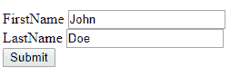

# 模型绑定

> 原文：<https://asp.mvc-tutorial.com/models/model-binding/>

客户端(通常是浏览器)和 web 服务器之间的通信非常简单——字符串被来回传递，因为客户端对您的喜好没有任何理解。NET 对象。所以，回到 ASP 经典和 ASP.NET web forms 的旧时代，在 MVC 框架被引入。NET 框架，更新模型的过程有点麻烦。首先，您必须创建一个包含用户可以更改的所有字段的表单。当这个表单发送回服务器时，您必须读取每个表单字段，并将其分配给您的模型。如果我们采用这种方法，并将其用于 ASP.NET MVC，它看起来会像这样:

```
<form method="post" action="/ModelBinding/UpdateFromOldSchoolForm">
    <input type="text" name="txtFirstName" value="@Model.FirstName" />
    <input type="text" name="txtLastName" value="@Model.LastName" />
    <input type="submit" value="Update" />
</form>
```

```
public IActionResult UpdateFromOldSchoolForm()
{
    WebUser webUser = LoadUserFromDatabase();

    webUser.FirstName = Request.Form["txtFirstName"];
    webUser.LastName = Request.Form["txtLastName"];

    UpdateUserInDatabase(webUser);

    return Content("User updated!");
}
```

一个手动构造的表单，它将值发送给一个方法，然后该方法将读取值并将其分配给一个对象。都是非常基本和老派的。然而，在 ASP.NET MVC 中，引入了**模型绑定**的概念。它允许您的视图使用来自模型的信息来生成(例如)用于编辑模型的表单，但更有帮助的是，它允许控制器上的接收方法将发布的值视为模型类型的对象，而不是强迫您从表单中读取字符串。换句话说，由于模型绑定的魔力，您现在可以在客户机和服务器之间的通信中一直使用对象。让我们看看它是如何工作的！

## 使用模型绑定

首先，我们需要一个模型。如果你不知道这个模型是什么，我建议你跳过几篇文章去阅读它。我们将创建一个简单的模型(类)来处理关于用户的信息:

<input type="hidden" name="IL_IN_ARTICLE">

```
public class WebUser
{
    public string FirstName { get; set; }
    public string LastName { get; set; }
}
```

在我们的控制器中，我们现在可以将这个类的一个实例传递给视图。在现实世界的应用程序中，我们可能会从数据库中获取 WebUser 对象，但是为了简单起见，我们只为这个演示生成一个新的对象:

```
[HttpGet]
public IActionResult SimpleBinding()  
{  
    return View(new WebUser() { FirstName = "John", LastName = "Doe" });  
}
```

通过@model 指令让我们的视图知道它可以期望什么样的模型，我们现在可以使用各种助手方法(稍后将详细介绍)来帮助生成表单:

```
@using(var form = Html.BeginForm())
{
    <div>
    @Html.LabelFor(m => m.FirstName)
    @Html.TextBoxFor(m => m.FirstName)
    </div>

    <div>
    @Html.LabelFor(m => m.LastName)
    @Html.TextBoxFor(m => m.LastName)
    </div>

    <input type="submit" value="Submit" />
}
```

结果将是一个看起来非常普通的表单，但是标签和文本框被指定为承载您的模型的属性:



默认情况下，表单将被发送回发送它的 URL，因此为了处理这个问题，我们需要一个接受后的控制器方法来处理表单提交:

```
[HttpPost]
public IActionResult SimpleBinding(WebUser webUser)
{
    //TODO: Update in DB here...
    return Content($"User {webUser.FirstName} updated!");
}
```

请注意，我们的控制器操作只接受一个参数，与我们最初传递给视图的模型类型相同:WebUser 类。在后台，ASP.NET MVC 现在将处理表单，并将可编辑控件中的值赋给 WebUser 类的属性。这就是模型绑定的魔力！

## 摘要

由于模型绑定，您可以更容易地维护模型和视图之间的关系。在本文中，我们只是触及了皮毛——模型绑定还有很多可能性，您将在接下来的文章中发现。

* * *