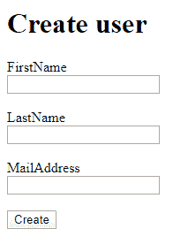
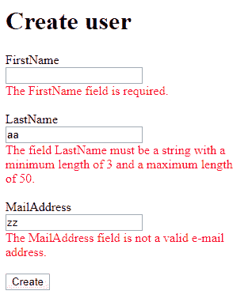

# 客户端模型验证

> 原文：<https://asp.mvc-tutorial.com/models/client-side-model-validation/>

到目前为止，我们在本教程中使用的所有模型验证都是在服务器端完成的。这意味着模型被传递回服务器，在那里根据您的数据注解执行验证，然后将结果返回给用户。这既是好的也是坏的:

这很好，因为**你不能信任客户端验证**——用户可以简单地绕过或改变在客户端执行的任何类型的验证。换句话说，您总是需要验证服务器上的东西，以绝对确保一切如您所愿。

另一方面，到服务器的额外往返会使验证速度变慢(如果服务器和客户机之间的延迟很长，速度会变慢)，而且还会增加 web 应用程序的资源需求:如果许多用户同时访问它，就会对服务器进行大量额外的验证调用。

因此，为了从两个世界获得最佳效果，您应该首先在客户端执行验证——如果发现任何错误，您不必执行服务器端验证。相反，你只需要立即告诉用户哪里出了问题，这样他们就可以修复它。另一方面，如果客户端验证没有发现错误，您就调用服务器并在那里执行验证，以绝对确保一切正常。

以前，这种双重验证方法要求您用 C#(或您使用的任何服务器端语言)为服务器编写验证代码，并用 JavaScript 为客户端编写验证代码。这非常麻烦，很容易导致不一致。对我们来说幸运的是，ASP.NET 核心试图为我们解决这个问题:当您为您的模型使用数据注解时，正如在以前的文章中所描述的，并且您使用标记助手或 HTML 助手来生成表单，框架将自动为元素生成验证数据。这个数据可以被一个 JavaScript 库用于客户端验证，这个 JavaScript 库是由微软在现有的 jQuery JavaScript 验证库的基础上创建的。

这听起来可能很复杂，但那是因为良好且健壮的验证是一项复杂的任务。因此，我将对如何使用相同的模型在 ASP.NET MVC 应用程序中实现服务器端和客户端验证做一个完整的演示。

<input type="hidden" name="IL_IN_ARTICLE">

## 模型

在我们的示例中，我们将创建一个表单，用于为我们想象的网站创建新的用户配置文件。我们首先要定义的是我们的模型，叫做 WebUser，它非常简单。它使用所有相关属性的数据注解来指示应该如何验证模型。看起来是这样的:

```
using System.ComponentModel.DataAnnotations;

namespace ClientSideValidation.Models
{
    public class WebUser
    {
    [Required]
    [StringLength(25)]
    public string FirstName { get; set; }

    [Required]
    [StringLength(50, MinimumLength = 3)]
    public string LastName { get; set; }

    [Required]
    [EmailAddress]
    public string MailAddress { get; set; }
    }
}
```

## 控制器

我们有一个名为 **UsersController** 的控制器——到目前为止，它只有两个方法，都叫做 **Create()** 。一个是 GET 版本，它将简单地服务于**视图**，然后是 POST 版本，当提交表单以创建新用户时会调用它。它将检查模型是否有效(由于数据注解，这是自动完成的)，然后返回视图。它看起来是这样的:

```
using ClientSideValidation.Models;
using Microsoft.AspNetCore.Mvc;

namespace ClientSideValidation.Controllers
{
    public class UsersController : Controller
    {
    [HttpGet]
    public IActionResult Create()
    {
        return View();
    }

    [HttpPost]
    public IActionResult Create(WebUser webUser)
    {
        if(ModelState.IsValid)
        {
        // Here the WebUser should be saved. Afterwards we would normally return another View, to 
        // indicate that the User has been successfully created, or redirect to another page 
        }
        return View();        
    }
    }
}
```

最有趣的部分是对**模型状态的检查。IsValid** 属性。在根据您的数据注解对模型进行验证之后，这将由框架自动填充。

## 景色

视图是支持 WebUser 类属性的非常基本的形式。我们将使用**标签助手**(它们将在本教程的其他地方详细描述)来生成标签、输入字段和验证输出——请注意，完成所有这些只需要很少的标记:

```
@model ClientSideValidation.Models.WebUser
@{
    ViewData["Title"] = "Create";
}

<h1>Create user</h1>

<form method="post" asp-controller="Users" asp-action="Create">    
    <div>
    <label asp-for="FirstName"></label><br />
    <input asp-for="FirstName" />
    <span asp-validation-for="FirstName" style="color: red;"></span>
    </div>
    <br />
    <div>
    <label asp-for="LastName"></label><br />
    <input asp-for="LastName" />
    <span asp-validation-for="LastName" style="color: red;"></span>
    </div>
    <br />
    <div>
    <label asp-for="MailAddress"></label><br />
    <input asp-for="MailAddress" />
    <span asp-validation-for="MailAddress" style="color: red;"></span>
    </div>
    <br />
    <input type="submit" value="Create" />
</form> 
```

*请注意，在撰写本文时，**标签助手仍然需要手动启用**才能使用。查看我们的文章[使用标签助手](https://asp.mvc-tutorial.com/tag-helpers/using-tag-helpers/)了解更多信息。*

多亏了标记助手(注意 asp-*属性),这一切都变成了一个完整的基本表单。它应该是这样的:



如果您查看生成的 HTML 源代码，您会看到这个框架为我们做了多少额外的工作:

```
<form method="post" action="/Users/Create">
    <div>
    <label for="FirstName">FirstName</label><br />
    <input type="text" data-val="true" data-val-length="The field FirstName must be a string with a maximum length of 25." data-val-length-max="25" data-val-required="The FirstName field is required." id="FirstName" maxlength="25" name="FirstName" value="" /><br />
    <span style="color: red;" class="field-validation-valid" data-valmsg-for="FirstName" data-valmsg-replace="true"></span>
    </div>
    <br />
    <div>
    <label for="LastName">LastName</label><br />
    <input type="text" data-val="true" data-val-length="The field LastName must be a string with a minimum length of 3 and a maximum length of 50." data-val-length-max="50" data-val-length-min="3" data-val-required="The LastName field is required." id="LastName" maxlength="50" name="LastName" value="" /><br />
    <span style="color: red;" class="field-validation-valid" data-valmsg-for="LastName" data-valmsg-replace="true"></span>
    </div>
    <br />
    <div>
    <label for="MailAddress">MailAddress</label><br />
    <input type="email" data-val="true" data-val-email="The MailAddress field is not a valid e-mail address." data-val-required="The MailAddress field is required." id="MailAddress" name="MailAddress" value="" /><br />
    <span style="color: red;" class="field-validation-valid" data-valmsg-for="MailAddress" data-valmsg-replace="true"></span>
    </div>
    <br />
    <input type="submit" value="Create" />
    <input name="__RequestVerificationToken" type="hidden" value="CfDJ8C-7mCG55hBDrFHYMGeG3xGBvY_epwiSr_q_mFnFRpTKHxdV8s0kZB-v0LZtzzOrKOpTHvxPvb_4oukqQCBdOj3idVTMAiic9h-oZahWfai5LK6MOVbEpsiqyzyKAD89JX8O7YfiXSegLbcDZpHcQQI" />
</form> 
```

当您单击 Create 按钮时，表单被发送到 UsersController 上的 Create(WebUser)方法。它将被服务器端验证，然后视图将被返回，但是**带有可见的验证输出**——所有这一切无需任何额外的努力，这真的很酷:



然而，在这一点上，我们仍然只使用服务器端验证——让我们改变一下。

## 添加客户端验证

最酷的部分来了！因为我们已经小心翼翼地以正确的方式创建了模型和视图，所以我们添加客户端验证所需要做的就是包含几个 JavaScript 库——其余的将会自动处理，因为我们已经创建了带有数据注解的模型和带有标记助手的表单。只需在您的视图或布局文件中包含以下行，最好是在 HEAD 部分中:

```
<script src="https://cdnjs.cloudflare.com/ajax/libs/jquery/3.4.1/jquery.min.js"></script>
<script src="https://cdnjs.cloudflare.com/ajax/libs/jquery-validate/1.19.1/jquery.validate.min.js"></script>
<script src="https://cdnjs.cloudflare.com/ajax/libs/jquery-validation-unobtrusive/3.2.11/jquery.validate.unobtrusive.min.js"></script>
```

当您重新加载页面时，您会注意到一些很酷的事情:**当您开始填写表单**时，验证会自动执行，如果您单击**创建**按钮，只有当表单看起来有效时，表单才会提交给服务器。如果是，然后表单被发送回服务器，它将根据您只在一个地方指定的相同规则进行服务器端验证。这真的是将 ASP.NET 核心框架的各种组件捆绑在一起的美妙之处！

### 请注意

*   第一行只是常规的 jQuery 框架——如果您已经在其他地方包含了这一行，就不需要包含这一行
*   这里所有的引用都是针对一个特定的 CDN(内容交付网络)——你可以选择另一个 CDN 或者直接从你的网站下载文件并提供给他们
*   这里所有的引用都是针对特定版本的(jQuery 3 . 4 . 1 等等)——您可能想要检查是否有更新的版本

## 摘要

验证用户输入一直是一件痛苦的事情——它需要大量的工作和重复的代码，尤其是当您既需要客户端验证又需要服务器端验证的时候。然而，如本文所示，ASP.NET 核心框架使这项任务变得更加容易、快速和健壮！

* * *