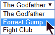
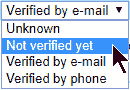
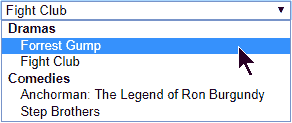
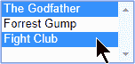

# 选择标签助手

> 原文：<https://asp.mvc-tutorial.com/tag-helpers/the-select-tag-helper/>

选择标签助手将允许您根据您的数据轻松创建 HTML 选择元素。这是一个更高级的标签助手，比我们在例如 Textarea 标签助手中看到的功能更多，但是正如你将看到的，这仅仅意味着当你在你的视图中使用它时，它将节省你更多的击键！您还会注意到，因为 Select Tag Helper 为您做了更多的工作，所以与以前的文章相比，本文中的示例要复杂一些。

首先，我们来讨论一下 SELECT 元素是做什么的。这里有一个纯 HTML 的例子:

```
<select>
    <option value="1">The Godfather</option>
    <option value="2">Forrest Gump</option>
    <option value="3">Fight Club</option>
</select>
```

在浏览器中，它看起来像这样:



如您所见，SELECT 元素将在一个列表(默认为下拉列表)中呈现一个或多个选项，允许您选择一个选项。选项被提供有选项元素，并且它们中的每一个都可以具有值(例如 ID)以及文本标签(在这种情况下是电影标题)。

<input type="hidden" name="IL_IN_ARTICLE">

然而，没有必要手工编写所有这些选项标记——我们可以使用 Select Tag Helper 基于数据源(通常是数据库)自动生成它们。

## for 和 items 属性

与其他几个标签助手一样，Select 标签助手具有 **asp-for** 属性，这将允许您将其值绑定到模型上的特定属性。除此之外，还有一个名为 **asp-items** 的属性可用，它将允许您为 SELECT 元素提供数据源。

asp-for 属性需要绑定到模型上的一个属性，asp-items 需要一个可能选项的列表。虽然这两个东西可以来自同一个模型，但是为此目的创建一个特定的 ViewModel 通常更实际，它将结合您正在使用的模型和可能的选项列表。这方面的一个例子可以是一个用于编辑用户的表单，其中您希望能够编辑姓名、电子邮件等基本内容。还允许用户选择他们居住的国家。该国家列表可能来自另一个来源，例如数据库或精选的国家列表。在这种情况下，您可以像这样创建一个视图模型:

```
public class EditUserViewModel
{
	public WebUser User { get; set; }

	public List<string> Countries { get; set; }
}
```

WebUser 类可能如下所示:

```
public class WebUser
{		
	public string FirstName { get; set; }

	public string LastName { get; set; }

	public string Country { get; set; }
}
```

现在，当您想要向用户显示编辑用户视图时，您可以创建 ViewModel，并向它提供一个 WebUser 对象和一个国家列表。显然，这两个东西通常来自其他地方，例如数据库，但为了说明，我只是在运行中创建它们。这是它在控制器中的样子:

```
public IActionResult EditUser()
{
	EditUserViewModel viewModel = new EditUserViewModel();
	viewModel.User = new WebUser()
	{
		FirstName = "John",
		LastName = "Doe",
		Country = "USA"
	};
	viewModel.Countries = new List<string>()
	{
		"USA",
		"Great Britain",
		"Germany"
	};
	return View(viewModel);
}
```

有了这些，我们终于可以查看使用标记助手的视图了:

```
@model HelloMVCWorld.ViewModels.EditUserViewModel

<form asp-action="UpdateUser" method="post">
    <input asp-for="User.FirstName" placeholder="First name" />
    <input asp-for="User.LastName" placeholder="Last name" />

    <select asp-items="@(new SelectList(Model.Countries))" asp-for="User.Country"></select>

    <input type="submit" value="Save" />
</form> 
```

这里最重要的部分当然是 Select 标记，我使用 SELECT 标记助手来生成下拉列表。特别注意 **asp-items 属性**，在这里我基于国家列表创建了一个新的**选择列表**。原因是 asp-items 属性期望提供的列表包含 **SelectItem** 类的实例——这个版本的 SelectList 构造器根据提供的源自动为我们创建这些实例。为此元素生成的 HTML 将如下所示:

```
<select id="User_Country" name="User.Country">
	<option selected="selected">USA</option>
	<option>Great Britain</option>
	<option>Germany</option>
</select>
```

请注意，USA 已经被预先选择了(带有 selected-attribute ),因为我们在控制器中生成的模型将它指定为当前国家——所有这些都是通过这一行 HTML/Razor 为我们处理的，这要感谢 Tag Helper！

### 带键/值的列表

在上面的例子中，有一件事您可能想知道:没有为选项标签提供值，这意味着当提交表单时，所选项目的文本也将被用作值。这是因为我们从一个简单的字符串列表(在本例中是国家名称)中生成选项标记，以使最初的例子更加简单。然而，在大多数情况下，您可能会基于键和值的组合来生成列表。例如，国家可能来自一个数据库，其中他们使用一个数字作为 ID，然后使用一个标题/名称字段作为国家的名称。幸运的是，这也是可能的，并且非常容易实现。

假设您有一个名为 **Country** 的类，由两个属性组成: **Id** 和**名称**。创建 ViewModel 时，您可以从数据库或其他数据源加载国家。在视图中，只需为 SelectList 使用另一个构造器，允许您指定所提供对象的哪些属性用于值和文本，如下所示:

```
<select asp-items="@(new SelectList(Model.Countries, "Id", "Name"))" asp-for="User.CountryId"></select><br /><br />
```

简单灵活——正是我们喜欢的方式！

## 使用枚举

Select 标记助手的另一个非常常见的使用场景是与[枚举](https://csharp.net-tutorials.com/advanced/enumerations/) (enums)结合使用。枚举是代码中定义的可能选项的列表，每个选项对应一个数字。这在很多情况下非常有用，你会在框架中发现很多枚举。这方面的一个示例是 DayOfWeek 枚举，用于 DateTime 结构上同名的属性。它是这样定义的:

```
public enum DayOfWeek
{
	Sunday = 0,
	Monday = 1,
	Tuesday = 2,
	Wednesday = 3,
	Thursday = 4,
	Friday = 5,
	Saturday = 6
}
```

您可以轻松定义自己的枚举，例如:

```
public enum WebUserStatus
{
	Unknown,
	Active,
	Deleted
}
```

除非您特别指定一个数字，否则枚举的第一个成员将是 0，接下来是 1，依此类推。

定义了 **WebUserStatus** 枚举之后，让我们尝试将它用于一个 SELECT 元素。幸运的是，HtmlHelper 类中有一个 helper 方法可以用于此目的:

```
<select asp-items="@(Html.GetEnumSelectList<HelloMVCWorld.Models.WebUserStatus>())" asp-for="Status"></select>
```

结果将是一个漂亮的下拉列表，其中包含来自 WebUserStatus 枚举的选项！

我们的枚举选项非常简单明了，但是因为语言规范不允许像空格这样的字符和一些特殊类型的字符，所以您经常会发现或创建一些名字不容易被人看到的枚举，比如:

```
public enum WebUserValidationStatus
{
	Unknown,		
	NotVerifiedYet,
	VerifiedByMail,
	VerifiedByPhone
}
```

当然，它们仍然有意义，但是对于非程序员来说，它们看起来不合适。幸运的是，您可以很容易地为所有(或部分)它们添加一个人类可读的版本。如果使用**显示**数据注解，这些值将被用来代替枚举标签。这里有一个例子:

```
public enum WebUserValidationStatus
{
	Unknown,		
	[Display(Name = "Not verified yet")]
	NotVerifiedYet,
	[Display(Name = "Verified by e-mail")]
	VerifiedByMail,
	[Display(Name = "Verified by phone")]
	VerifiedByPhone
}
```

这是它的样子:



## 与组一起工作

原生 HTML Select 元素支持数据分组，这基本上意味着您可以添加像标题一样工作的元素，而不是实际的元素，从而使下面的元素作为该组的一部分出现。Select Tag Helper 也支持这种行为，但是它要求您提供一组分组的项目，而不是我们在前面的示例中看到的任何类型的对象。为此，您通常会创建一个视图模型来包含分组的项目:

```
using Microsoft.AspNetCore.Mvc.Rendering;
using System.Collections.Generic;

namespace HelloMVCWorld.ViewModels
{
	public class GroupedMoviesViewModel
	{
		public GroupedMoviesViewModel()
		{
			this.Movies = new List<SelectListItem>();
		}

		public List<SelectListItem> Movies { get; set; }
	}
} 
```

然后，在创建 ViewModel 时，您应该创建 **SelectListItem** 类的实例来保存项目，并为您想要的每个组创建一个 **SelectListGroup** 类的实例，并将其分配给 **SelectListItem** 的。这听起来比实际情况复杂，正如您所看到的:

```
public IActionResult SelectGroups()
{
	GroupedMoviesViewModel viewModel = new GroupedMoviesViewModel();

	SelectListGroup dramaMovies = new SelectListGroup() { Name = "Dramas" };
	viewModel.Movies.Add(new SelectListItem()
	{
		Group = dramaMovies,
		Text = "Forrest Gump"
	});
	viewModel.Movies.Add(new SelectListItem()
	{
		Group = dramaMovies,
		Text = "Fight Club"
	});

	SelectListGroup comedyMovies = new SelectListGroup() { Name = "Comedies" };
	viewModel.Movies.Add(new SelectListItem()
	{
		Group = comedyMovies,
		Text = "Anchorman: The Legend of Ron Burgundy"
	});
	viewModel.Movies.Add(new SelectListItem()
	{
		Group = comedyMovies,
		Text = "Step Brothers"
	});

	return View(viewModel);
}
```

结果将如下所示:



正如您在生成的 HTML 中看到的，这些组是用 OPTGROUP 标记而不是用于常规元素的 OPTION 标记创建的:

```
<select>
	<optgroup label="Dramas">
		<option>Forrest Gump</option>
		<option>Fight Club</option>
	</optgroup>
	<optgroup label="Comedies">
		<option>Anchorman: The Legend of Ron Burgundy</option>
		<option>Step Brothers</option>
	</optgroup>
</select>
```

## 使用多个选择列表

在某些情况下，您希望最终用户能够同时从列表中选择多个项目。这在下拉列表中是不可能的，下拉列表是 HTML SELECT 元素的默认呈现方式，但实际上它是受支持的。如果您使用" **multiple** "属性，您的 SELECT 标记将呈现为一个 listbox 而不是一个下拉列表，允许您选择多个项目:



幸运的是，Select Tag Helper 也支持这一点——事实上，如果 asp-for 属性中使用的属性是 IEnumerable 类型，例如 list，它将自动使用多选列表。下面是一个 ViewModel 示例，它将向视图提供一组电影，同时在 **FavoriteMovieIds** 属性中接受多个选择:

```
public class FavoriteMoviesViewModel
{
	public List<Movie> Movies { get; set; }

	public List<int> FavoriteMovieIds { get; set; }
}
```

在视图中使用它就像这样简单:

```
<select asp-for="FavoriteMovieIds" asp-items="@(new SelectList(Model.Movies, "Id", "Title"))"></select>
```

这将产生您在上面截图中看到的列表。HTML 看起来和以前差不多，增加了 **multiple** 属性:

```
<select id="FavoriteMovieIds" multiple="multiple" name="FavoriteMovieIds">
	<option value="1">The Godfather</option>
	<option value="2">Forrest Gump</option>
	<option value="3">Fight Club</option>
</select>
```

## 摘要

HTML SELECT 元素是更复杂的 HTML 元素之一，有很多可能性，这就是为什么 **Select 标签助手**使用起来也有点复杂，如上面的例子所示。然而，这也意味着它可以节省你比平时更多的时间！

* * *