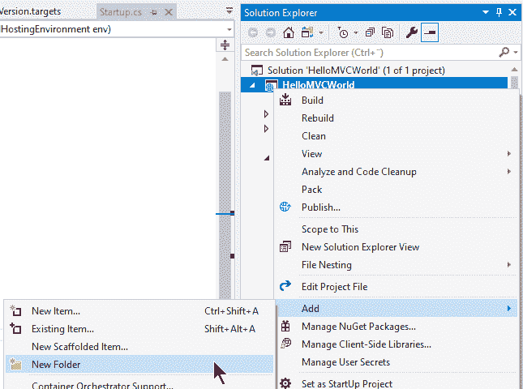
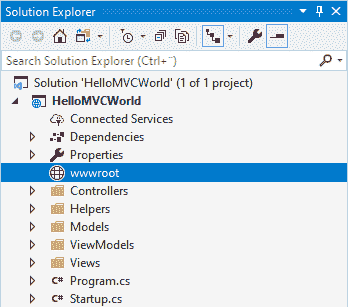
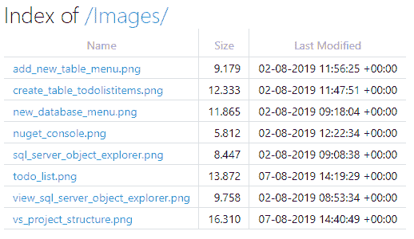

# 提供静态文件

> 原文：<https://asp.mvc-tutorial.com/core-concepts/serving-static-files/>

在本文中，我们将讨论如何在 ASP.NET 核心 MVC 应用中提供静态文件。但首先，我们来谈谈什么是静态文件。在这个动态网站的世界里，内容是动态生成的，例如由 C#编写的代码，静态文件则完全相反:它由你在编辑器中编写，保存到磁盘，然后完全由 web 服务器提供。这通常用于图像、CSS 和 JavaScript 文件，因为即使这些文件可以动态生成(有时非常有用)并且是动态的，作为静态文件也足够了。

下一个重要的问题是:为什么这个主题甚至需要本教程中的一篇文章？如果你使用过其他服务器端框架，比如 PHP、ASP Classic 甚至 ASP.NET web forms，你会习惯于这样一个事实:静态文件可以像动态文件一样容易地通过 web 服务器提供服务——在这些框架中，它通常只依赖于扩展名。例如，一个名为“style.css”的文件将被直接提供，而不通过 ASP.NET 管道(这将节省一些资源)，而一个名为“style.aspx”的文件将由 ASP.NET 框架处理(但最终结果仍然可以是一个样式表！).

## 启用静态文件支持

然而，在 ASP.NET 核心，事情有点不同。对静态文件的支持在默认情况下甚至没有启用——你必须通过调用 Startup.cs 文件中的 **UseStaticFiles()** 来启用它。这与 ASP.NET 核心所使用的模块化方法非常一致，在这种方法中，事情是根据需要来启用的，以保持您的应用快速和精简。

因此，我们需要做的第一件事是打开 Startup.cs 文件并修改`Configure()`方法，使其包含对 **UseStaticFiles()** 的调用。它可能是这样的:

```
public void Configure(IApplicationBuilder app, IWebHostEnvironment env)
{
    app.UseStaticFiles();
    ........        
```

<input type="hidden" name="IL_IN_ARTICLE">

有了这些，您的应用将被允许服务静态文件。

## 包括静态文件

但是还有另一个你需要注意的小细节，它将 ASP.NET 核心与 PHP 或 ASP 经典区分开来:静态文件不能仅仅放在你的应用的根目录或它下面的随机文件夹中。相反，引入了一个特殊的文件夹，称为“wwwroot”。这将是所有静态文件和文件夹的位置，它可以像任何其他文件夹一样添加到您的项目中。只需在解决方案浏览器中右键单击项目并选择 **Add - > New Folder** :



当提示输入名称时，确保将其称为 **wwwroot** 。如果操作正确，您会看到这确实是 ASP.NET 核心中的一个特殊文件夹，因为尽管解决方案资源管理器中的文件夹和文件通常是按字母顺序排序的，但 wwwroot 文件夹会立即移动到树的顶部，它甚至有自己的图标:



现在，您可以在您的应用中提供静态文件了！wwwroot 文件夹中的文件和文件夹可通过您的 web 应用 URL 的根目录直接访问。通过向这个新文件夹添加一个 HTML 文件来测试一下(右键单击文件夹并选择**添加- >新项目...**然后选择 HTML 页面)并调用它，例如“test.html”。只是添加一些随机的东西，然后尝试通过应用的 URL 调用它。例如，如果您的应用位于 *https://localhost:44380/* ，您将能够访问位于*https://localhost:44380/test . html*的文件。

你当然可以添加子文件夹到你的 wwwroot 文件夹中——如果你有几个不同类型的文件，这通常是个好主意。一个常见的做法是为样式表(CSS)、JavaScript 和图像创建文件夹，但这完全取决于你。请记住，文件夹名称当然必须包含在您用来访问文件的 URL 中，例如*https://localhost:443img/logo . png*。

## 启用目录浏览

许多网络服务器会自动生成一个目录中的文件列表，并显示给访问者，如果你访问它的路径，而没有找到默认文件(如 index.html)。然而，出于安全原因，这在 ASP.NET 核心中是默认禁用的——一般来说，没有理由让访问者知道哪些文件存在于你的 web 服务器上，除非你明确地链接到它们，并且在理论上。但是，在极少数情况下，允许访问者浏览特定文件夹中的文件是很有用的，通常是在您想要访问文件夹中的文件而不必手动创建每个文件的链接的情况下。

幸运的是，这在 ASP.NET 内核中仍然是可能的——为了说明这一点，我在我的 **wwwroot** 文件夹中创建了一个名为“Images”的文件夹。我想让访问者浏览这个文件夹的内容，并允许他们看到这个特定文件夹中的文件。

首先，在您的 **Startup.cs** 文件中需要两个额外的 *using* 语句:

```
using Microsoft.Extensions.FileProviders;
using System.IO;
```

然后，您需要再次修改 **Configure()** 方法——您仍然应该不带参数地调用 **UseStaticFiles()** ,以启用对静态文件的默认访问，但是除此之外，我们将使用一个名为 **UseDirectoryBrowser()** 的方法来提供对我们的 Images 文件夹的目录访问:

```
public void Configure(IApplicationBuilder app, IWebHostEnvironment env)
{
    app.UseStaticFiles();        
    app.UseDirectoryBrowser(new DirectoryBrowserOptions
    {
    FileProvider = new PhysicalFileProvider
    (
        Path.Combine(Directory.GetCurrentDirectory(), "wwwroot", "Images")            
    ),
    RequestPath = "/Images"
    });
    ....
```

准备就绪后，您现在可以浏览 wwwroot 的“Images”文件夹——一个包含每个文件的链接和详细信息的精美文件列表将自动生成并提供给访问者:



只要您在目录中添加文件，它们就会自动包含在此列表中。

## 摘要

在 ASP.NET 核心 MVC 中提供静态文件与在 ASP.NET web forms 等其他框架中略有不同，因为它必须被特别启用(通过调用 **UseStaticFiles()** 方法)并放置在一个名为“wwwroot”的特殊文件夹中。然而，正如本文所示，这一点也不难。

* * *