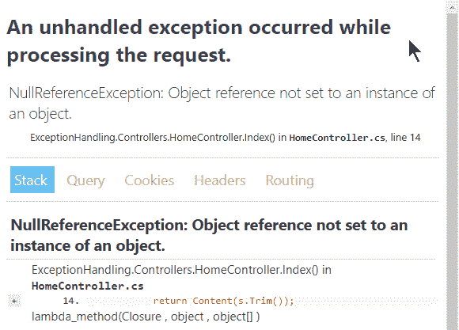

# 处理异常

> 原文：<https://asp.mvc-tutorial.com/core-concepts/handling-exceptions/>

一个软件中的错误可以有很多，但是在最近的编程语言中，它们通常被称为异常。异常通常被描述为“程序执行过程中的一个事件，它扰乱了正常的流程”——换句话说，就是一些不期望的、应该被处理的事情。这被称为异常处理，它是现代软件的一个非常重要的部分，包括 web 应用。

然而在网络世界中，有了像 ASP.NET 核心这样的框架，实际上有不止一种类型的错误需要处理。也有例外，我们将在本文中讨论，还有我们从 web/HTTP 技术中继承的错误。例如，如果用户试图访问一个不存在的页面，就会向访问者返回一个 404 错误。很多网络服务器会有一个默认的页面来与用户交流，如果没有，浏览器会处理。然而，404 错误是一个很好的例子，它并不是一个真正的异常，您希望在您的应用中优雅地处理它。

然而，对于用户/访问者来说，发生什么类型的错误或异常并没有太大的区别——唯一重要的是如何处理和从中恢复，以及如何呈现给用户。因此，在本文中，我们将讨论异常，然后在下一篇文章中讨论基于 HTTP 的错误。

## 异常处理

一般来说，我不会详细讨论异常，因为这在 [C#教程](https://csharp.net-tutorials.com/advanced/exceptions/)中更有意义，但是让我们简单地讨论一下这个主题。首先，如果你已经知道一个异常可能发生，例如，因为你调用的方法可能抛出一个异常，你当然应该尝试在本地处理它..捕捉块:

```
public IActionResult Details(int id)  
{  
    try  
    {  
    var product = DbHelper.GetProduct(id);  
    return View(product);  
    }  
    catch(Exception ex)  
    {  
    // Here you may want to log the exception and return an actual error page
    return Content("Sorry, an error occurred!");  
    }  
}
```

<input type="hidden" name="IL_IN_ARTICLE">

然而，许多异常可能难以预料，所以如果您不想将所有代码都包装在里面，请尝试..catch 块，您需要在更高的级别处理异常。试着打开你在 ASP.NET 核心 MVC 项目中找到的 **Startup.cs** 文件，看看 **Configure()** 方法。它的外观和功能取决于您用来创建项目的模板，但是如果您使用了空模板并且没有对其进行更改，您可能会发现类似下面的几行代码:

```
public void Configure(IApplicationBuilder app, IWebHostEnvironment env)
{
    if(env.IsDevelopment())
    {
    app.UseDeveloperExceptionPage();
    }
    ....
```

它们基本上是告诉您的 web 应用使用特殊的开发人员异常页面，只要应用运行在开发模式下(稍后将详细介绍)。当抛出一个异常时，你会看到这样的结果，要么是因为你使用了 **throw** 关键字，要么是因为你做了一些导致异常的事情:

```
public IActionResult Index()
{
    string s = null;
    return Content(s.Trim());
}
```

显然，这将导致一个**NullReferenceException**——只需尝试在浏览器中访问该操作，并注意结果。根据您使用的 ASP.NET 核心的版本，它看起来会像这样:



正如您所看到的，ASP.NET 为您生成了一个非常详细的错误页面——通过这个页面，您应该能够指出问题所在(也可能没有我们示例中那么明显)并修复它。出于安全原因，这些细节应该只向开发人员显示，而绝不向用户/访问者显示。相反，当我们不在开发模式时，我们应该向用户显示一个更加用户友好的错误消息，可能带有一个道歉，然后将异常记录到数据库中。

第一部分，我们向用户显示一些用户友好的东西，很简单。可以用很多方法，但都是从我们之前在 **Startup.cs** 的 **Configure()** 方法中谈到的代码开始。我们需要对它进行修改，以便它能够处理应用不处于开发模式的情况，如下所示:

```
public void Configure(IApplicationBuilder app, IWebHostEnvironment env)
{
    if(env.IsDevelopment())
    {
    app.UseDeveloperExceptionPage();
    }
    else
    {
    app.UseExceptionHandler("/Error");
    }
    ....
```

在`UseExceptionHandler()`方法的帮助下，我们可以在发生错误时将用户重定向到特定的路径。在这种情况下，我们将它们发送到“/Error”，因此我们需要一个方法来处理这个路径。一种方法是在名为 **Error()** 的 **HomeController** 上定义一个动作，或者创建一个 **ErrorController** 并定义一个 **Index()** 方法。我使用了后一种方法，它看起来像这样:

```
public class ErrorController : Controller
{
    public IActionResult Index()
    {
    return Content("We're so sorry, but an error just occurred! We'll try to get it fixed ASAP!");
    }
}
```

在现实世界的应用中，这当然应该用一个好看的视图来代替，它甚至可以使用与页面其余部分相同的布局！

### 异常详细信息

我们现在可以更优雅地处理意外异常，但我们仍然不知道哪里出错了。因为我们不向用户显示任何细节，所以我们需要在告诉用户出错之前处理它。要访问关于异常的信息，我们可以使用**IExceptionHandlerPathFeature**接口。它可以在*微软找到。AspNetCore.Diagnostics* 命名空间，所以您需要在处理异常的地方导入它，例如在 ErrorController:

```
using Microsoft.AspNetCore.Diagnostics;
```

现在我们可以更改 **Index()** 动作来实际处理异常，然后再告诉用户:

```
public class ErrorController : Controller  
{  
    public IActionResult Index()  
    {  
    var exceptionHandlerPathFeature = HttpContext.Features.Get<IExceptionHandlerPathFeature>();  
    if((exceptionHandlerPathFeature != null) && (exceptionHandlerPathFeature.Error != null))  
    {  
        // In our example, the ExceptionHelper.LogException() method will take care of   
        // logging the exception to the database and perhaps even alerting the webmaster  
        // Make sure that this method doesn't throw any exceptions or you might end  
        // in an endless loop!  
        ExceptionHelper.LogException(exceptionHandlerPathFeature.Error);  
    }  
    return Content("We're so sorry, but an error just occurred! It has been logged and we'll try to get it fixed ASAP!");  
    }  
}
```

有了所有这些，您的应用现在更加健壮，并为可能发生的意外异常做好了准备。

## 摘要

在本文中，我们已经学习了如何处理异常，不管它们是否在预料之中。这是创建健壮的 web 应用的重要一步，在您的 web 应用发布之前，您应该有一个策略。

您应该考虑的另一件事是如何处理应用将返回给用户的各种 HTTP 状态代码，例如，当一个页面没有找到时的 404 代码——我们将在下一篇文章中讨论这个问题。

* * *