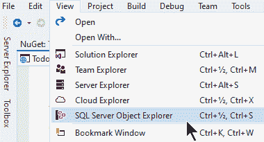
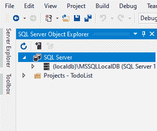
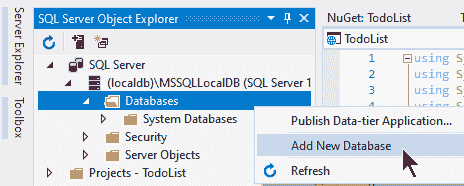
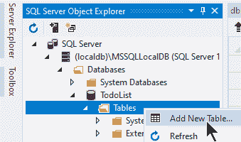
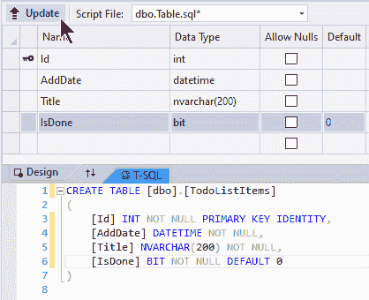
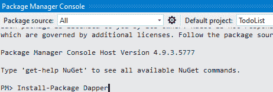

# 入门指南

> 原文：<https://asp.mvc-tutorial.com/working-with-databases/getting-started/>

在之前的文章中，我们决定使用一个数据库引擎( **MS SQL Server** ，对于测试/开发:SQL Server Express LocalDB )和一个数据库框架/ORM ( **Dapper** )。在本文中，我将帮助您开始使用这两个工具，这样您就可以继续学习如何让您的 ASP.NET MVC 项目与数据库协同工作。

在接下来的文章中，我们将构建一个完整(但简单)的数据库驱动的待办事项列表。除了我们现在将要讨论的数据库引擎和框架，你还需要一个新的 ASP.NET MVC 核心项目。创建一个新项目的过程已经在本教程的前面描述过了，所以如果你不确定如何去做，只需返回并阅读全部内容。

## 设置 SQL Server Express (LocalDB)

正如在以前的一篇文章中提到的，Microsoft SQL Server 附带了一个易于安装的开发版本，名为 SQL Server Express (LocalDB)。名称的最后一部分很能说明问题:LocalDB 替代方案是 SQL Server 的一个完全精简的版本，只能在您的本地计算机上访问，而不是在您的开发计算机上运行一个完整的 SQL Server 及其所有服务(理论上可以从 Internet 上的任何其他计算机上访问)。此外，LocalDB 不是作为持续运行的服务全天候可用，而是在您需要时启动。

LocalDB 与 Visual Studio 一起安装(除非您主动要求安装程序不要这样做)，您甚至可以从 Visual Studio 内部控制它。如果您还没有看到用于执行此操作的工具窗口，只需转到**视图**菜单，然后单击 **SQL Server 对象资源管理器**:

 <input type="hidden" name="IL_IN_ARTICLE">

SQL Server 对象资源管理器工具窗口现在将出现，外观如下:



尝试展开 *(localdb)* 节点，以便可以看到数据库等。如果您以前没有使用过您的 LocalDB(我假设您没有，因为您正在阅读本教程),*数据库*节点将是空的。我们需要为此做些什么，为我们即将到来的 TodoList 项目创建一个新的数据库:

### 创建新数据库



在弹出的对话框中，给你的数据库取一个合适的名字——我把我的数据库命名为 **TodoList** ，就像我为此创建的 Visual Studio 项目一样。

### 添加表格

一个 SQL Server 数据库可以包含多个表，这些表保存实际数据。表很像代码中的类——它们包含关于特定实体的信息。对于我们的项目，我们需要一个表来保存待办事项列表中的所有项目。因此，该表的合适名称是 **TodoListItems** 。

添加表就像添加数据库一样简单:



您将看到“表设计器”窗口，您可以在其中为该表添加所需的行。下面是我的 **TodoListItems** 表的样子:



您可以重新创建我已有的行，或者如果您想节省时间，只需将下面的 SQL 复制到设计器的 T-SQL 部分:

```
CREATE TABLE [dbo].[TodoListItems]
(
    [Id] INT NOT NULL PRIMARY KEY IDENTITY, 
    [AddDate] DATETIME NOT NULL, 
    [Title] NVARCHAR(200) NOT NULL, 
    [IsDone] BIT NOT NULL DEFAULT 0
)
```

完成后，只需点击**更新**按钮(你可以在上面截图的顶部看到)。这将使 Visual Studio 将 SQL 应用于您的数据库，从而创建新表——您将看到它立即出现在 SQL Server 对象资源管理器中。祝贺您，您现在拥有了一个包含行的表的数据库——换句话说，数据后端已经可以使用了！

## 添加 Dapper

有了数据库，我们现在只需要数据库框架，就像在以前的文章中讨论的那样。多亏了 NuGet 包系统，在你的项目中安装第三方库变得非常容易。你可以通过 UI 或者使用 NuGet 控制台来完成:从**工具**菜单中，选择 **NuGet 包管理器** - > **包管理器控制台**。控制台将在工具窗口中打开，如下所示:



现在键入以下命令并按 Enter 键:

```
Install-Package Dapper
```

这将使 NuGet 管理器将最新版本的 **Dapper** 库安装到您的项目中！

当谈到持久存储时，例如像 SQL Server 这样的数据库，经常会提到 **CRUD** 的概念。它代表 **C** reate、 **R** ead、 **U** pdate、**D**elete——这些都是你在使用数据库时会一直做的操作。然而，Dapper 只包括做阅读的方法。这是因为他们希望库尽可能的精简和快速:它将为您执行所有的映射，您可以从数据库中获取数据，但是如果您想要执行其他操作之一，您将不得不为它手动编写 SQL。

但是不用担心！有许多第三方 Dapper 扩展，它们可以扩展 Dapper 的功能来完成这些操作以及许多其他有用的任务。[衣冠楚楚。Contrib](https://www.nuget.org/packages/Dapper.Contrib/) 就是一个很好的例子——它简单地添加了我们需要的 CRUD 操作，比如 **Insert()** 、 **Update()** 和 **Delete()** 。它可以像 Dapper 本身一样容易地安装，就像 Dapper 一样，它只是扩展了您将使用的类。在软件包管理器控制台中运行以下命令:

```
Install-Package Dapper.Contrib
```

有了这些，我们终于准备好继续了。

## 摘要

我们现在有了一个数据库，包括一个包含待办事项列表项的表，并且安装了数据库框架(Dapper)。在下一篇文章中，我们将继续努力创建我们的 ASP.NET MVC 数据库驱动的待办事项列表。

* * *