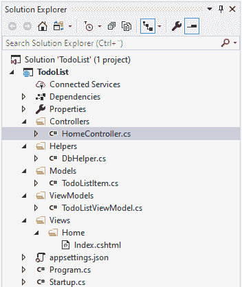
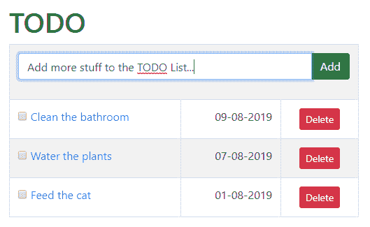

# 待办事项列表:模型、视图模型和助手

> 原文：<https://asp.mvc-tutorial.com/working-with-databases/todo-list-models-viewmodels-helpers/>

正如所承诺的，我们将在本章中构建一个数据库驱动的待办事项列表。在前面的文章中，我们已经做了必要的准备，包括建立数据库和在我们的项目中添加对 Dapper 数据库框架的支持。现在到了有趣的部分:我们将开始实际的编码！

前几篇文章的快速总结:到目前为止，您应该已经有了 ASP.NET MVC 核心项目的设置，最好叫做“TodoList”。在这个项目中，您应该已经添加了 Dapper 和 Dapper。Contrib NuGet 包，并且您应该已经建立了到 LocalDB 数据库的连接，其中您应该已经添加了一个数据库(TodoList ),其中包含一个表(TodoListItems)。

我们现在将开始向您的项目添加文件，并且我们将在接下来的文章中添加更多的文件。作为参考，以下是我们完成后您的项目结构应该是什么样子的想法:



当我们完全完成后，我们将有一个单页的待办事项列表 web 应用。它将带有添加、编辑和删除项目的功能。项目将显示标题和添加日期，以及显示项目是否已完成的复选框，只需单击即可切换。它看起来会像这样:

 <input type="hidden" name="IL_IN_ARTICLE">

说够了，让我们开始吧！

## 助手

为了获得到数据库的连接，我们将创建一个新的 **SqlConnection** 类的实例。它实现了 IDbConnection 接口，由于 Dapper，这个实例将自动扩展 Dapper 框架中的所有强大功能。

当实例化 SqlConnection 类时，我们需要提供一个所谓的**连接字符串**。该字符串包含连接到相关数据库所需的信息:最重要的是数据库服务器的 IP/主机名，但通常也包含用户名和密码，以及要使用的数据库的名称。但是，由于我们当前连接的是 LocalDB 版本，而不是成熟的 SQL Server，因此我们可以省略用户名/密码部分，只提供实例的名称以及我们想要使用的数据库。

连接字符串通常存储在一个配置文件中，但是我们现在不讨论它。相反，我们将实现一个名为 DbHelper 的助手类，它可以为我们提供一个正确初始化的 SqlConnection 类实例，因此我们不必在每次使用数据库时都编写整个连接字符串。这个非常简单的类目前只有一个静态方法，看起来像这样:

```
using System;
using System.Data.SqlClient;

namespace TodoList.Helpers
{
    public class DbHelper
    {
    public static SqlConnection GetConnection()
    {
        return new SqlConnection(@"Data Source=(localdb)\MSSQLLocalDB;Initial Catalog=TodoList;");
    }
    }
}
```

确保所使用的连接字符串与您的计算机上所需的字符串相匹配。您可以通过在 **SQL Server 对象浏览器**中右键单击您的数据库并选择**属性**来验证这一点。在出现的属性工具窗口中，检查**连接字符串**——如果不匹配，就用你自己的版本替换上面代码中的那个。

## 模型和视图模型

我们的项目需要一个模型:TodoListItem 模型。它是我们存储在数据库中的数据的. NET 表示形式，所以您可以从我们创建数据库表(TodoListItems)时认出属性名。它应该是这样的:

```
using System;
using System.ComponentModel.DataAnnotations;

namespace TodoList.Models
{
    public class TodoListItem
    {
    public int Id { get; set; }

    public DateTime AddDate { get; set; }

    [Required]
    [MinLength(2, ErrorMessage = "Title must contain at least two characters!")]
    [MaxLength(200, ErrorMessage = "Title must contain a maximum of 200 characters!")]
    public string Title { get; set; }        

    public bool IsDone { get; set; }
    }
}
```

注意，我已经向 **Title** 属性添加了一些模型验证数据注解——因为这是类中唯一用户可编辑的部分，所以我们只需要验证这个属性。在这种情况下，我们只需要一些基本的长度验证:最小长度为 2，因为很难用更少的字符表达需要完成的事情，最大长度为 200，以匹配数据库表中的列，该列也被设置为最多包含 200 个字符。

我们还需要一个视图模型。它将用于控制器和视图之间的通信:

```
using System;
using System.Collections.Generic;
using System.Data.SqlClient;
using System.Linq;
using TodoList.Models;
using Dapper;
using TodoList.Helpers;

namespace TodoList.ViewModels
{
    public class TodoListViewModel
    {
    public TodoListViewModel()
    {
        using(var db = DbHelper.GetConnection())
        {
        this.EditableItem = new TodoListItem();
        this.TodoItems = db.Query<TodoListItem>("SELECT * FROM TodoListItems ORDER BY AddDate DESC").ToList();
        }
    }

    public List<TodoListItem> TodoItems { get; set; }

    public TodoListItem EditableItem { get; set; }
    }
}
```

这个视图模型基本上只是一个容器，它将存储两件事情:TODO 项目的完整列表(在 **TodoItems** 属性中)以及一个名为 **EditableItem** 的属性。后者将用于表示当前正在编辑的项，或者如果没有正在编辑的项，则是对将被添加到列表中的下一个可能项的引用。这将允许我们使用完全相同的表单，无论我们是创建一个新项目还是编辑一个现有的项目。

您还会注意到，这是我们第一次真正与数据库通信！它发生在 ViewModel 的构造器中，因为每次我们需要这个 ViewModel 时，我们也需要 TODO 列表项。注意我是如何在 db (SqlConnection)对象上使用 **Query()** 方法的:这实际上是一个 Dapper 方法，允许我们提供一个 SQL 查询(“SELECT * FROM ...”part ),它将获取 TodoListItems 表中的所有行，然后按照它们的 AddDate 降序排序。 **Dapper 然后会施展魔法，自动将这些数据库表行转换成。TodoListItem 类的 NET 对象！**

## 摘要

有了所需的模型和视图模型，以及我们的 DbHelper 类，我们就可以进入下一步了——在接下来的文章中，我们将添加完成这个项目所需的视图和控制器。

* * *