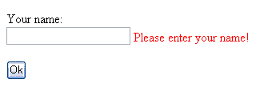

# 验证- RequiredFieldValidator

> 原文：<https://asp.net-tutorials.com/validation/required-field-validator/>

RequiredFieldValidator 实际上非常简单，但是非常有用。您可以使用它来确保用户在 TextBox 控件中输入了内容。让我们试一试，在页面中添加一个 RequiredFieldValidator。我们还将添加一个用于验证的文本框，以及一个用于提交表单的按钮。

```
<form id="form1" runat="server">
    Your name:<br />
    <asp:TextBox runat="server" id="txtName" />
    <asp:RequiredFieldValidator runat="server" id="reqName" controltovalidate="txtName" errormessage="Please enter your name!" />
    <br /><br />
    <asp:Button runat="server" id="btnSubmitForm" text="Ok" />
</form>
```

实际上，这就是我们测试 RequiredFieldValidator 最基本部分所需的全部内容。我确信现在控件的所有属性都是有意义的，所以我不会详细讨论它们。尝试运行网站并单击按钮。您应该会看到类似这样的内容:



如果您的浏览器支持 JavaScript，大多数现代浏览器都支持 JavaScript，那么您会注意到页面并没有回发到服务器——验证是在客户端执行的！这是 ASP.NET 验证器非常酷的一点。只有在必要时才在服务器端进行验证！要了解这种感觉，可以将 enableclientscript="false "添加到 RequiredFieldValidator 中，然后重试。现在您将看到浏览器回发到服务器，但是结果是一样的——验证器仍然工作！

现在，除了在页面有效的情况下回发之外，这个按钮什么也不做。我们将通过添加一个 onclick 事件来改变这种情况:

<input type="hidden" name="IL_IN_ARTICLE">

```
<asp:Button runat="server" id="btnSubmitForm" text="Ok" onclick="btnSubmitForm_Click" />
```

在代码隐藏文件中，我们添加了以下事件处理程序:

```
protected void btnSubmitForm_Click(object sender, EventArgs e)
{
    if(Page.IsValid)
    {
        btnSubmitForm.Text = "My form is valid!";
    }
}
```

您会注意到，在我们做任何事情之前，我们会检查页面是否有效。这一点非常重要，因为如果出于某种原因没有使用客户端验证，就会出现这个代码。一旦涉及到服务器端验证，您的工作就是确保没有敏感代码被执行，除非您希望它被执行。如你所见，这很简单——只需查看页面。是一个有效参数，可以使用了。尝试再次运行该网站，并注意如果您提交有效的表单，按钮的文本是如何变化的。

* * *