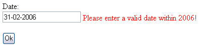

# 验证-范围验证器

> 原文：<https://asp.net-tutorials.com/validation/range-validator/>

**RangeValidator** 正如其名称所暗示的那样；它确保用户输入在指定的范围内。您可以使用它来验证数字、字符串和日期，这在许多情况下非常有用。由于我们上次验证了数字，所以这次我们将尝试使用日期。

```
Date:<br />
<asp:TextBox runat="server" id="txtDate" />
<asp:RangeValidator runat="server" id="rngDate" controltovalidate="txtDate" type="Date" minimumvalue="01-01-2006" maximumvalue="31-12-2006" errormessage="Please enter a valid date within 2006!" />
<br /><br />
```

如果你不是欧洲人，你可能会觉得这种日期格式有点奇怪，因为我们在欧洲使用 dd-mm-yy。如果它不适合您正在使用的机器上的日期格式，您可以更改它。现在，尝试运行网站，并在我们的新文本框中输入日期。它只在日期在 2006 年内有效，一个很酷的副作用是日期也被检查有效性。请看这个截图，它向我们展示了验证器也对不可能的日期做出反应:



同样，如果客户端验证不起作用，它将在我们的代码隐藏中被捕获，如 RequiredFieldValidator 所示。如果你错过了这一部分，那么一定要检查第一章！

* * *