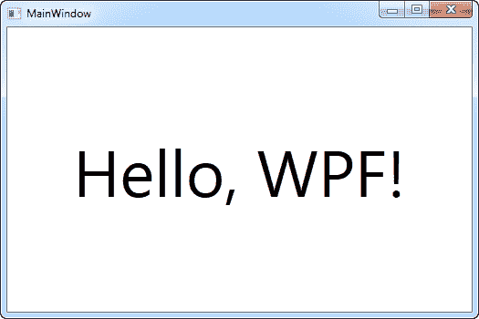

# 你好，WPF！

> 原文：<https://wpf-tutorial.com/getting-started/hello-wpf/>

在几乎所有编程教程中，第一个也是非常经典的例子是“Hello，world！”例如，但在本教程中，我们会发疯，改变成“你好，WPF！”相反。我们的目标只是让这段文字出现在屏幕上，向您展示开始使用它是多么容易。

本教程的其余部分假设您已经安装了一个 IDE，最好是 Visual Studio 或 Visual Studio Community(有关如何获得它的说明，请参见上一篇文章)。如果您使用的是另一种产品，您必须根据您的产品修改说明。

在 Visual Studio 中，从**文件**菜单中选择**新项目**开始。在左边，你应该有一个目录树。每当涉及到代码时，本教程将关注 C#，所以你应该从模板列表中选择它，因为我们将创建 Windows 应用，你应该从树中选择**窗口**。这将在右侧给出一个可能的 Windows 应用类型列表，您应该在这里选择一个 **WPF 应用**。我在**名称**文本字段中将我的项目命名为“HelloWPF”。确保对话框底部的其余设置正常，然后按下 **Ok** 按钮。

您的新项目将有几个文件，但是我们现在只关注其中的一个: *MainWindow.xaml* 。这是应用的主窗口，在启动应用时首先显示，除非您特别更改它。其中的 XAML 代码(XAML 将在本教程的另一章中详细讨论)应该是这样的:

```
<Window x:Class="WpfApplication1.MainWindow"

    xmlns:x="http://schemas.microsoft.com/winfx/2006/xaml"
    Title="MainWindow" Height="350" Width="525">
    <Grid>

    </Grid>
</Window>
```

这是 Visual Studio 为我们的窗口创建的基本 XAML，它的所有部分在关于 XAML 和“窗口”的章节中都有解释。您现在可以实际运行应用(选择 Debug-> Start Debug 或按下 **F5** )来查看我们的应用当前包含的空窗口，但是现在是时候在屏幕上显示我们的消息了。

<input type="hidden" name="IL_IN_ARTICLE">

我们将通过向 Grid panel 添加一个 文本块（`TextBlock`）控件来实现这一点，并将我们前面提到的消息作为内容:

```
<Window x:Class="WpfApplication1.MainWindow"

    xmlns:x="http://schemas.microsoft.com/winfx/2006/xaml"
    Title="MainWindow" Height="350" Width="525">
    <Grid>
        <TextBlock HorizontalAlignment="Center" VerticalAlignment="Center" FontSize="72">
            Hello, WPF!
        </TextBlock>
    </Grid>
</Window>
```

现在尝试运行应用(选择 Debug-> Start Debug 或按下 **F5** ),看看您努力工作的美丽成果——您的第一个 WPF 应用:



您会注意到，我们在 TextBlock 上使用了三个不同的属性来获得一个定制的对齐方式(在窗口的中间)，还使用了 FontSize 属性来获得更大的文本。所有这些概念都将在后面的文章中讨论。

恭喜你走到这一步。现在去读剩下的教程，很快你就会掌握 WPF 了！

* * *