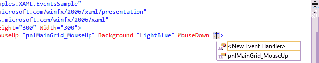
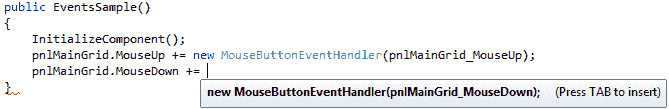

# XAML 事件

> 原文：<https://wpf-tutorial.com/xaml/events-in-xaml/>

大多数现代 UI 框架都是事件驱动的，WPF 也是如此。所有控件，包括窗口(也继承了 Control 类)都公开了一系列您可以订阅的事件。您可以订阅这些事件，这意味着当它们发生时您的应用程序会得到通知，并且您可以对此做出反应。

有许多类型的事件，但是一些最常用的是响应用户使用鼠标或键盘与应用程序的交互。在大多数控件上，你会发现像 KeyDown，KeyUp，MouseDown，MouseEnter，MouseLeave，MouseUp 和其他一些事件。

我们将更仔细地研究事件在 WPF 是如何工作的，因为这是一个复杂的主题，但是现在，您需要知道如何将 XAML 的控件事件链接到代码隐藏文件中的一段代码。看看这个例子:

```
<Window x:Class="WpfTutorialSamples.XAML.EventsSample"

        xmlns:x="http://schemas.microsoft.com/winfx/2006/xaml"
        Title="EventsSample" Height="300" Width="300">
	<Grid Name="pnlMainGrid" MouseUp="pnlMainGrid_MouseUp" Background="LightBlue">        

    </Grid>
</Window>
```

注意我们是如何通过编写方法名来订阅网格的 MouseUp 事件的。此方法需要使用正确的事件签名在代码隐藏中定义。在这种情况下，它应该是这样的:

```
private void pnlMainGrid_MouseUp(object sender, MouseButtonEventArgs e)
{
	MessageBox.Show("You clicked me at " + e.GetPosition(this).ToString());
}
```

<input type="hidden" name="IL_IN_ARTICLE">

MouseUp 事件使用一个名为 **MouseButtonEventHandler** 的委托，您可以订阅这个委托。它有两个参数，一个 sender(引发事件的控件)和一个包含有用信息的 MouseButtonEventArgs 对象。我们在示例中使用它来获取鼠标光标的位置并告诉用户。

几个事件可能使用相同的委托类型——例如，MouseUp 和 MouseDown 都使用 **MouseButtonEventHandler** 委托，而 MouseMove 事件使用 **MouseEventHandler** 委托。在定义事件处理方法时，您需要知道它使用哪个委托，如果您不知道，可以在文档中查找。

幸运的是，Visual Studio 可以帮助我们为事件生成正确的事件处理程序。最简单的方法就是在 XAML 写下事件的名称，然后让 VS 的智能感知为您完成剩下的工作:



当您选择 **<时，新的事件处理程序>** Visual Studio 将在您的代码隐藏文件中生成一个适当的事件处理程序。它将被命名为<控件名> _ <事件名>，在我们的例子中是 **pnlMainGrid_MouseDown** 。右键单击事件名称并选择**导航到事件处理程序**，VS 会带你直接找到它。

## 从代码隐藏订阅事件

上面解释了订阅事件的最常见方式，但有时您可能希望直接从代码隐藏订阅事件。这是使用+= C#语法完成的，其中您直接在对象上添加事件处理程序。关于这一点的完整解释属于一个专门的 C#示例，但为了便于比较，这里有一个示例:

```
using System;
using System.Windows;
using System.Windows.Input;

namespace WpfTutorialSamples.XAML
{
	public partial class EventsSample : Window
	{
		public EventsSample()
		{
			InitializeComponent();
			pnlMainGrid.MouseUp += new MouseButtonEventHandler(pnlMainGrid_MouseUp);
		}

		private void pnlMainGrid_MouseUp(object sender, MouseButtonEventArgs e)
		{
			MessageBox.Show("You clicked me at " + e.GetPosition(this).ToString());
		}

	}
}
```

同样，您需要知道使用哪个委托，同样，Visual Studio 可以帮助您做到这一点。你一写:

pnlMainGrid。MouseDown +=

Visual Studio 将提供帮助:



只需按两次[Tab]键，Visual Studio 就会为您生成正确的事件处理程序，它就在当前方法的正下方，随时可以实现。当你订阅这样的活动时，你不需要在 XAML 做。

* * *