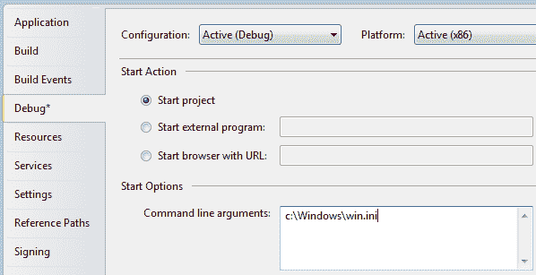

# WPF 的命令行参数

> 原文：<https://wpf-tutorial.com/wpf-application/command-line-parameters/>

命令行参数是一种技术，您可以将一组参数传递给希望启动的应用程序，以某种方式影响它。最常见的例子是用特定的文件打开应用程序，例如在编辑器中。您可以使用 Windows 的内置记事本应用程序，通过运行以下命令(从“开始”菜单中选择“运行”或按[WindowsKey-R]):

notepad.exe c:\ Windows \ win . ini

这将打开记事本，同时打开 win.ini 文件(您可能需要调整路径以匹配您的系统)。记事本只需查找一个或几个参数，然后使用它们，您的应用程序也可以这样做！

命令行参数通过启动事件传递到您的 WPF 应用程序，我们在 App.xaml 文章中订阅了该事件。我们将在本例中做同样的事情，然后使用通过方法参数传递给的值。首先，App.xaml 文件:

```
<Application x:Class="WpfTutorialSamples.App"

             xmlns:x="http://schemas.microsoft.com/winfx/2006/xaml"
			 Startup="Application_Startup">
    <Application.Resources></Application.Resources>
</Application>
```

我们在这里所做的就是订阅 **Startup** 事件，替换 **StartupUri** 属性。然后在 App.xaml.cs 中实现该事件:

<input type="hidden" name="IL_IN_ARTICLE">

```
using System;
using System.Collections.Generic;
using System.Windows;

namespace WpfTutorialSamples
{
	public partial class App : Application
	{

		private void Application_Startup(object sender, StartupEventArgs e)
		{
			MainWindow wnd = new MainWindow();
			if(e.Args.Length == 1)
				MessageBox.Show("Now opening file: \n\n" + e.Args[0]);
			wnd.Show();
		}
	}
}
```

这里使用的是 **StartupEventArgs** 。它被传递到应用程序启动事件中，名称为 e。它具有属性 **Args** ，这是一个字符串数组。命令行参数由空格分隔，除非空格在带引号的字符串中。

## 测试命令行参数

如果您运行上面的示例，什么都不会发生，因为没有指定命令行参数。幸运的是，Visual Studio 使得在您的应用程序中测试这一点变得很容易。从**项目**菜单中选择**【项目名称】属性**，然后进入**调试**选项卡，在这里可以定义命令行参数。它应该是这样的:



尝试运行应用程序，您将看到它对您的参数做出响应。

当然，这条信息并不十分有用。相反，您可能希望将它传递给主窗口的构造函数，或者对它调用一个公共的 open 方法，如下所示:

```
using System;
using System.Collections.Generic;
using System.Windows;

namespace WpfTutorialSamples
{
	public partial class App : Application
	{

		private void Application_Startup(object sender, StartupEventArgs e)
		{
			MainWindow wnd = new MainWindow();
			// The OpenFile() method is just an example of what you could do with the
			// parameter. The method should be declared on your MainWindow class, where
			// you could use a range of methods to process the passed file path
			if(e.Args.Length == 1)
				wnd.OpenFile(e.Args[0]);
			wnd.Show();
		}
	}
}
```

## 命令行的可能性

在这个例子中，我们测试是否只有一个参数，如果有，我们就用它作为文件名。在现实世界的例子中，您可能会收集几个参数，甚至将它们用于选项，例如打开或关闭某个功能。您可以通过遍历传递的整个参数列表来完成，同时收集您需要的信息，但这超出了本文的范围。

* * *