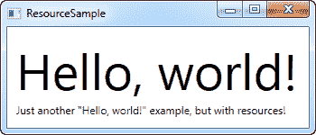
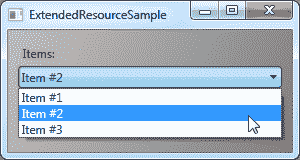
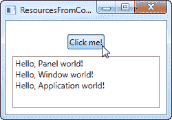

# 资源

> 原文：<https://wpf-tutorial.com/wpf-application/resources/>

WPF 引入了一个非常方便的概念:将数据存储为一种资源的能力，既可以本地存储一个控件的数据，也可以本地存储整个窗口的数据，还可以全局存储整个应用程序的数据。数据几乎可以是你想要的任何东西，从实际信息到 WPF 控制的层次结构。这允许您将数据放在一个地方，然后从或其他几个地方使用它，这非常有用。

这个概念在样式和模板中被大量使用，我们将在本教程的后面讨论，但是正如本章将要说明的，你也可以用它来做很多其他的事情。请允许我用一个简单的例子来说明:

```
<Window x:Class="WpfTutorialSamples.WPF_Application.ResourceSample"

        xmlns:x="http://schemas.microsoft.com/winfx/2006/xaml"
        xmlns:sys="clr-namespace:System;assembly=mscorlib"
        Title="ResourceSample" Height="150" Width="350">
    <Window.Resources>
        <sys:String x:Key="strHelloWorld">Hello, world!</sys:String>
    </Window.Resources>
    <StackPanel Margin="10">
        <TextBlock Text="{StaticResource strHelloWorld}" FontSize="56" />
        <TextBlock>Just another "<TextBlock Text="{StaticResource strHelloWorld}" />" example, but with resources!</TextBlock>
    </StackPanel>
</Window>
```



使用 x:Key 属性给资源一个键，这允许您通过使用这个键，结合 StaticResource 标记扩展，从应用程序的其他部分引用它。在这个例子中，我只存储了一个简单的字符串，然后从两个不同的 **TextBlock** 控件中使用它。

## 静态资源与动态资源

<input type="hidden" name="IL_IN_ARTICLE">

在迄今为止的示例中，我使用了 StaticResource 标记扩展来引用资源。然而，存在一种替代方案，即 DynamicResource。

主要区别在于静态资源只被解析一次，也就是在加载 XAML 的时候。如果稍后更改了资源，这种更改将不会反映在您使用 StaticResource 的地方。

另一方面，DynamicResource 在实际需要时被解析，如果资源发生变化，则再次解析。可以把它想象成绑定到一个静态值，而不是绑定到一个函数，该函数监视这个值，并在每次值发生变化时发送给你——这并不完全是它的工作方式，但它应该能让你更好地了解什么时候使用什么。动态资源还允许您使用在设计时甚至不存在的资源，例如，如果您在应用程序启动时从代码隐藏添加它们。

## 更多资源类型

共享一个简单的字符串很容易，但是您可以做得更多。在下一个例子中，我还将存储一个完整的字符串数组，以及一个用于背景的渐变画笔。这应该会让您很好地了解您可以利用资源做多少事情:

```
<Window x:Class="WpfTutorialSamples.WPF_Application.ExtendedResourceSample"

        xmlns:x="http://schemas.microsoft.com/winfx/2006/xaml"
        xmlns:sys="clr-namespace:System;assembly=mscorlib"
        Title="ExtendedResourceSample" Height="160" Width="300"
        Background="{DynamicResource WindowBackgroundBrush}">
    <Window.Resources>
        <sys:String x:Key="ComboBoxTitle">Items:</sys:String>

        <x:Array x:Key="ComboBoxItems" Type="sys:String">
            <sys:String>Item #1</sys:String>
            <sys:String>Item #2</sys:String>
            <sys:String>Item #3</sys:String>
        </x:Array>

        <LinearGradientBrush x:Key="WindowBackgroundBrush">
            <GradientStop Offset="0" Color="Silver"/>
            <GradientStop Offset="1" Color="Gray"/>
        </LinearGradientBrush>
    </Window.Resources>
    <StackPanel Margin="10">
        <Label Content="{StaticResource ComboBoxTitle}" />
        <ComboBox ItemsSource="{StaticResource ComboBoxItems}" />
    </StackPanel>
</Window>
```



这一次，我们添加了一些额外的资源，所以我们的窗口现在包含一个简单的字符串，一个字符串数组和一个 LinearGradientBrush。字符串用作标签，字符串数组用作 ComboBox 控件的项目，渐变画笔用作整个窗口的背景。如你所见，几乎任何东西都可以作为资源存储。

## 本地和应用范围的资源

目前，我们将资源存储在窗口级别，这意味着您可以从整个窗口访问它们。

如果您只需要特定控件的给定资源，您可以通过将它添加到该特定控件而不是窗口中来使它更加本地化。它的工作方式完全相同，唯一的区别是现在只能从放置它的控件范围内访问:

```
<StackPanel Margin="10">
    <StackPanel.Resources>
        <sys:String x:Key="ComboBoxTitle">Items:</sys:String>
    </StackPanel.Resources>
    <Label Content="{StaticResource ComboBoxTitle}" />
</StackPanel>
```

在本例中，我们将资源添加到 StackPanel，然后从其子控件 Label 中使用它。StackPanel 中的其他控件也可以使用它，就像这些子控件的子控件可以访问它一样。但是，这个特定 StackPanel 之外的控件不能访问它。

如果您需要从几个窗口访问资源的能力，这也是可能的。 **App.xaml** 文件可以包含资源 ，就像窗口和任何种类的 WPF 控件一样，当你将它们存储在 App.xaml 中时，它们可以在项目的所有窗口和用户控件 中全局访问。它的工作方式与从窗口存储和使用时完全相同:

```
<Application x:Class="WpfTutorialSamples.App"

             xmlns:x="http://schemas.microsoft.com/winfx/2006/xaml"
             xmlns:sys="clr-namespace:System;assembly=mscorlib"
             StartupUri="WPF application/ExtendedResourceSample.xaml">
    <Application.Resources>
        <sys:String x:Key="ComboBoxTitle">Items:</sys:String>
    </Application.Resources>
</Application>
```

使用它也是一样的——WPF 会自动向上移动范围，从本地控件到窗口，然后到 App.xaml，以找到给定的资源:

```
<Label Content="{StaticResource ComboBoxTitle}" />
```

## 来自代码隐藏的资源

到目前为止，我们已经使用标记扩展直接从 XAML 访问了所有的资源。然而，您当然也可以从代码隐藏中访问您的资源，这在几种情况下会很有用。在上一个示例中，我们看到了如何将资源存储在几个不同的位置，因此在本示例中，我们将从代码隐藏中访问三个不同的资源，每个资源存储在不同的范围内:

**App.xaml:**

```
<Application x:Class="WpfTutorialSamples.App"

             xmlns:x="http://schemas.microsoft.com/winfx/2006/xaml"
             xmlns:sys="clr-namespace:System;assembly=mscorlib"
             StartupUri="WPF application/ResourcesFromCodeBehindSample.xaml">
    <Application.Resources>
        <sys:String x:Key="strApp">Hello, Application world!</sys:String>
    </Application.Resources>
</Application>
```

**窗口:**

```
<Window x:Class="WpfTutorialSamples.WPF_Application.ResourcesFromCodeBehindSample"

        xmlns:x="http://schemas.microsoft.com/winfx/2006/xaml"
        xmlns:sys="clr-namespace:System;assembly=mscorlib"
        Title="ResourcesFromCodeBehindSample" Height="175" Width="250">
    <Window.Resources>
        <sys:String x:Key="strWindow">Hello, Window world!</sys:String>
    </Window.Resources>
    <DockPanel Margin="10" Name="pnlMain">
        <DockPanel.Resources>
            <sys:String x:Key="strPanel">Hello, Panel world!</sys:String>
        </DockPanel.Resources>

        <WrapPanel DockPanel.Dock="Top" HorizontalAlignment="Center" Margin="10">
            <Button Name="btnClickMe" Click="btnClickMe_Click">Click me!</Button>
        </WrapPanel>

        <ListBox Name="lbResult" />
    </DockPanel>
</Window>
```

**代码隐藏:**

```
using System;
using System.Windows;

namespace WpfTutorialSamples.WPF_Application
{
	public partial class ResourcesFromCodeBehindSample : Window
	{
		public ResourcesFromCodeBehindSample()
		{
			InitializeComponent();
		}

		private void btnClickMe_Click(object sender, RoutedEventArgs e)
		{
			lbResult.Items.Add(pnlMain.FindResource("strPanel").ToString());
			lbResult.Items.Add(this.FindResource("strWindow").ToString());
			lbResult.Items.Add(Application.Current.FindResource("strApp").ToString());
		}
	}
}
```



如你所见，我们存储了三种不同的“你好，世界！”消息:一个在 App.xaml 中，一个在窗口中，一个在主面板的本地。该界面由一个按钮和一个列表框组成。

在代码隐藏中，我们处理按钮的 click 事件，其中我们将每个文本字符串添加到 ListBox，如屏幕截图所示。我们使用 **FindResource()** 方法，该方法将资源作为一个对象返回(如果找到的话)，然后我们通过 使用 ToString()方法将其转换为我们知道的字符串。

注意我们如何在不同的范围内使用 FindResource()方法——首先在面板上，然后在窗口上，然后在当前的**应用程序**对象上。在我们知道的地方寻找资源是有意义的，但是正如已经提到的，如果没有找到资源， 搜索会沿着层次向上进行，所以原则上，我们可以在所有三种情况下使用面板上的 FindResource()方法，因为如果没有找到，它会让 继续到窗口，然后到应用程序级别。

反过来就不一样了——搜索不沿着树向下导航，所以如果已经在本地为控件或窗口定义了资源，就不能在应用程序级别开始查找。

* * *