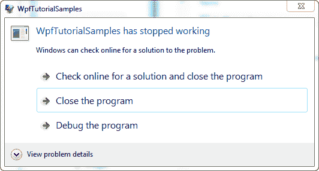
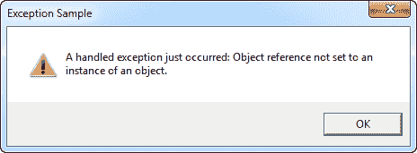
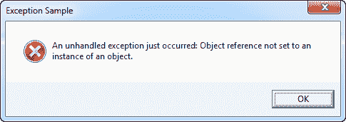

# 在 WPF 处理异常

> 原文：<https://wpf-tutorial.com/wpf-application/handling-exceptions/>

如果你熟悉 C#或其他语言。NET 语言，那么异常处理对您来说应该并不陌生:每当您有一段可能抛出异常的代码时，您就应该将它包装在 try-catch 块中，以优雅地处理异常。例如，考虑这个例子:

```
private void Button_Click(object sender, RoutedEventArgs e)
{
	string s = null;
	s.Trim();
}
```

显然它会出错，因为我试图对一个当前为空的变量执行`Trim()`方法。如果你不处理这个异常，你的应用将会崩溃，Windows 将不得不处理这个问题。正如你所看到的，这不是很用户友好:



在这种情况下，由于这样一个简单且容易避免的错误，用户将被迫关闭您的应用。因此，如果您知道事情可能会出错，那么您应该使用 try-catch 块，就像这样:

```
private void Button_Click(object sender, RoutedEventArgs e)
{
	string s = null;
	try
	{
		s.Trim();
	}
	catch(Exception ex)
	{
		MessageBox.Show("A handled exception just occurred: " + ex.Message, "Exception Sample", MessageBoxButton.OK, MessageBoxImage.Warning);
	}
}
```

<input type="hidden" name="IL_IN_ARTICLE">

然而，有时即使是最简单的代码也会抛出异常，WPF 让您可以全局处理所有未处理的异常，而不是用 try- catch 块包装每一行代码。这是通过应用类上的**DispatcherUnhandledException**事件来完成的。如果订阅，一旦抛出异常，WPF 将调用订阅方法，而这个异常不是在您自己的代码中处理的。这是一个完整的示例，基于我们刚刚讨论的内容:

```
<Window x:Class="WpfTutorialSamples.WPF_Application.ExceptionHandlingSample"

        xmlns:x="http://schemas.microsoft.com/winfx/2006/xaml"
        Title="ExceptionHandlingSample" Height="200" Width="200">
    <Grid>
        <Button HorizontalAlignment="Center" VerticalAlignment="Center" Click="Button_Click">
            Do something bad!
        </Button>
    </Grid>
</Window>
```

```
using System;
using System.Windows;

namespace WpfTutorialSamples.WPF_Application
{
	public partial class ExceptionHandlingSample : Window
	{
		public ExceptionHandlingSample()
		{
			InitializeComponent();
		}

		private void Button_Click(object sender, RoutedEventArgs e)
		{
			string s = null;
			try
			{
				s.Trim();
			}
			catch(Exception ex)
			{
				MessageBox.Show("A handled exception just occurred: " + ex.Message, "Exception Sample", MessageBoxButton.OK, MessageBoxImage.Warning);
			}
			s.Trim();
		}
	}
}
```

请注意，我在 try-catch 块之外额外调用了`Trim()`方法，以便处理第一个调用，而不处理第二个调用。对于第二个，我们需要 App.xaml 的魔力:

```
<Application x:Class="WpfTutorialSamples.App"

             xmlns:x="http://schemas.microsoft.com/winfx/2006/xaml"
             DispatcherUnhandledException="Application_DispatcherUnhandledException"
             StartupUri="WPF Application/ExceptionHandlingSample.xaml">
    <Application.Resources>
    </Application.Resources>
</Application>
```

```
using System;
using System.Windows;

namespace WpfTutorialSamples
{
	public partial class App : Application
	{
		private void Application_DispatcherUnhandledException(object sender, System.Windows.Threading.DispatcherUnhandledExceptionEventArgs e)
		{
			MessageBox.Show("An unhandled exception just occurred: " + e.Exception.Message, "Exception Sample", MessageBoxButton.OK, MessageBoxImage.Error);
			e.Handled = true;
		}
	}
}
```



我们处理异常的方式很像本地异常，但是消息框中的文本和图像略有不同。另外，请注意，我将 e.Handled 属性设置为 true。这告诉 WPF，我们已经处理完了这个异常，不应该再做其他事情了。

## 摘要

异常处理是任何应用的一个非常重要的部分，幸运的是，WPF 和。NET 使得在本地和全局处理异常变得非常容易。当有意义时，您应该在本地处理异常，并且只使用全局处理作为后备机制，因为本地处理允许您更具体地以更专业的方式处理问题。

* * *