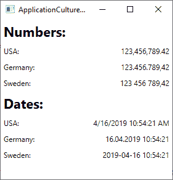
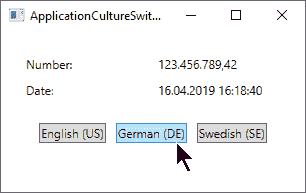

# 应用文化/ui 文化

> 原文：<https://wpf-tutorial.com/wpf-application/application-culture-uiculture/>

如果您在 WPF 应用中使用过一些数字或日期，例如，由于本教程中的一篇文章，您可能会注意到一些很酷的东西:数字和日期会自动以与您计算机上使用的格式相匹配的格式显示。如果你生活在一个说英语的国家，这可能看起来没什么大不了的，但是如果你生活在一个日期和/或数字显示不同的国家，这真的很酷。

如果你在想“在格式化像数字和日期这样简单的东西时，肯定不会有那么多的差异吧？”，我建议您看一下这个示例应用，在这里，我按照美国、德国和瑞典人的偏好设置了相同的数字和相同的日期:



如你所见，数字和日期的显示方式有很多细微的差别。好消息是。NET framework 可以帮你解决很多问题——事实上，它已经做到了:默认情况下，日期和数字是根据执行应用的计算机的系统设置来格式化的。坏消息是，这种行为可能并不总是你想要的。但是不要担心——你可以很容易地改变这一点。这都与使用 **CultureInfo** 类有关，你可以在关于 CultureInfo 的 [C#教程文章中读到更多。现在，让我们讨论如何将这些技术应用到您的 WPF 应用中。](https://csharp.net-tutorials.com/working-with-culture-and-regions/the-cultureinfo-class/)

## 即席格式

如果你只需要为一个特定的信息应用格式，比如一个标签控件的内容，你可以很容易地结合使用 **ToString()** 方法和 **CultureInfo** 类来完成。例如，在上面的示例中，我应用了不同的基于文化的格式，如下所示:

<input type="hidden" name="IL_IN_ARTICLE">

```
double largeNumber = 123456789.42;

CultureInfo usCulture = new CultureInfo("en-US");
CultureInfo deCulture = new CultureInfo("de-DE");
CultureInfo seCulture = new CultureInfo("sv-SE");

lblNumberUs.Content = largeNumber.ToString("N2", usCulture);
lblNumberDe.Content = largeNumber.ToString("N2", deCulture);
lblNumberSe.Content = largeNumber.ToString("N2", seCulture);
```

对于某些情况，这可能就足够了，在这些情况下，您只需要在几个地方设置特殊的格式，但是通常，您应该决定您的应用是应该使用系统设置(默认设置)，还是应该用整个应用的特定区域性设置来重写此行为。

## current culture & CurrentUICulture

将另一种文化应用到您的 WPF 应用是非常容易的。您将潜在地处理两个属性，在**线程**类的 **CurrentThread** 属性中找到: **CurrentCulture** 和 **CurrentUICulture** 。但是有什么区别呢？

**CurrentCulture** 属性控制数字和日期等如何显示。被格式化。默认值来自执行应用的计算机的操作系统，可以独立于操作系统使用的语言进行更改。例如，对于一个住在德国的人来说，安装以英语为界面语言的 Windows 是很常见的，而对于数字和日期，他们仍然更喜欢德语符号。对于这种情况，CurrentCulture 属性将默认为 German。

**CurrentUICulture** 属性指定接口应该使用的语言。只有当您的应用支持多种语言时，这才是相关的，例如，通过使用语言资源文件。同样，这允许您在处理数字、日期等的输入/输出时使用一种语言文化(例如英语)，而使用另一种文化(例如德语)。

### 改变应用文化

考虑到这一点，您现在必须决定是否更改 CurrentCulture 和/或 CurrentUICulture。这几乎可以在任何时候完成，但是在启动应用时完成最有意义——否则，在切换之前，可能已经使用默认的区域性生成了一些输出。下面是一个示例，我们在 Application_Startup()事件中更改了区域性和 UICulture，该事件可在您的 WPF 应用的 App.xaml.cs 文件中使用:

```
private void Application_Startup(object sender, StartupEventArgs e)
{
    Thread.CurrentThread.CurrentCulture = new CultureInfo("de-DE");
    Thread.CurrentThread.CurrentUICulture = new CultureInfo("en-US");
}
```

因为我们使用 Thread 类和 CultureInfo，所以不要忘记将所需的名称空间添加到您的文件中，如果它们还不存在的话:

```
using System.Threading;
using System.Globalization;
```

有了这个，数字和日期现在将根据他们喜欢的德语格式( **de-DE** )进行格式化。*如前所述，如果您的应用不支持多种语言，您可以省去为 UICulture 定义文化的那一行(最后一行)。*

在 **Application_Startup** 事件期间或者最迟在主窗口的构造器中更改区域性是最有意义的，因为当您更改 **CurrentCulture** 属性时，已经生成的值不会自动更新。但这并不意味着您不能这样做，正如下一个示例所示，它也很好地展示了输出是如何受 **CurrentCulture** 属性影响的:

```
<Window x:Class="WpfTutorialSamples.WPF_Application.ApplicationCultureSwitchSample"

    xmlns:x="http://schemas.microsoft.com/winfx/2006/xaml"
    xmlns:d="http://schemas.microsoft.com/expression/blend/2008"
    xmlns:mc="http://schemas.openxmlformats.org/markup-compatibility/2006"
    xmlns:local="clr-namespace:WpfTutorialSamples.WPF_Application"
    mc:Ignorable="d"
    Title="ApplicationCultureSwitchSample" Height="200" Width="320">
    <StackPanel Margin="20">
    <Grid>
        <Grid.RowDefinitions>
        <RowDefinition Height="Auto" />
        <RowDefinition Height="Auto" />
        </Grid.RowDefinitions>
        <Grid.ColumnDefinitions>
        <ColumnDefinition Width="*" />
        <ColumnDefinition Width="*" />
        </Grid.ColumnDefinitions>
        <Label>Number:</Label>
        <Label Name="lblNumber" Grid.Column="1" />
        <Label Grid.Row="1">Date:</Label>
        <Label Name="lblDate" Grid.Row="1" Grid.Column="1" />
    </Grid>
    <StackPanel Orientation="Horizontal" HorizontalAlignment="Center" Margin="0,20">
        <Button Tag="en-US" Click="CultureInfoSwitchButton_Click" HorizontalContentAlignment="Stretch">English (US)</Button>
        <Button Tag="de-DE" Click="CultureInfoSwitchButton_Click" HorizontalContentAlignment="Stretch" Margin="10,0">German (DE)</Button>
        <Button Tag="sv-SE" Click="CultureInfoSwitchButton_Click" HorizontalContentAlignment="Stretch">Swedish (SE)</Button>
    </StackPanel>
    </StackPanel>
</Window>
```

```
using System;  
using System.Globalization;  
using System.Threading;  
using System.Windows;  
using System.Windows.Controls;  

namespace WpfTutorialSamples.WPF_Application  
{  
    public partial class ApplicationCultureSwitchSample : Window  
    {  
    public ApplicationCultureSwitchSample()  
    {  
        InitializeComponent();          
    }  

    private void CultureInfoSwitchButton_Click(object sender, RoutedEventArgs e)  
    {  
        Thread.CurrentThread.CurrentCulture = new CultureInfo((sender as Button).Tag.ToString());          
        lblNumber.Content = (123456789.42d).ToString("N2");  
        lblDate.Content = DateTime.Now.ToString();  
    }  
    }  
}
```

有趣的部分出现在 CultureInfoSwitchButton_Click 事件中，在该事件中，我们根据单击的按钮设置 CurrentCulture，然后更新包含数字和日期的两个标签:



### culture & Threads:DefaultThreadCurrentCulture 属性

如果您的应用使用多个线程，您应该考虑使用**DefaultThreadCurrentCulture**属性。它可以在`CultureInfo`类(在中介绍)中找到。NET framework 版)，并将确保不仅当前线程，而且未来的线程都将使用相同的区域性。您可以这样使用它，例如在**应用 _ 启动**事件中:

```
CultureInfo.DefaultThreadCurrentCulture = new CultureInfo("de-DE");
```

那么，您是否必须同时设置 **CurrentCulture** 和**DefaultThreadCurrentCulture**属性？实际上，不会——如果您尚未更改 CurrentCulture 属性，设置 DefaultThreadCurrentCulture 属性也将应用于 CurrentCulture 属性。换句话说，如果您计划在应用中使用多线程，那么使用 DefaultThreadCurrentCulture 而不是 CurrentCulture 是有意义的——它会考虑所有的情况。

## 摘要

处理你的 WPF 申请的文化是非常重要的，但对你来说幸运的是，WPF 会为你做很多完全开箱即用的事情。如果您需要更改默认行为，也很容易，使用 **CurrentCulture** 和 **CurrentUICulture** 属性，如本文的大量示例所示。

* * *