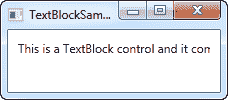

# 文本块（`TextBlock`）控件

> 原文：<https://wpf-tutorial.com/basic-controls/the-textblock-control/>

本质上，TextBlock 不是一个控件，因为它不从 control 类继承，但是它的用法很像 WPF 框架中的任何其他控件，所以为了简单起见，我们称它为控件。

文本块（`TextBlock`）控件是 WPF 中最基本的控件之一，但是它非常有用。它允许你在屏幕上显示文本，就像标签（`Label`）控件一样，但是以一种更简单和更少资源需求的方式。一个常见的理解是，标签用于简短的单行文本(但可能包括例如图像)，而 TextBlock 也适用于多行字符串，但只能包含文本(字符串)。Label 和 TextBlock 都有自己独特的优势，所以您应该根据具体情况选择使用哪一种。

我们已经在“你好，WPF！”中使用了 文本块（`TextBlock`）控件文章，但是现在，让我们看看最简单形式的 TextBlock:

```
<Window x:Class="WpfTutorialSamples.Basic_controls.TextBlockSample"

        xmlns:x="http://schemas.microsoft.com/winfx/2006/xaml"
        Title="TextBlockSample" Height="100" Width="200">
    <Grid>
		<TextBlock>This is a TextBlock</TextBlock>
    </Grid>
</Window>
```


这很简单，如果你已经阅读了本教程的前几章，那么这里应该没有什么新的东西。textBlock 之间的文本只是设置 TextBlock 的 Text 属性的快捷方式。

<input type="hidden" name="IL_IN_ARTICLE">

对于下一个例子，让我们尝试一个更长的文本来展示 TextBlock 如何处理它。我还增加了一些空白，让它看起来更好一点:

```
<Window x:Class="WpfTutorialSamples.Basic_controls.TextBlockSample"

        xmlns:x="http://schemas.microsoft.com/winfx/2006/xaml"
        Title="TextBlockSample" Height="100" Width="200">
    <Grid>
		<TextBlock Margin="10">This is a TextBlock control and it comes with a very long text</TextBlock>
    </Grid>
</Window>
```



## 处理长字符串

您很快就会从截图中意识到，TextBlock 完全能够处理长的多行文本，但是默认情况下它不会做任何事情。在这种情况下，文本太长，无法在窗口中呈现，所以 WPF 尽可能多地呈现文本，然后停止。

幸运的是，有几种方法可以解决这个问题。在下一个示例中，我将向您展示所有这些方法，然后逐一解释:

```
<Window x:Class="WpfTutorialSamples.Basic_controls.TextBlockSample"

        xmlns:x="http://schemas.microsoft.com/winfx/2006/xaml"
        Title="TextBlockSample" Height="200" Width="250">
    <StackPanel>
		<TextBlock Margin="10" Foreground="Red">
			This is a TextBlock control<LineBreak />
			with multiple lines of text.
		</TextBlock>
		<TextBlock Margin="10" TextTrimming="CharacterEllipsis" Foreground="Green">
			This is a TextBlock control with text that may not be rendered completely, which will be indicated with an ellipsis.
		</TextBlock>
		<TextBlock Margin="10" TextWrapping="Wrap" Foreground="Blue">
			This is a TextBlock control with automatically wrapped text, using the TextWrapping property.
		</TextBlock>
	</StackPanel>
</Window>
```


因此，我们有三个 文本块（`TextBlock`）控件，每个控件都有不同的颜色(使用 Foreground 属性),以便于查看。他们都以不同的方式处理文本内容过长的问题:

红色文本块使用**换行**标签在指定位置手动换行。这使您可以绝对控制文本在何处换行，但在大多数情况下这不是很灵活。如果用户将窗口变大，文本仍将在同一位置换行，即使现在可能有足够的空间将整个文本放在一行中。

绿色 TextBlock 使用值为 **CharacterEllipsis** 的 **TextTrimming** 属性使 TextBlock 显示一个省略号(...)当控件容纳不下更多文本时。这是显示有更多文本，但没有足够的空间来显示它的一种常见方式。当你有可能太长的文本，但你绝对不希望它使用超过一行时，这是很棒的。作为对**字符省略号**的替代，您可以使用**单词省略号**，它将在最后一个可能的单词的末尾而不是最后一个可能的字符处修剪文本，防止一个单词只显示一部分。

蓝色 TextBlock 使用值为 **Wrap** 的 **TextWrapping** 属性，使 TextBlock 在无法容纳上一行文本时换行到下一行。与第一个 TextBlock 相反，在第一个 TextBlock 中，我们手动定义文本的换行位置，这是完全自动的，甚至更好:只要 text block 获得更多或更少的可用空间，它也会自动调整。尝试将示例中的窗口变大或变小，您将会看到包装是如何更新以适应这种情况的。

这都是关于在文本块中处理简单的字符串。在下一章中，我们将研究 TextBlock 的一些更高级的功能，它允许我们在 TextBlock 中创建各种样式的文本等等。

* * *