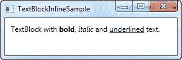
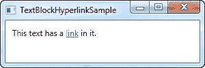
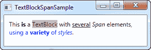
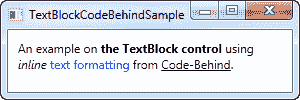

# TextBlock 控件-内联格式

> 原文：<https://wpf-tutorial.com/basic-controls/the-textblock-control-inline-formatting/>

在上一篇文章中，我们研究了 TextBlock 控件的核心功能:显示一个简单的字符串并在必要时包装它。我们甚至使用了不同于默认颜色的另一种颜色来呈现文本，但是如果您不仅仅想为 TextBlock 中的所有文本定义一种静态颜色，那该怎么办呢？

幸运的是，TextBlock 控件支持内联元素。这些类似控件的小构造都继承自 Inline 类，这意味着它们可以作为更大文本的一部分以内联方式呈现。截至发稿时，支持的元素包括 AnchoredBlock、Bold、Hyperlink、InlineUIContainer、Italic、LineBreak、Run、Span 和 Underline。在下面的例子中，我们将看看其中的大部分。

## 粗体、斜体和下划线

这些可能是最简单的内联元素类型。这些名字应该告诉你很多关于它们的功能，但是我们仍然会给你一个如何使用它们的简单例子:

```
<Window x:Class="WpfTutorialSamples.Basic_controls.TextBlockInlineSample"

        xmlns:x="http://schemas.microsoft.com/winfx/2006/xaml"
        Title="TextBlockInlineSample" Height="100" Width="300">
    <Grid>
		<TextBlock Margin="10" TextWrapping="Wrap">
			TextBlock with <Bold>bold</Bold>, <Italic>italic</Italic> and <Underline>underlined</Underline> text.
		</TextBlock>
    </Grid>
</Window>
```

 <input type="hidden" name="IL_IN_ARTICLE">

就像 HTML 一样，你只需要在你的文本周围加上一个粗体标签就可以得到粗体文本等等。这使得在应用程序中创建和显示不同的文本变得非常容易。

所有这三个标记都是 Span 元素的子类，每个标记都在 Span 元素上设置一个特定的属性来创建所需的效果。例如，Bold 标记只设置底层 Span 元素的 FontWeight 属性，Italic 元素设置 FontStyle，等等。

## 换行

简单地在文本中插入一个换行符。请参阅前一章中我们使用 LineBreak 元素的例子。

## 超链接

Hyperlink 元素允许您在文本中包含链接。它以适合您当前 Windows 主题的样式呈现，通常是某种带下划线的蓝色文本，带有红色悬停效果和手动鼠标光标。您可以使用 NavigateUri 属性来定义要导航到的 URL。这里有一个例子:

```
<Window x:Class="WpfTutorialSamples.Basic_controls.TextBlockHyperlinkSample"

        xmlns:x="http://schemas.microsoft.com/winfx/2006/xaml"
        Title="TextBlockHyperlinkSample" Height="100" Width="300">
	<Grid>
		<TextBlock Margin="10" TextWrapping="Wrap">
			This text has a <Hyperlink RequestNavigate="Hyperlink_RequestNavigate" NavigateUri="https://www.google.com">link</Hyperlink> in it.
		</TextBlock>
	</Grid>
</Window>
```



超链接也用于 WPF 页面的内部，可以用来在页面之间导航。在这种情况下，您不必像示例中那样专门处理 RequestNavigate 事件，但是为了从常规的 WPF 应用程序启动外部 URL，我们需要这个事件和 Process 类的一些帮助。我们订阅了 RequestNavigate 事件，该事件允许我们在用户的默认浏览器中使用一个简单的事件处理程序启动链接的 URL，类似于代码隐藏文件中的事件处理程序:

```
private void Hyperlink_RequestNavigate(object sender, System.Windows.Navigation.RequestNavigateEventArgs e)
{
	System.Diagnostics.Process.Start(e.Uri.AbsoluteUri);
}
```

## 奔跑

Run 元素允许您使用 Span 元素的所有可用属性来设置字符串的样式，但是 Span 元素可能包含其他行内元素，而 Run 元素可能只包含纯文本。这使得 Span 元素更加灵活，因此在大多数情况下是合乎逻辑的选择。

## 跨度

默认情况下，Span 元素没有任何特定的呈现，但是允许您设置几乎任何类型的特定呈现，包括字体大小、样式和粗细、背景和前景色等等。Span 元素的伟大之处在于，它允许在其中包含其他行内元素，这使得实现文本和样式的高级组合变得更加容易。在下面的例子中，我使用了许多 Span 元素，向您展示了使用内联 Span 元素的一些可能性:

```
<Window x:Class="WpfTutorialSamples.Basic_controls.TextBlockSpanSample"

        xmlns:x="http://schemas.microsoft.com/winfx/2006/xaml"
        Title="TextBlockSpanSample" Height="100" Width="300">
    <Grid>
		<TextBlock Margin="10" TextWrapping="Wrap">
			This <Span FontWeight="Bold">is</Span> a
			<Span Background="Silver" Foreground="Maroon">TextBlock</Span>
			with <Span TextDecorations="Underline">several</Span>
			<Span FontStyle="Italic">Span</Span> elements,
			<Span Foreground="Blue">
				using a <Bold>variety</Bold> of <Italic>styles</Italic>
			</Span>.
		</TextBlock>
	</Grid>
</Window>
```



因此，正如您所看到的，如果其他元素在您的情况下都没有意义，或者如果您只是想要一个空白画布来开始格式化您的文本，那么 Span 元素是一个很好的选择。

## 从 c#/代码隐藏中格式化文本

正如您所看到的，通过 XAML 格式化文本非常容易，但是在某些情况下，您可能更喜欢或者甚至需要从您的 c#/代码隐藏文件中进行格式化。这有点麻烦，但这里有一个例子告诉你如何做:

```
<Window x:Class="WpfTutorialSamples.Basic_controls.TextBlockCodeBehindSample"

        xmlns:x="http://schemas.microsoft.com/winfx/2006/xaml"
        Title="TextBlockCodeBehindSample" Height="100" Width="300">
    <Grid></Grid>
</Window>
```

```
using System;
using System.Windows;
using System.Windows.Controls;
using System.Windows.Documents;
using System.Windows.Media;

namespace WpfTutorialSamples.Basic_controls
{
	public partial class TextBlockCodeBehindSample : Window
	{
		public TextBlockCodeBehindSample()
		{
			InitializeComponent();
			TextBlock tb = new TextBlock();
			tb.TextWrapping = TextWrapping.Wrap;
			tb.Margin = new Thickness(10);
			tb.Inlines.Add("An example on ");
			tb.Inlines.Add(new Run("the TextBlock control ") { FontWeight = FontWeights.Bold });
			tb.Inlines.Add("using ");
			tb.Inlines.Add(new Run("inline ") { FontStyle = FontStyles.Italic });
			tb.Inlines.Add(new Run("text formatting ") { Foreground = Brushes.Blue });
			tb.Inlines.Add("from ");
			tb.Inlines.Add(new Run("Code-Behind") { TextDecorations = TextDecorations.Underline });
			tb.Inlines.Add(".");
			this.Content = tb;
		}
	}
}
```



有这种可能性当然很好，在某些情况下这样做也是必要的，但这个例子可能会让你更加欣赏 XAML。

* * *