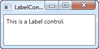
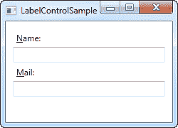
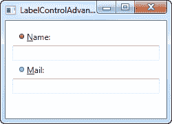

# 标签（`Label`）控件

> 原文：<https://wpf-tutorial.com/basic-controls/the-label-control/>

最简单的 Label 控件看起来非常像我们在另一篇文章中使用的 TextBlock。您会很快注意到，标签有一个内容属性，而不是文本属性。这样做的原因是标签可以直接在其内部承载任何类型的控件，而不仅仅是文本。该内容也可以是字符串，正如您将在第一个非常基本的示例中看到的:

```
<Window x:Class="WpfTutorialSamples.Basic_controls.LabelControlSample"

        xmlns:x="http://schemas.microsoft.com/winfx/2006/xaml"
        Title="LabelControlSample" Height="100" Width="200">
    <Grid>
		<Label Content="This is a Label control." />
	</Grid>
</Window>
```



您可能注意到的另一件事是，默认情况下，标签有一点填充，允许文本呈现在离左上角几个像素的地方。对于 文本块（`TextBlock`）控件，情况并非如此，您必须手动指定它。

在这样一个简单的例子中，内容只是一个字符串，标签实际上会在内部创建一个 TextBlock，并在其中显示您的字符串。

## 标签（`Label`）控件与文本块（`TextBlock`）控件

<input type="hidden" name="IL_IN_ARTICLE">

那么，为什么要使用标签呢？标签和文本块之间有一些重要的区别。TextBlock 仅允许您呈现文本字符串，而 Label 还允许您:

*   指定边框
*   呈现其他控件，例如图像
*   通过 contenttemplate 属性使用模板内容
*   **使用访问键将焦点放在相关控件上**

最后一点实际上是在 文本块（`TextBlock`）控件上使用标签的主要原因之一。每当您只想呈现简单的文本时，您应该使用 文本块（`TextBlock`）控件，因为在大多数情况下，它比 Label 更轻便，性能也更好。

## 标签和访问键(助记键)

在 Windows 和其他操作系统中，您可以通过按住[Alt]键，然后按下与您希望访问的控件相对应的字符来访问对话框中的控件，这是一种常见的做法。按住[Alt]键时，要按的字符将突出显示。文本块（`TextBlock`）控件不支持此功能，但 Label 支持，因此对于控件标签，Label 控件通常是一个很好的选择。让我们来看一个实际应用的例子:

```
<Window x:Class="WpfTutorialSamples.Basic_controls.LabelControlSample"

        xmlns:x="http://schemas.microsoft.com/winfx/2006/xaml"
        Title="LabelControlSample" Height="180" Width="250">
	<StackPanel Margin="10">
		<Label Content="_Name:" Target="{Binding ElementName=txtName}" />
		<TextBox Name="txtName" />
		<Label Content="_Mail:" Target="{Binding ElementName=txtMail}" />
		<TextBox Name="txtMail" />
	</StackPanel>
</Window>
```



该屏幕截图显示了我们的示例对话框在按下 Alt 键时的样子。尝试运行它，按住[Alt]键，然后按 N 和 m。您将看到焦点如何在两个文本框之间移动。

这里有几个新概念。首先，我们通过在字符前加一个下划线(_)来定义访问键。它不必是第一个字符，可以在标签内容中的任何字符之前。通常的做法是将第一个尚未使用的字符用作另一个控件的访问键。

我们使用**目标**属性来连接标签和指定的控件。我们为此使用了一个标准的 WPF 绑定，使用了**元素名**属性，所有这些我们将在本教程稍后描述。该绑定基于控件的名称，因此如果您更改了该名称，还必须记住更改绑定。

## 使用控件作为标签内容

如前所述，Label 控件允许您承载其他控件，同时仍然保留其他优点。让我们尝试一个例子，在这个例子中，我们在标签中有一个图像和一段文本，同时每个标签都有一个访问键:

```
<Window x:Class="WpfTutorialSamples.Basic_controls.LabelControlAdvancedSample"

        xmlns:x="http://schemas.microsoft.com/winfx/2006/xaml"
        Title="LabelControlAdvancedSample" Height="180" Width="250">
	<StackPanel Margin="10">
		<Label Target="{Binding ElementName=txtName}">
			<StackPanel Orientation="Horizontal">
				<Image Source="http://cdn1.iconfinder.com/data/icons/fatcow/16/bullet_green.png" />
				<AccessText Text="_Name:" />
			</StackPanel>
		</Label>
		<TextBox Name="txtName" />
		<Label Target="{Binding ElementName=txtMail}">
			<StackPanel Orientation="Horizontal">
				<Image Source="http://cdn1.iconfinder.com/data/icons/fatcow/16/bullet_blue.png" />
				<AccessText Text="_Mail:" />
			</StackPanel>
		</Label>
		<TextBox Name="txtMail" />
	</StackPanel>
</Window>
```



这只是前一个示例的扩展版本——我们的标签现在将包含一个图像和一段文本，而不是简单的文本字符串(在 AccessText 控件中，这允许我们仍然使用标签的访问键)。这两个控件都在一个水平 StackPanel 中，因为这个标签就像任何其他 ContentControl 派生一样，只能承载一个直接的子控件。

本教程后面描述的图像（`Image`）控件使用了一个远程图像——这只是为了演示的目的，对于大多数实际应用来说并不是一个好主意。

## 摘要

在大多数情况下，Label 控件正如其名称所暗示的那样:它充当另一个控件的文本标签。这是它的主要目的。对于大多数其他情况，您可能应该使用 文本块（`TextBlock`）控件或 WPF 提供的其他文本容器之一。

* * *