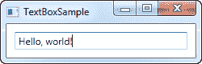
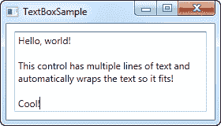
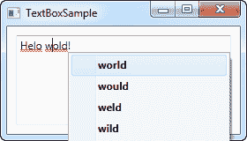
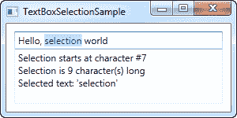

# 文本框控件

> 原文：<https://wpf-tutorial.com/basic-controls/the-textbox-control/>

TextBox 控件是 WPF 中最基本的文本输入控件，它允许最终用户编写纯文本，既可以在一行中进行对话框输入，也可以像编辑器一样在多行中编写。

## 单行文本框

TextBox 控件是一个非常常用的东西，实际上您不需要在它上面使用任何属性，就可以拥有一个完整的可编辑文本字段。这里有一个赤裸裸的例子:

```
<Window x:Class="WpfTutorialSamples.Basic_controls.TextBoxSample"

        xmlns:x="http://schemas.microsoft.com/winfx/2006/xaml"
        Title="TextBoxSample" Height="80" Width="250">
    <StackPanel Margin="10">
		<TextBox />
	</StackPanel>
</Window>
```



这就是获得文本字段所需的全部内容。我在运行示例之后、截图之前添加了文本，但是您也可以通过标记来完成，使用 text 属性来预填充文本框:

<input type="hidden" name="IL_IN_ARTICLE">

```
<TextBox Text="Hello, world!" />
```

尝试右键单击文本框。你将得到一个选项菜单，允许你使用 Windows 剪贴板中的文本框。撤销和重做的默认快捷键(Ctrl+Z 和 Ctrl+Y)应该也可以使用，而且所有这些功能都是免费的！

## 多行文本框

如果运行上面的示例，您会注意到默认情况下 TextBox 控件是一个单行控件。当您按 Enter 键时不会发生任何事情，如果您添加的文本超过了一行所能容纳的范围，控件只会滚动。但是，将 TextBox 控件制作成多行编辑器非常简单:

```
<Window x:Class="WpfTutorialSamples.Basic_controls.TextBoxSample"

        xmlns:x="http://schemas.microsoft.com/winfx/2006/xaml"
        Title="TextBoxSample" Height="160" Width="280">
    <Grid Margin="10">
		<TextBox AcceptsReturn="True" TextWrapping="Wrap" />
	</Grid>
</Window>
```



我添加了两个属性:AcceptsReturn 通过允许使用 Enter/Return 键转到下一行来使 TextBox 成为多行控件，以及 TextWrapping 属性，该属性将使文本在到达行尾时自动换行。

## 用文本框进行拼写检查

作为一个额外的好处，TextBox 控件实际上附带了针对英语和其他几种语言的自动拼写检查(截至编写时，支持英语、法语、德语和西班牙语)。

它的工作方式很像微软的 Word，拼写错误用下划线标出，你可以用鼠标右键点击它，找到建议的替代方法。启用拼写检查非常简单:

```
<Window x:Class="WpfTutorialSamples.Basic_controls.TextBoxSample"

        xmlns:x="http://schemas.microsoft.com/winfx/2006/xaml"
        Title="TextBoxSample" Height="160" Width="280">
    <Grid Margin="10">
		<TextBox AcceptsReturn="True" TextWrapping="Wrap" SpellCheck.IsEnabled="True" Language="en-US" />
	</Grid>
</Window>
```



我们使用了前面的多行 textbox 示例作为基础，然后我添加了两个新属性:拼写检查类中名为 IsEnabled 的 attached 属性，它只是在父控件上启用拼写检查，以及 Language 属性，它指示拼写检查器使用哪种语言。

## 使用文本框选择

就像 Windows 中的任何其他可编辑控件一样，TextBox 允许选择文本，例如，一次删除整个单词或将一段文本复制到剪贴板。WPF 文本框有几个用于处理选定文本的属性，所有这些属性你都可以阅读甚至修改。在下一个示例中，我们将读取这些属性:

```
<Window x:Class="WpfTutorialSamples.Basic_controls.TextBoxSelectionSample"

        xmlns:x="http://schemas.microsoft.com/winfx/2006/xaml"
        Title="TextBoxSelectionSample" Height="150" Width="300">
	<DockPanel Margin="10">
		<TextBox SelectionChanged="TextBox_SelectionChanged" DockPanel.Dock="Top" />
		<TextBox Name="txtStatus" AcceptsReturn="True" TextWrapping="Wrap" IsReadOnly="True" />

	</DockPanel>
</Window>
```

该示例由两个 TextBox 控件组成:一个用于编辑，另一个用于将当前选择状态输出到。为此，我们将 IsReadOnly 属性设置为 true，以防止编辑 status TextBox。我们在第一个文本框上订阅 SelectionChanged 事件，该事件在代码隐藏中处理:

```
using System;
using System.Text;
using System.Windows;
using System.Windows.Controls;

namespace WpfTutorialSamples.Basic_controls
{
	public partial class TextBoxSelectionSample : Window
	{
		public TextBoxSelectionSample()
		{
			InitializeComponent();
		}

		private void TextBox_SelectionChanged(object sender, RoutedEventArgs e)
		{
			TextBox textBox = sender as TextBox;
			txtStatus.Text = "Selection starts at character #" + textBox.SelectionStart + Environment.NewLine;
			txtStatus.Text += "Selection is " + textBox.SelectionLength + " character(s) long" + Environment.NewLine;
			txtStatus.Text += "Selected text: '" + textBox.SelectedText + "'";
		}
	}
}
```



我们使用三个有趣的属性来实现这一点:

**SelectionStart** ，它给我们当前的光标位置，或者如果有选择:它从哪里开始。

**SelectionLength** ，它给出了当前选择的长度，如果有的话。否则它将返回 0。

**SelectedText** ，如果有选择的话，会给出当前选中的字符串。否则返回一个空字符串。

## 修改选择

所有这些属性都是可读和可写的，这意味着您也可以修改它们。例如，可以设置 SelectionStart 和 SelectionLength 属性来选择自定义的文本范围，或者可以使用 SelectedText 属性来插入和选择字符串。请记住，文本框必须有焦点，例如，首先调用 focus()方法，这样才能工作。

* * *