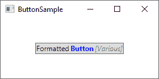

# 按钮（`Button`）控件

> 原文：<https://wpf-tutorial.com/basic-controls/the-button-control/>

没有按钮（`Button`）控件的 GUI 框架是不完整的，所以 WPF 当然有一个很好的按钮（`Button`）控件，就像其他的框架控件一样，它非常灵活，可以让你完成几乎任何事情。但是让我们从一些基本的例子开始。

## 一个简单的按钮

就像许多其他 WPF 控件一样，只需在窗口中添加一个按钮标签就可以显示一个按钮。如果您将文本放在标签(或另一个控件)之间，它将作为按钮的内容:

```
<Button>Hello, world!</Button>
```


很简单，对吧？当然，该按钮实际上还没有做任何事情，但是如果你指向它，你会发现它开箱后就有一个很好的悬停效果。但是让我们让按钮做点什么，通过订阅它的 **Click** 事件(关于这个过程的更多信息可以在 XAML 订阅事件的文章中找到):

<input type="hidden" name="IL_IN_ARTICLE">

```
<Button Click="HelloWorldButton_Click">Hello, World!</Button>
```

在代码隐藏中，您需要一个匹配的方法来处理单击:

```
private void HelloWorldButton_Click(object sender, RoutedEventArgs e)
{
    MessageBox.Show("Hello, world!");
}
```

你现在有一个非常基本的按钮，当你点击它时，会显示一条消息！

### 格式化内容

在内部，按钮内容中的简单文本被转换成 文本块（`TextBlock`）控件，这也意味着您可以控制文本格式的相同方面。你会发现按钮（`Button`）控件上有几个属性可以做到这一点，包括(但不限于)**前台**、**后台**、 **FontWeight** 等等。换句话说，更改按钮（`Button`）控件中文本的格式非常容易:

```
<Button Background="Beige" Foreground="Blue" FontWeight="Bold">Formatted Button</Button>
```


通过直接在按钮上设置这些属性，您当然只能对所有内容应用相同的格式，但是如果这还不够好，请继续阅读以获得更高级的内容格式。

## 具有高级内容的按钮

我们已经多次讨论过这个问题，但是 WPF 的一个非常酷的地方是能够用其他 WPF 控件替换控件中的简单文本。这也意味着你不必将你的按钮局限于简单的文本，以同样的方式格式化——你可以添加几个不同格式的文本控件。WPF 按钮只支持一个直接的子控件，但是你可以把它变成一个面板，这样它就可以承载你所需要的任何数量的控件。您可以用它来创建各种格式的按钮:

```
<Button>
    <StackPanel Orientation="Horizontal">
    <TextBlock>Formatted </TextBlock>
    <TextBlock Foreground="Blue" FontWeight="Bold" Margin="2,0">Button</TextBlock>
    <TextBlock Foreground="Gray" FontStyle="Italic">[Various]</TextBlock>
    </StackPanel>
</Button>
```



但是当然，你不仅仅局限于文本——你可以在你的按钮里放入任何你想要的东西，这就把我们带到了一个我知道很多人会问的话题。有图像的按钮！

### 带图像的按钮(ImageButton)

在许多 UI 框架中，你会发现一个常规的按钮，然后是一个或几个其他的变体，它们会提供额外的特性。最常用的变体之一是 **ImageButton** ，顾名思义，这是一个通常允许你在文本前包含图像的按钮。但是在 WPF，不需要一个单独的控件来完成这个——正如你刚才看到的，我们可以在一个按钮里放几个控件，所以你可以很容易地添加一个图像（`Image`）控件，就像这样:

```
<Button Padding="5">  
    <StackPanel Orientation="Horizontal">  
    <Image Source="/WpfTutorialSamples;componeimg/help.png" />  
    <TextBlock Margin="5,0">Help</TextBlock>  
    </StackPanel>  
</Button>
```


在 WPF 创建一个 ImageButton 真的很简单，当然你也可以随意移动东西，例如，如果你想让图片在文本之后而不是之前，等等。

## 按钮衬垫

你可能已经注意到，WPF 框架中的按钮在默认情况下没有任何填充。这意味着文本非常靠近边框，这可能看起来有点奇怪，因为大多数按钮在其他地方(网络，其他应用等。)侧面至少要有一些衬垫。不用担心，因为按钮带有一个**填充**属性:

```
<Button Padding="5,2">Hello, World!</Button>
```

这将在两侧应用 5 个像素的填充，在顶部和底部应用 2 个像素的填充。但是在某种程度上，将填充应用到所有的按钮可能会有点累，所以这里有一个小技巧:你可以使用一个样式在整个应用中全局应用填充，或者只在这个特定的窗口中应用填充(稍后将详细介绍样式)。这里有一个例子，我们使用*窗口将它应用到窗口。资源*属性:

```
<Window.Resources>
    <Style TargetType="{x:Type Button}">
    <Setter Property="Padding" Value="5,2"/>
    </Style>
</Window.Resources>
```

这个填充现在将应用于所有按钮，但是您当然可以通过在按钮上专门定义 padding 属性来覆盖它。以下是本示例中所有按钮使用通用填充时的外观:


## 摘要

正如你从这篇文章中看到的，在 WPF 框架中使用按钮非常容易，而且你可以不断地定制这个重要的控件。

* * *