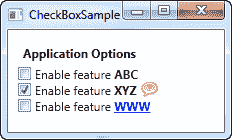
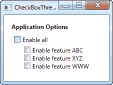

# 复选框控件

> 原文：<https://wpf-tutorial.com/basic-controls/the-checkbox-control/>

CheckBox 控件允许最终用户打开或关闭一个选项，通常在代码隐藏中反映一个布尔值。如果您不确定复选框的外观，让我们直接看一个例子:

```
<Window x:Class="WpfTutorialSamples.Basic_controls.CheckBoxSample"

        xmlns:x="http://schemas.microsoft.com/winfx/2006/xaml"
        Title="CheckBoxSample" Height="140" Width="250">
    <StackPanel Margin="10">
		<Label FontWeight="Bold">Application Options</Label>
		<CheckBox>Enable feature ABC</CheckBox>
		<CheckBox IsChecked="True">Enable feature XYZ</CheckBox>
		<CheckBox>Enable feature WWW</CheckBox>
	</StackPanel>
</Window>
```


如您所见，复选框非常容易使用。对于第二个复选框，我使用 IsChecked 属性默认选中它，但除此之外，不需要任何属性来使用它。如果要检查某个复选框是否已选中，也应该从代码隐藏中使用 IsChecked 属性。

## 自定义内容

CheckBox 控件继承自 ContentControl 类，这意味着它可以接受自定义内容并显示在其旁边。如果你只是指定一段文本，就像我在上面的例子中做的那样，WPF 会把它放在一个 TextBlock 控件中并显示它，但这只是一个让你更容易的快捷方式。您可以在其中使用任何类型的控件，我们将在下一个示例中看到:

<input type="hidden" name="IL_IN_ARTICLE">

```
<Window x:Class="WpfTutorialSamples.Basic_controls.CheckBoxSample"

        xmlns:x="http://schemas.microsoft.com/winfx/2006/xaml"
        Title="CheckBoxSample" Height="140" Width="250">
    <StackPanel Margin="10">
		<Label FontWeight="Bold">Application Options</Label>
		<CheckBox>
			<TextBlock>
				Enable feature <Run Foreground="Green" FontWeight="Bold">ABC</Run>
			</TextBlock>
		</CheckBox>
		<CheckBox IsChecked="True">
			<WrapPanel>
				<TextBlock>
					Enable feature <Run FontWeight="Bold">XYZ</Run>
				</TextBlock>
				<Image Source="/WpfTutorialSamples;componeimg/question.png" Width="16" Height="16" Margin="5,0" />
			</WrapPanel>
		</CheckBox>
		<CheckBox>
			<TextBlock>
				Enable feature <Run Foreground="Blue" TextDecorations="Underline" FontWeight="Bold">WWW</Run>
			</TextBlock>
		</CheckBox>
	</StackPanel>
</Window>
```



从示例标记中可以看出，您可以对内容做任何想做的事情。在这三个复选框中，我对文本做了不同的处理，在中间的一个复选框中，我甚至加入了一个图像控件。通过指定一个控件作为内容，而不仅仅是文本，我们可以更好地控制外观，最酷的是无论你点击内容的哪一部分，它都会激活复选框并切换它的开关。

## IsThreeState 属性

如前所述，复选框通常对应一个布尔值，这意味着它只有两种状态:真或假(开或关)。然而，由于布尔数据类型可能是可空的，有效地允许第三个选项(真、假或空)，CheckBox 控件也可以支持这种情况。通过将 IsThreeState 属性设置为 true，复选框将获得第三种状态，称为“不确定状态”。

一种常见的用法是拥有一个“Enable all”复选框，它可以控制一组子复选框，并显示它们的集合状态。我们的示例显示了如何创建一个可以打开和关闭的功能列表，在顶部有一个常见的“Enable all”复选框:

```
<Window x:Class="WpfTutorialSamples.Basic_controls.CheckBoxThreeStateSample"

        xmlns:x="http://schemas.microsoft.com/winfx/2006/xaml"
        Title="CheckBoxThreeStateSample" Height="170" Width="300">
	<StackPanel Margin="10">
		<Label FontWeight="Bold">Application Options</Label>
		<StackPanel Margin="10,5">
			<CheckBox IsThreeState="True" Name="cbAllFeatures" Checked="cbAllFeatures_CheckedChanged" Unchecked="cbAllFeatures_CheckedChanged">Enable all</CheckBox>
			<StackPanel Margin="20,5">
				<CheckBox Name="cbFeatureAbc" Checked="cbFeature_CheckedChanged" Unchecked="cbFeature_CheckedChanged">Enable feature ABC</CheckBox>
				<CheckBox Name="cbFeatureXyz" IsChecked="True" Checked="cbFeature_CheckedChanged" Unchecked="cbFeature_CheckedChanged">Enable feature XYZ</CheckBox>
				<CheckBox Name="cbFeatureWww" Checked="cbFeature_CheckedChanged" Unchecked="cbFeature_CheckedChanged">Enable feature WWW</CheckBox>
			</StackPanel>
		</StackPanel>
	</StackPanel>
</Window>
```

```
using System;
using System.Windows;

namespace WpfTutorialSamples.Basic_controls
{
	public partial class CheckBoxThreeStateSample : Window
	{
		public CheckBoxThreeStateSample()
		{
			InitializeComponent();
		}

		private void cbAllFeatures_CheckedChanged(object sender, RoutedEventArgs e)
		{
			bool newVal = (cbAllFeatures.IsChecked == true);
			cbFeatureAbc.IsChecked = newVal;
			cbFeatureXyz.IsChecked = newVal;
			cbFeatureWww.IsChecked = newVal;
		}

		private void cbFeature_CheckedChanged(object sender, RoutedEventArgs e)
		{
			cbAllFeatures.IsChecked = null;
			if((cbFeatureAbc.IsChecked == true) && (cbFeatureXyz.IsChecked == true) && (cbFeatureWww.IsChecked == true))
				cbAllFeatures.IsChecked = true;
			if((cbFeatureAbc.IsChecked == false) && (cbFeatureXyz.IsChecked == false) && (cbFeatureWww.IsChecked == false))
				cbAllFeatures.IsChecked = false;
		}

	}
}
```



这个例子从两个不同的角度工作:如果您选中或取消选中“Enable all”复选框，那么所有的子复选框，在我们的例子中每个代表一个应用程序特性，要么被选中，要么被取消选中。反之亦然，选中或取消选中一个子复选框会影响“Enable all”复选框的状态:如果它们都被选中或取消选中，那么“Enable all”复选框将获得相同的状态——否则该值将为空，这将迫使复选框进入不确定状态。

所有这些行为都可以在上面的截图中看到，并且是通过订阅复选框控件的选中和未选中事件来实现的。在现实世界的示例中，您可能会绑定这些值，但是这个示例显示了使用 IsThreeState 属性创建“切换全部”效果的基本操作。

* * *