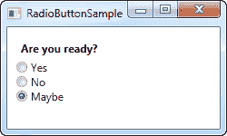
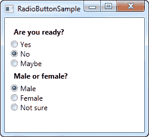
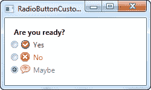

# 单选按钮（`RadioButton`）控件

> 原文：<https://wpf-tutorial.com/basic-controls/the-radiobutton-control/>

RadioButton 控件允许您为用户提供一个可能选项的列表，同时只能选择其中一个选项。使用 组合框（`ComboBox`）控件可以用更少的空间达到同样的效果，但是一组单选按钮可以让用户更好地了解他们所拥有的选项。

```
<Window x:Class="WpfTutorialSamples.Basic_controls.RadioButtonSample"

        xmlns:x="http://schemas.microsoft.com/winfx/2006/xaml"
        Title="RadioButtonSample" Height="150" Width="250">
	<StackPanel Margin="10">
		<Label FontWeight="Bold">Are you ready?</Label>
		<RadioButton>Yes</RadioButton>
		<RadioButton>No</RadioButton>
		<RadioButton IsChecked="True">Maybe</RadioButton>
	</StackPanel>
</Window>
```



我们所做的就是添加一个带有问题的标签，然后添加三个单选按钮，每个按钮都有一个可能的答案。我们通过在最后一个单选按钮上使用 IsChecked 属性来定义一个默认选项，用户只需单击其他单选按钮之一就可以更改它。这也是您想从代码隐藏中用来检查单选按钮是否被选中的属性。

## 单选按钮组

如果您尝试运行上面的示例，您将会看到，正如所承诺的那样，同一时间只能选中一个 RadioButton。但是，如果您想要几组单选按钮，每组都有自己单独的选项，该怎么办呢？这就是**组名**属性发挥作用的地方，它允许 指定哪些单选按钮属于同一个组。这里有一个例子:

<input type="hidden" name="IL_IN_ARTICLE">

```
<Window x:Class="WpfTutorialSamples.Basic_controls.RadioButtonSample"

        xmlns:x="http://schemas.microsoft.com/winfx/2006/xaml"
        Title="RadioButtonSample" Height="230" Width="250">
	<StackPanel Margin="10">
		<Label FontWeight="Bold">Are you ready?</Label>
		<RadioButton GroupName="ready">Yes</RadioButton>
		<RadioButton GroupName="ready">No</RadioButton>
		<RadioButton GroupName="ready" IsChecked="True">Maybe</RadioButton>

		<Label FontWeight="Bold">Male or female?</Label>
		<RadioButton GroupName="sex">Male</RadioButton>
		<RadioButton GroupName="sex">Female</RadioButton>
		<RadioButton GroupName="sex" IsChecked="True">Not sure</RadioButton>
	</StackPanel>
</Window>
```



通过在每个单选按钮上设置 GroupName 属性，现在可以为两个组中的每一个组进行选择。否则，所有六个单选按钮只能有一个选项。

## 自定义内容

RadioButton 继承自 ContentControl 类，这意味着它可以接受自定义内容并显示在其旁边。如果你只是指定一段文本，就像我在上面的例子中做的那样，WPF 会把它放在一个 文本块（`TextBlock`）控件中并显示它，但这只是一个让你更容易的快捷方式。您可以在其中使用任何类型的控件，我们将在下一个示例中看到:

```
<Window x:Class="WpfTutorialSamples.Basic_controls.RadioButtonCustomContentSample"

        xmlns:x="http://schemas.microsoft.com/winfx/2006/xaml"
        Title="RadioButtonCustomContentSample" Height="150" Width="250">
	<StackPanel Margin="10">
		<Label FontWeight="Bold">Are you ready?</Label>
		<RadioButton>
			<WrapPanel>
				<Image Source="/WpfTutorialSamples;componeimg/accept.png" Width="16" Height="16" Margin="0,0,5,0" />
				<TextBlock Text="Yes" Foreground="Green" />
			</WrapPanel>
		</RadioButton>
		<RadioButton Margin="0,5">
			<WrapPanel>
				<Image Source="/WpfTutorialSamples;componeimg/cancel.png" Width="16" Height="16" Margin="0,0,5,0" />
				<TextBlock Text="No" Foreground="Red" />
			</WrapPanel>
		</RadioButton>
		<RadioButton IsChecked="True">
			<WrapPanel>
				<Image Source="/WpfTutorialSamples;componeimg/question.png" Width="16" Height="16" Margin="0,0,5,0" />
				<TextBlock Text="Maybe" Foreground="Gray" />
			</WrapPanel>
		</RadioButton>
	</StackPanel>
</Window>
```



从标签的角度来看，这个例子有点沉重，但是概念非常简单。对于每个 RadioButton，我们都有一个 WrapPanel，里面有一个图像和一段文本。由于我们现在使用 文本块（`TextBlock`）控件来控制文本，这也允许我们以任何想要的方式格式化文本。对于这个例子，我已经改变了文本颜色来匹配选择。图像（`Image`）控件(稍后将详细介绍)用于显示每个选项的图像。

请注意，您可以单击 RadioButton 上的任意位置，甚至是图像或文本来打开它，因为我们已经将它指定为 RadioButton 的内容。如果你把它作为一个单独的面板，放在 RadioButton 旁边，用户将不得不直接点击 RadioButton 的圆形来激活它，这是不太实际的。

* * *