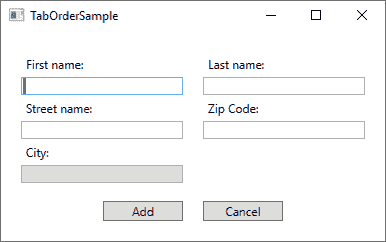

# Tab 键顺序

> 原文：<https://wpf-tutorial.com/control-concepts/tab-order/>

如果你在计算机上工作了足够长的时间，想要学习编程，你可能也知道你可以使用键盘上的 Tab 键来浏览一个窗口/对话框。这允许您在填写表单或类似的东西时将手放在键盘上，而不是使用鼠标来选择下一个字段/控件。

WPF 直接支持这种行为，甚至更好:当从一个字段移动到另一个字段时，它会自动建立使用的顺序，所以一般来说，你根本不用担心这一点。然而，有时你的窗口/对话框的设计会导致 WPF 使用你可能不同意的 tab 键顺序，原因有很多。此外，您可以决定某些控件不应该是跳转顺序的一部分。请允许我用一个例子来说明这一点:



这个对话框由一个网格组成，中间分开，两边是 StackPanel，包含标签和文本框。默认的 tab 键顺序行为是从窗口的第一个控件开始，然后在移动到下一个控件之前，通过在其中找到的每个子控件进行 tab 键切换。由于对话框由垂直方向的栈面板组成，这意味着我们将从*名字*字段开始，然后移动到*街道名称*字段，然后是*城市*字段，然后移动到包含*姓氏*和*邮政编码*字段的第二个栈面板。当 tab 离开第二个栈面板时，这两个按钮将最终被触及。

然而，对于这个对话框，这不是我想要的行为。相反，我想从*的名字*跳转到*的姓氏*(所以基本上是水平移动而不是垂直移动)，最重要的是，当在表单中跳转时，我不想进入*的城市*字段，因为它将根据这个假想对话框中的*邮政编码*自动填充，因此被设为只读。为了完成所有这些，我将使用两个属性: **TabIndex** 和 **IsTabStop** 。TabIndex 用于定义顺序，而 IsTabStop 属性将强制 WPF 在跳转窗口时跳过一个控件。下面是用于创建对话框的标签:

```
<Window x:Class="WpfTutorialSamples.Control_concepts.TabOrderSample"

    xmlns:x="http://schemas.microsoft.com/winfx/2006/xaml"
    xmlns:d="http://schemas.microsoft.com/expression/blend/2008"
    xmlns:mc="http://schemas.openxmlformats.org/markup-compatibility/2006"
    xmlns:local="clr-namespace:WpfTutorialSamples.Control_concepts"
    mc:Ignorable="d"
    Title="TabOrderSample" Height="250" Width="400">
    <Grid Margin="20">
    <Grid.ColumnDefinitions>
        <ColumnDefinition Width="*" />
        <ColumnDefinition Width="20" />
        <ColumnDefinition Width="*" />
    </Grid.ColumnDefinitions>
    <Grid.RowDefinitions>
        <RowDefinition Height="*" />
        <RowDefinition Height="Auto" />
    </Grid.RowDefinitions>
    <StackPanel>
        <Label>First name:</Label>
        <TextBox TabIndex="0" />
        <Label>Street name:</Label>
        <TextBox TabIndex="2" />
        <Label>City:</Label>
        <TextBox TabIndex="5" IsReadOnly="True" IsTabStop="False" Background="Gainsboro" />
    </StackPanel>
    <StackPanel Grid.Column="2">
        <Label>Last name:</Label>
        <TextBox TabIndex="1" />
        <Label>Zip Code:</Label>
        <TextBox TabIndex="4" />
    </StackPanel>
    <Button Grid.Row="1" HorizontalAlignment="Right" Width="80">Add</Button>
    <Button Grid.Row="1" Grid.Column="2" HorizontalAlignment="Left" Width="80">Cancel</Button>
    </Grid>
</Window>
```

<input type="hidden" name="IL_IN_ARTICLE">

注意，我只是在 **TabIndex** 属性中给每个相关控件一个数字，然后对用于城市的文本框使用**IsTabStop**——控制对话框中的 tab 键顺序就是这么简单！

## 摘要

控制对话框的 tab 键顺序非常重要，但对我们来说幸运的是，WPF 在为你自动定义合适的 tab 键顺序方面做得非常好。然而，在某些情况下，使用 **TabIndex** 和 **IsTabStop** 属性进行控制是有意义的，如上例所示。

* * *