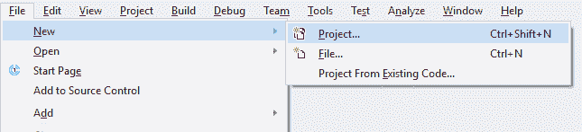

# 访问键

> 原文：<https://wpf-tutorial.com/control-concepts/access-keys/>

**访问键**的概念，有时被称为*加速键*或*键盘加速键*，允许你通过按住 Alt 键然后按下键盘上的另一个键来到达窗口内的特定控件。这增强了窗口的可用性，因为它允许用户使用键盘来导航窗口，而不必使用鼠标。

## 定义访问键

为 WPF 控件定义访问键非常容易，但是这种方法可能会让您有点吃惊。通常，这将有一个属性，但访问键没有。相反，您可以通过在控件的 Text/Content 属性中将下划线作为字母的前缀来定义访问键。例如，像这样:

```
<Button Content="_New"></Button>
```

注意 N 字符前面的下划线(_)——这将把 N 键变成这个按钮（`Button`）控件的指定访问键。默认情况下，控件的外观不会改变，从这个例子中可以看出，我已经为所有按钮定义了访问键:

 <input type="hidden" name="IL_IN_ARTICLE">

但是，一旦您按下键盘上的 **Alt** 键，可用的访问键就会以下划线突出显示:


按住 **Alt** 键的同时，您现在可以按下其中一个访问键(如 N、O 或 S)来激活特定的按钮。它会像被鼠标点击一样做出反应。

访问键适用于对话框/窗口中的单个元素，但它们在传统的窗口菜单中更有用，在传统的窗口菜单中，您通常需要在菜单项的层次结构中单击才能找到您需要的菜单项。下面是一个来自 Visual Studio 的示例:



在这种情况下，当我想开始一个新项目时，我不必通过几次鼠标移动和点击来浏览菜单，我可以按住 **Alt** 键，然后按 **F** (对于*文件*)，然后按 **N** (对于*新*)，然后按 **P** (对于*项目*)。当然，这也可以通过常规的键盘快捷键(Ctrl+Shift+N)来实现，但是直到你到达菜单层级的最后一级时，该快捷键才可见，所以除非你已经记住了它，否则使用访问键可能会更容易，因为一旦你按下 **Alt** 键，它们就会在视觉上高亮显示。

### 哪些字符应该用作访问键？

您可能想使用控制文本/内容中的任何字符，但是实际上有选择正确字符的指导原则。最重要的规则当然是选择一个没有被另一个控件使用过的字符，但是除此之外，你还应该遵循以下原则:

*   使用**首字**的**首字**
*   如果不可能，使用第二个或第三个单词的第一个字符(如*中的 **A** 另存为*
*   如果不可能，使用第一个单词的第二个字符(例如*打开*中的 **P**
*   如果不可能，使用第二个或第三个单词的第二个字符(例如*中的 **l** 保存所有*
*   总的来说，你可能想避免像 *i* 和 *l* 这样的窄字符，而选择像 *m* 、 *s* 、 *w* 等更宽的字符。

## 将两个控件绑定在一起

在我们到目前为止看到的例子中，我们已经能够在我们想要访问的控件上直接定义访问键。但是至少有一个例子说明这是不可能的:当你有一个输入控件时，比如一个 **TextBox** ，表明其用途的文本并不存在于实际的 TextBox 控件中。相反，您通常会使用第二个控件通过文本来指示 TextBox 控件的用途。这通常是一个**标签**控件。

因此，在本例中，Label 控件将包含描述性文本，因此也包含访问键，但是您希望关注的控件将是 TextBox 控件。没问题——我们可以使用标签的目标属性将它与文本框(或任何其他控件)绑定在一起，就像这样:

```
<StackPanel Margin="20">
    <Label Content="_First name:" Target="{Binding ElementName=txtFirstName}" />
    <TextBox Name="txtFirstName" />
    <Label Content="_Last name:" Target="{Binding ElementName=txtLastName}" />
    <TextBox Name="txtLastName" />
    <Button Content="_Save" Margin="20"></Button>
</StackPanel>
```

注意如何为标签（`Label`）控件指定访问键，然后使用**目标**属性将其绑定到相关的**文本框**控件，这里我们使用基于**元素名称**的**绑定**来完成实际工作。现在，我们可以使用 Alt+F 和 Alt+L 来访问两个文本框（`TextBox`）控件，使用 Alt+S 来访问按钮。


## 摘要

通过在你的窗口/对话框中使用访问键，你使得人们只使用他们的键盘导航变得更加容易。这在超级用户中尤其流行，他们会尽可能地使用键盘而不是鼠标。你应该总是使用访问键，尤其是对于你的菜单。

* * *