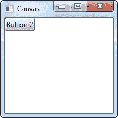
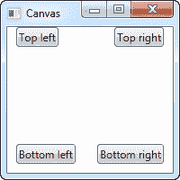
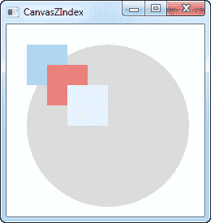
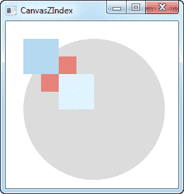

# 画布控件

> 原文：<https://wpf-tutorial.com/panels/canvas/>

画布可能是所有面板中最简单的。默认情况下，它并不做任何事情，它只是允许你把控件放入其中，然后使用显式坐标自己定位它们。

如果你曾经使用过另一个 UI 库，比如 WinForms，这可能会让你有宾至如归的感觉，但是虽然拥有所有子控件的绝对控制权很诱人，但这也意味着一旦用户开始调整你的窗口大小，如果你本地化绝对定位的文本或者如果内容被缩放，面板将不会为你做任何事情。

稍后再详细介绍，我们来看一个简单的例子。这主要是向您展示默认情况下画布做的事情有多少:

```
<Window x:Class="WpfTutorialSamples.Panels.Canvas"

        xmlns:x="http://schemas.microsoft.com/winfx/2006/xaml"
        Title="Canvas" Height="200" Width="200">
	<Canvas>
		<Button>Button 1</Button>
		<Button>Button 2</Button>
	</Canvas>
</Window>
```



如您所见，尽管我们有两个按钮，但它们都被放置在完全相同的位置，因此只有最后一个是可见的。画布什么也不做，直到你开始给子控件坐标。这是使用画布控件的左、右、上、下附加属性完成的。

<input type="hidden" name="IL_IN_ARTICLE">

这些属性允许您指定相对于画布四个边缘的位置。默认情况下，它们都被设置为 NaN(不是一个数字)，这将使画布将它们放置在左上角，但如上所述，您可以很容易地更改这一点:

```
<Window x:Class="WpfTutorialSamples.Panels.Canvas"

        xmlns:x="http://schemas.microsoft.com/winfx/2006/xaml"
        Title="Canvas" Height="200" Width="200">
	<Canvas>
		<Button Canvas.Left="10">Top left</Button>
		<Button Canvas.Right="10">Top right</Button>
		<Button Canvas.Left="10" Canvas.Bottom="10">Bottom left</Button>
		<Button Canvas.Right="10" Canvas.Bottom="10">Bottom right</Button>
	</Canvas>
</Window>
```



请注意我是如何只设置我需要的属性的。对于前两个按钮，我只想为 X 轴指定一个值，所以我使用 Left 和 Right 属性从每个方向将按钮推向中心。

对于底部的按钮，我使用左/右和底部两个方向将它们推向中心。您通常会指定上限值或下限值和/或左值或右值。

如前所述，由于画布给了你对位置的完全控制，它不会真的关心是否有足够的空间来放置所有的控件，或者一个控件是否在另一个控件之上。这使得它几乎不适合任何类型的对话框设计，但是顾名思义，画布至少适合一件事:绘画。WPF 有一堆控件，你可以把它们放在画布里，做出漂亮的插图。

## z 指数

在下一个例子中，我们将使用 WPF 的几个与形状相关的控件来说明使用画布时的另一个非常重要的概念:Z-Index。通常，如果画布中的两个控件重叠，标签中最后定义的控件将优先，并与其他控件重叠。但是，通过在 Panel 类上使用附加的 ZIndex 属性，这可以很容易地更改。

首先，一个我们根本不使用 z 索引的例子:

```
<Window x:Class="WpfTutorialSamples.Panels.CanvasZIndex"

        xmlns:x="http://schemas.microsoft.com/winfx/2006/xaml"
        Title="CanvasZIndex" Height="275" Width="260">
    <Canvas>
        <Ellipse Fill="Gainsboro" Canvas.Left="25" Canvas.Top="25" Width="200" Height="200" />
        <Rectangle Fill="LightBlue" Canvas.Left="25" Canvas.Top="25" Width="50" Height="50" />
        <Rectangle Fill="LightCoral" Canvas.Left="50" Canvas.Top="50" Width="50" Height="50" />
        <Rectangle Fill="LightCyan" Canvas.Left="75" Canvas.Top="75" Width="50" Height="50" />
    </Canvas>
</Window>
```



请注意，因为每个矩形都是在圆之后定义的，所以它们都与圆重叠，并且每个矩形都将与先前定义的矩形重叠。让我们试着改变一下:

```
<Window x:Class="WpfTutorialSamples.Panels.CanvasZIndex"

        xmlns:x="http://schemas.microsoft.com/winfx/2006/xaml"
        Title="CanvasZIndex" Height="275" Width="260">
    <Canvas>
        <Ellipse Panel.ZIndex="2" Fill="Gainsboro" Canvas.Left="25" Canvas.Top="25" Width="200" Height="200" />
        <Rectangle Panel.ZIndex="3" Fill="LightBlue" Canvas.Left="25" Canvas.Top="25" Width="50" Height="50" />
        <Rectangle Panel.ZIndex="2" Fill="LightCoral" Canvas.Left="50" Canvas.Top="50" Width="50" Height="50" />
        <Rectangle Panel.ZIndex="4" Fill="LightCyan" Canvas.Left="75" Canvas.Top="75" Width="50" Height="50" />
    </Canvas>
</Window>
```



默认的 ZIndex 值是 0，但是我们给每个形状分配一个新的值。规则是具有较高 z 索引的元素与具有较低值的元素重叠。如果两个值相同，则最后定义的元素“胜出”。正如您在截图中看到的，更改 ZIndex 属性会产生完全不同的效果。

* * *