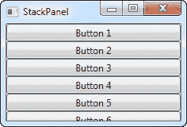
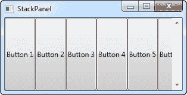
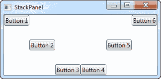
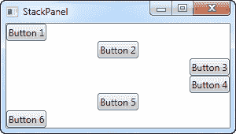

# 栈面板控件

> 原文：<https://wpf-tutorial.com/panels/stackpanel/>

StackPanel 与 WrapPanel 非常相似，但是至少有一个重要的区别:StackPanel 不包装内容。相反，它向一个方向扩展内容，允许你一个项目接一个项目地堆叠。让我们首先尝试一个非常简单的示例，就像我们对 WrapPanel 所做的那样:

```
<Window x:Class="WpfTutorialSamples.Panels.StackPanel"

        xmlns:x="http://schemas.microsoft.com/winfx/2006/xaml"
        Title="StackPanel" Height="160" Width="300">
	<StackPanel>
		<Button>Button 1</Button>
		<Button>Button 2</Button>
		<Button>Button 3</Button>
		<Button>Button 4</Button>
		<Button>Button 5</Button>
		<Button>Button 6</Button>
	</StackPanel>
</Window>
```



您应该注意的第一件事是 StackPanel 并不关心是否有足够的空间来存放内容。它不会以任何方式包装内容，也不会自动为您提供滚动的能力(不过您可以使用 ScrollViewer 控件来实现这一点——在后面的章节中会详细介绍)。

您可能还会注意到，StackPanel 的默认方向是垂直的，而 WrapPanel 的默认方向是水平的。但是就像对于 WrapPanel 一样，这可以很容易地使用 Orientation 属性进行更改:

```
<StackPanel Orientation="Horizontal">
```

<input type="hidden" name="IL_IN_ARTICLE"> 

您可能会注意到的另一件事是，默认情况下，StackPanel 会拉伸其子控件。在垂直对齐的 StackPanel 上，像第一个例子中那样，所有子控件都被水平拉伸。在水平对齐的 StackPanel 上，所有子控件都被垂直拉伸，如上所示。StackPanel 通过将其子控件上的 HorizontalAlignment 或 VerticalAlignment 属性设置为 Stretch 来实现这一点，但是如果您愿意，也可以很容易地覆盖它。请看下一个示例，我们使用了与上一个示例相同的标签，但这次我们为所有子控件的 VerticalAlignment 属性赋值:

```
<Window x:Class="WpfTutorialSamples.Panels.StackPanel"

        xmlns:x="http://schemas.microsoft.com/winfx/2006/xaml"
        Title="StackPanel" Height="160" Width="300">
	<StackPanel Orientation="Horizontal">
		<Button VerticalAlignment="Top">Button 1</Button>
		<Button VerticalAlignment="Center">Button 2</Button>
		<Button VerticalAlignment="Bottom">Button 3</Button>
		<Button VerticalAlignment="Bottom">Button 4</Button>
		<Button VerticalAlignment="Center">Button 5</Button>
		<Button VerticalAlignment="Top">Button 6</Button>
	</StackPanel>
</Window>
```



我们使用顶部、中心和底部的值将按钮放置在一个漂亮的图案中，只是为了好玩。当然，对于垂直对齐的 StackPanel 也可以这样做，您可以在子控件上使用水平对齐:

```
<Window x:Class="WpfTutorialSamples.Panels.StackPanel"

        xmlns:x="http://schemas.microsoft.com/winfx/2006/xaml"
        Title="StackPanel" Height="160" Width="300">
	<StackPanel Orientation="Vertical">
		<Button HorizontalAlignment="Left">Button 1</Button>
		<Button HorizontalAlignment="Center">Button 2</Button>
		<Button HorizontalAlignment="Right">Button 3</Button>
		<Button HorizontalAlignment="Right">Button 4</Button>
		<Button HorizontalAlignment="Center">Button 5</Button>
		<Button HorizontalAlignment="Left">Button 6</Button>
	</StackPanel>
</Window>
```



正如你所看到的，控件仍然是从上到下的，但是不同于相同的宽度，每个控件都是左对齐、右对齐或居中对齐。

* * *