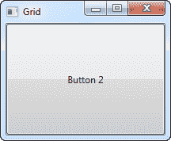
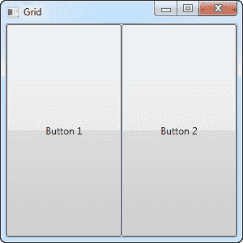
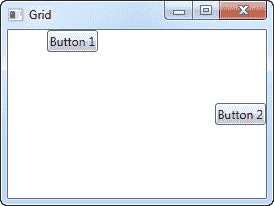

# 网格（`Grid`）控件

> 原文：<https://wpf-tutorial.com/panels/grid/>

网格可能是最复杂的面板类型。一个网格可以包含多行和多列。您可以为每一行定义一个高度，为每一列定义一个宽度，以像素的绝对数量、可用空间的百分比或 auto 来定义，其中行或列将根据内容自动调整其大小。当其他面板不起作用时，使用网格，例如，当您需要多个列并且经常与其他面板结合使用时。

在其最基本的形式中，网格将简单地接受您放入其中的所有控件，拉伸它们以使用最大的可用空间，并将其放置在彼此之上:

```
<Window x:Class="WpfTutorialSamples.Panels.Grid"

        xmlns:x="http://schemas.microsoft.com/winfx/2006/xaml"
        Title="Grid" Height="300" Width="300">
    <Grid>
		<Button>Button 1</Button>
		<Button>Button 2</Button>
	</Grid>
</Window>
```



如您所见，最后一个控件获得了顶部位置，这意味着您甚至看不到第一个按钮。虽然对大多数情况来说不是很有用，所以让我们试着划分空间，这正是网格做得很好的地方。我们通过使用 ColumnDefinitions 和 RowDefinitions 来实现这一点。在第一个示例中，我们将坚持使用列:

```
<Window x:Class="WpfTutorialSamples.Panels.Grid"

        xmlns:x="http://schemas.microsoft.com/winfx/2006/xaml"
        Title="Grid" Height="300" Width="300">
    <Grid>
		<Grid.ColumnDefinitions>
			<ColumnDefinition Width="*" />
			<ColumnDefinition Width="*" />
		</Grid.ColumnDefinitions>
		<Button>Button 1</Button>
		<Button Grid.Column="1">Button 2</Button>
	</Grid>
</Window>
```

<input type="hidden" name="IL_IN_ARTICLE"> 

在本例中，我们简单地将可用空间分为两列，这两列将使用“星形宽度”平均共享空间(这将在后面解释)。在第二个按钮上，我使用一个所谓的附加属性将按钮放在第二列(0 是第一列，1 是第二列，依此类推)。我也可以在第一个按钮上使用这个属性，但是它会自动分配给第一列和第一行，这正是我们在这里想要的。

如您所见，控件占用了所有可用空间，这是网格排列其子控件时的默认行为。它通过将其子控件上的 HorizontalAlignment 和 VerticalAlignment 设置为 Stretch 来实现这一点。

在某些情况下，您可能希望它们只占用所需的空间，并且/或者控制它们在网格中的放置方式。最简单的方法是直接在你想要操作的控件上设置水平对齐和垂直对齐。下面是上述示例的修改版本:

```
<Window x:Class="WpfTutorialSamples.Panels.Grid"

        xmlns:x="http://schemas.microsoft.com/winfx/2006/xaml"
        Title="Grid" Height="300" Width="300">
    <Grid>
		<Grid.ColumnDefinitions>
			<ColumnDefinition Width="*" />
			<ColumnDefinition Width="*" />
		</Grid.ColumnDefinitions>		
		<Button VerticalAlignment="Top" HorizontalAlignment="Center">Button 1</Button>
		<Button Grid.Column="1" VerticalAlignment="Center" HorizontalAlignment="Right">Button 2</Button>
	</Grid>
</Window>
```



正如你从结果截图中看到的，第一个按钮现在被放置在顶部并居中。第二个按钮放在中间，右对齐。

## 摘要

网格是一个非常通用的面板，比我们在本文中看到的有更多的可能性。我们将在接下来的几篇文章中深入探讨其余的问题。

* * *