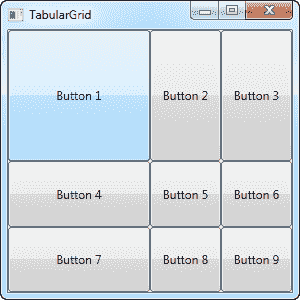

# 网格-行和列

> 原文：<https://wpf-tutorial.com/panels/grid-rows-and-columns/>

在上一章中，我们向您介绍了伟大的网格面板，并向您展示了如何使用它的几个基本示例。在这一章中，我们将做一些更高级的布局，因为这是网格真正发光的地方。首先，让我们添加更多的列，甚至一些行，以获得真正的表格布局:

```
<Window x:Class="WpfTutorialSamples.Panels.TabularGrid"

        xmlns:x="http://schemas.microsoft.com/winfx/2006/xaml"
        Title="TabularGrid" Height="300" Width="300">
    <Grid>
		<Grid.ColumnDefinitions>
			<ColumnDefinition Width="2*" />
			<ColumnDefinition Width="1*" />
			<ColumnDefinition Width="1*" />
		</Grid.ColumnDefinitions>
		<Grid.RowDefinitions>
			<RowDefinition Height="2*" />
			<RowDefinition Height="1*" />
			<RowDefinition Height="1*" />
		</Grid.RowDefinitions>
		<Button>Button 1</Button>
		<Button Grid.Column="1">Button 2</Button>
		<Button Grid.Column="2">Button 3</Button>
		<Button Grid.Row="1">Button 4</Button>
		<Button Grid.Column="1" Grid.Row="1">Button 5</Button>
		<Button Grid.Column="2" Grid.Row="1">Button 6</Button>
		<Button Grid.Row="2">Button 7</Button>
		<Button Grid.Column="1" Grid.Row="2">Button 8</Button>
		<Button Grid.Column="2" Grid.Row="2">Button 9</Button>
	</Grid>
</Window>
```



一共有九个按钮，每个按钮放在一个包含三行三列的网格中各自的单元格中。我们再次使用基于星形的宽度，但这一次我们也分配了一个数字——第一行和第一列的宽度为 2*，这基本上意味着它使用的空间量是宽度为 1*的行和列的两倍(或者只是*——这是相同的)。

您还会注意到，我使用了附加的属性网格。行和网格。列将控件放置在网格中，您会再次注意到，我在想要使用第一行或第一列(或两者)的控件上省略了这些属性。这本质上与指定零是一样的。这省去了一些打字的时间，但是你可能更喜欢为了更好的概览而分配它们——这完全取决于你自己！

* * *