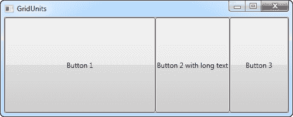

# 网格单元

> 原文：<https://wpf-tutorial.com/panels/grid-units/>

到目前为止，我们主要使用星形宽度/高度，它指定一行或一列应该占据组合空间的一定百分比。但是，还有另外两种方法可以指定列或行的宽度或高度:绝对单位和自动宽度/高度。让我们尝试创建一个网格，将这些元素混合在一起:

```
<Window x:Class="WpfTutorialSamples.Panels.GridUnits"

        xmlns:x="http://schemas.microsoft.com/winfx/2006/xaml"
        Title="GridUnits" Height="200" Width="400">
	<Grid>
		<Grid.ColumnDefinitions>
			<ColumnDefinition Width="1*" />
			<ColumnDefinition Width="Auto" />
			<ColumnDefinition Width="100" />
		</Grid.ColumnDefinitions>
		<Button>Button 1</Button>
		<Button Grid.Column="1">Button 2 with long text</Button>
		<Button Grid.Column="2">Button 3</Button>
	</Grid>
</Window>
```


在本例中，第一个按钮的宽度为星形，第二个按钮的宽度设置为 Auto，最后一个按钮的静态宽度为 100 像素。

结果可以在屏幕截图上看到，其中第二个按钮只占用了渲染较长文本所需的空间，第三个按钮占用了承诺的 100 像素，第一个按钮使用了可变宽度，占用了剩余的空间。

在一个网格中，一个或几个列(或行)具有可变(星形)宽度，它们自动共享使用绝对或自动宽度/高度的列/行尚未使用的宽度/高度。当我们调整窗口大小时，这变得更加明显:

<input type="hidden" name="IL_IN_ARTICLE"> 

在第一张截图上，你会看到网格为最后两个按钮保留了空间，尽管这意味着第一个按钮没有获得正确呈现所需的所有空间。在第二个屏幕截图上，你会看到最后两个按钮保持完全相同的空间，将多余的空间留给第一个按钮。

当设计各种各样的对话框时，这是一个非常有用的技术。例如，考虑一个简单的联系人表单，用户输入姓名、电子邮件地址和评论。前两个字段通常有一个固定的高度，而最后一个字段可能会占用尽可能多的空间，为输入较长的注释留出空间。在下一章中，我们将尝试使用不同高度和宽度的网格、行和列来构建联系人表单。

* * *