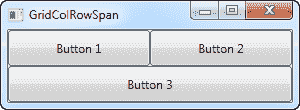
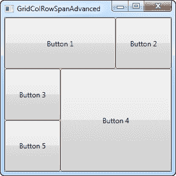

# 跨越网格

> 原文：<https://wpf-tutorial.com/panels/grid-column-row-span/>

默认的网格行为是每个控件占用一个单元格，但有时您希望某个控件占用更多的行或列。幸运的是，网格通过附加的属性 ColumnSpan 和 RowSpan 使这变得非常容易。该属性的默认值显然是 1，但您可以指定一个更大的数字，使控件跨越更多的行或列。

下面是一个非常简单的例子，我们使用 ColumnSpan 属性:

```
<Window x:Class="WpfTutorialSamples.Panels.GridColRowSpan"

        xmlns:x="http://schemas.microsoft.com/winfx/2006/xaml"
        Title="GridColRowSpan" Height="110" Width="300">
	<Grid>
		<Grid.ColumnDefinitions>			
			<ColumnDefinition Width="1*" />
			<ColumnDefinition Width="1*" />
		</Grid.ColumnDefinitions>
		<Grid.RowDefinitions>
			<RowDefinition Height="*" />
			<RowDefinition Height="*" />
		</Grid.RowDefinitions>
		<Button>Button 1</Button>
		<Button Grid.Column="1">Button 2</Button>
		<Button Grid.Row="1" Grid.ColumnSpan="2">Button 3</Button>
	</Grid>
</Window>
```



我们只定义了两列和两行，它们都占据了相同的空间。前两个按钮只是正常使用列，但是对于第三个按钮，我们使用 ColumnSpan 属性使它在第二行占据两列空间。

这非常简单，我们可以使用面板的组合来实现相同的效果，但是对于稍微高级一点的情况，这真的很有用。让我们尝试一些更好地显示这是多么强大:

<input type="hidden" name="IL_IN_ARTICLE">

```
<Window x:Class="WpfTutorialSamples.Panels.GridColRowSpanAdvanced"

        xmlns:x="http://schemas.microsoft.com/winfx/2006/xaml"
        Title="GridColRowSpanAdvanced" Height="300" Width="300">
    <Grid>
		<Grid.ColumnDefinitions>
			<ColumnDefinition Width="*" />
			<ColumnDefinition Width="*" />
			<ColumnDefinition Width="*" />
		</Grid.ColumnDefinitions>
		<Grid.RowDefinitions>
			<RowDefinition Height="*" />
			<RowDefinition Height="*" />
			<RowDefinition Height="*" />
		</Grid.RowDefinitions>
		<Button Grid.ColumnSpan="2">Button 1</Button>
		<Button Grid.Column="3">Button 2</Button>
		<Button Grid.Row="1">Button 3</Button>
		<Button Grid.Column="1" Grid.Row="1" Grid.RowSpan="2" Grid.ColumnSpan="2">Button 4</Button>
		<Button Grid.Column="0" Grid.Row="2">Button 5</Button>
	</Grid>
</Window>
```



在三列三行的情况下，我们通常有九个单元格，但是在这个例子中，我们使用了行和列的组合，只用五个按钮来填充所有的可用空间。正如你所看到的，一个控件可以跨越额外的列，额外的行，或者在按钮 4 的情况下:两者都有。

如您所见，在一个网格中跨越多列和/或多行非常容易。在后面的文章中，我们将在一个更实际的例子中使用跨度和所有其他网格技术。

* * *