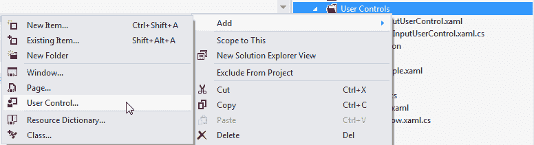
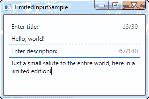

# 创建和使用用户控件

> 原文：<https://wpf-tutorial.com/usercontrols-and-customcontrols/creating-using-a-usercontrol/>

用户控件，在 WPF 中由 UserControl 类表示，是将标签和代码分组到一个可重用的容器中的概念，以便具有相同功能的相同界面可以在几个不同的地方甚至跨几个应用使用。

用户控件的行为很像 WPF 窗口——一个可以放置其他控件的区域，然后是一个可以与这些控件交互的代码隐藏文件。包含用户控件的文件也以。xaml，代码隐藏以. xaml.cs 结尾，就像一个窗口。不过，开始的标签看起来有点不同:

```
<UserControl x:Class="WpfTutorialSamples.User_Controls.LimitedInputUserControl"

         xmlns:x="http://schemas.microsoft.com/winfx/2006/xaml"
         xmlns:mc="http://schemas.openxmlformats.org/markup-compatibility/2006" 
         xmlns:d="http://schemas.microsoft.com/expression/blend/2008" 
         mc:Ignorable="d" 
         d:DesignHeight="300" d:DesignWidth="300">
    <Grid>

    </Grid>
</UserControl>
```

不过没有什么太奇怪的——一个根 UserControl 元素代替了 Window 元素，然后是 DesignHeight 和 DesignWidth 属性，它们在设计时控制用户控件的大小(在运行时，大小将由保存用户控件的容器决定)。你会在代码隐藏中注意到同样的事情，它只是继承了 *UserControl* 而不是 *Window* 。

## 创建用户控件

像添加另一个窗口一样，通过右键单击要添加用户控件的项目或文件夹名称，将用户控件添加到项目中，如该屏幕截图所示(根据您使用的 Visual Studio 版本，情况可能会有所不同):

<input type="hidden" name="IL_IN_ARTICLE"> 

对于本文，我们将创建一个有用的用户控件，它能够将文本框中的文本量限制为特定的字符数，同时向用户显示已经使用了多少个字符以及总共可能使用了多少个字符。这很容易做到，并在很多网络应用中使用，如 Twitter。将此功能添加到常规窗口中很容易，但由于它在应用的几个地方都很有用，因此将其包装在一个易于重用的 UserControl 中是有意义的。

在深入研究代码之前，让我们先看看我们想要的最终结果:



下面是用户控件本身的代码:

```
<UserControl x:Class="WpfTutorialSamples.User_Controls.LimitedInputUserControl"

         xmlns:x="http://schemas.microsoft.com/winfx/2006/xaml"
         xmlns:mc="http://schemas.openxmlformats.org/markup-compatibility/2006" 
         xmlns:d="http://schemas.microsoft.com/expression/blend/2008" 
         mc:Ignorable="d" 
         d:DesignHeight="300" d:DesignWidth="300">
    <Grid>
    <Grid.RowDefinitions>
        <RowDefinition Height="Auto" />
        <RowDefinition Height="*" />
    </Grid.RowDefinitions>      
    <Grid.ColumnDefinitions>
        <ColumnDefinition Width="*" />
        <ColumnDefinition Width="Auto" />
    </Grid.ColumnDefinitions>
    <Label Content="{Binding Title}" />
    <Label Grid.Column="1">
        <StackPanel Orientation="Horizontal">
        <TextBlock Text="{Binding ElementName=txtLimitedInput, Path=Text.Length}" />
        <TextBlock Text="/" />
        <TextBlock Text="{Binding MaxLength}" />
        </StackPanel>
    </Label>
    <TextBox MaxLength="{Binding MaxLength}" Grid.Row="1" Grid.ColumnSpan="2" Name="txtLimitedInput" ScrollViewer.VerticalScrollBarVisibility="Auto" TextWrapping="Wrap" />
    </Grid>
</UserControl>
```

```
using System;
using System.Windows.Controls;

namespace WpfTutorialSamples.User_Controls
{
    public partial class LimitedInputUserControl : UserControl
    {
    public LimitedInputUserControl()
    {
        InitializeComponent();
        this.DataContext = this;
    }

    public string Title { get; set; }

    public int MaxLength { get; set; }
    }
}
```

标签非常简单:一个两列两行的网格。网格的上部包含两个标签，一个显示标题，另一个显示统计数据。它们中的每一个都为所有需要的信息使用数据绑定——**标题**和**最大长度**来自代码隐藏属性，我们已经在中将其定义为常规类的常规属性。

当前字符数是通过绑定到文本获得的。属性，该属性使用用户控件的下半部分。结果可以在上面的截图上看到。注意，由于所有这些绑定，我们不需要任何 C#代码来更新标签或设置 TextBox 的 MaxLength 属性——相反，我们只是直接绑定到属性。

## 消费/使用用户控件

有了上面的代码，我们所需要的就是在我们的窗口中消费(使用)用户控件。我们将通过在窗口的 XAML 代码的顶部添加对用户控件所在的命名空间的引用来实现这一点:

```
xmlns:uc="clr-namespace:WpfTutorialSamples.User_Controls"
```

之后，我们可以使用 uc 前缀将该控件添加到我们的窗口中，就像添加其他 WPF 控件一样:

```
<uc:LimitedInputUserControl Title="Enter title:" MaxLength="30" Height="50" />
```

注意我们是如何在 XAML 中直接使用**标题**和**最大长度**属性的。以下是我们窗口的完整代码示例:

```
<Window x:Class="WpfTutorialSamples.User_Controls.LimitedInputSample"

    xmlns:x="http://schemas.microsoft.com/winfx/2006/xaml"
    xmlns:uc="clr-namespace:WpfTutorialSamples.User_Controls"
    Title="LimitedInputSample" Height="200" Width="300">
    <Grid Margin="10">
    <Grid.RowDefinitions>
        <RowDefinition Height="Auto" />
        <RowDefinition Height="*" />
    </Grid.RowDefinitions>

    <uc:LimitedInputUserControl Title="Enter title:" MaxLength="30" Height="50" />
    <uc:LimitedInputUserControl Title="Enter description:" MaxLength="140" Grid.Row="1" />

    </Grid>
</Window>
```

这样，我们就可以在一行代码中重用整个功能，如这个例子所示，我们有两次有限的文本输入控件。如前所述，最终结果如下所示:


## 摘要

强烈建议将常用的界面和功能放在用户控件中，从上面的例子可以看出，它们非常容易创建和使用。

* * *