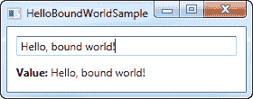

# 你好，绑定的世界！

> 原文：<https://wpf-tutorial.com/data-binding/hello-bound-world/>

就像我们用经典的“你好，世界！”开始这个教程一样例如，我们将向您展示在 WPF 使用数据绑定有多简单，只需一句“您好，绑定世界！”举例。让我们直入主题，然后我会解释它:

```
<Window x:Class="WpfTutorialSamples.DataBinding.HelloBoundWorldSample"

        xmlns:x="http://schemas.microsoft.com/winfx/2006/xaml"
        Title="HelloBoundWorldSample" Height="110" Width="280">
    <StackPanel Margin="10">
		<TextBox Name="txtValue" />
		<WrapPanel Margin="0,10">
			<TextBlock Text="Value: " FontWeight="Bold" />
			<TextBlock Text="{Binding Path=Text, ElementName=txtValue}" />
		</WrapPanel>
	</StackPanel>
</Window>
```



这个简单的例子展示了我们如何绑定 TextBlock 的值来匹配 TextBox 的 Text 属性。从截图中可以看出，当您在 TextBox 中输入文本时，TextBlock 会自动更新。在一个非绑定的世界中，这将要求我们侦听 TextBox 上的事件，然后在每次文本改变时更新 TextBlock，但是有了数据绑定，只需使用标签就可以建立这种连接。

## 绑定的语法

所有的魔法都发生在花括号之间，在 XAML，花括号封装了一个标签扩展。对于数据绑定，我们使用绑定扩展，它允许我们描述文本属性的绑定关系。最简单的绑定形式如下:

<input type="hidden" name="IL_IN_ARTICLE">

{绑定}

这只是返回当前的数据上下文(稍后会详细介绍)。这肯定是有用的，但是在大多数情况下，您会希望将一个属性绑定到数据上下文中的另一个属性。像这样的绑定应该是这样的:

{绑定路径=NameOfProperty}

Path 记录了您要绑定到的属性，但是，由于 Path 是绑定的默认属性，如果您愿意，可以省略它，如下所示:

{绑定名称属性}

您将会看到许多不同的例子，其中一些例子明确定义了 Path，而另一些例子则忽略了 Path。不过，最终还是取决于你自己。

不过，绑定还有许多其他属性，其中之一就是我们在示例中使用的 ElementName。这允许我们直接连接到另一个 UI 元素作为源。我们在绑定中设置的每个属性都用逗号分隔:

{绑定路径=Text，ElementName=txtValue}

## 摘要

这只是 WPF 所有约束性可能性的一瞥。在接下来的章节中，我们将会发现更多，向您展示数据绑定是多么强大。

* * *