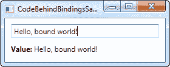

# 通过代码隐藏进行数据绑定

> 原文：<https://wpf-tutorial.com/data-binding/data-binding-via-code-behind/>

正如我们在前面的数据绑定示例中看到的，使用 XAML 定义绑定非常容易，但在某些情况下，您可能希望从代码隐藏中完成。这也很简单，提供了和你使用 XAML 一样的可能性。让我们试试“Hello，bound world”的例子，但是这次从代码隐藏中创建所需的绑定:

```
<Window x:Class="WpfTutorialSamples.DataBinding.CodeBehindBindingsSample"

    xmlns:x="http://schemas.microsoft.com/winfx/2006/xaml"
    Title="CodeBehindBindingsSample" Height="110" Width="280">
    <StackPanel Margin="10">
    <TextBox Name="txtValue" />
    <WrapPanel Margin="0,10">
        <TextBlock Text="Value: " FontWeight="Bold" />
        <TextBlock Name="lblValue" />
    </WrapPanel>
    </StackPanel>
</Window>
```

```
using System;
using System.Windows;
using System.Windows.Controls;
using System.Windows.Data;

namespace WpfTutorialSamples.DataBinding
{
    public partial class CodeBehindBindingsSample : Window
    {
    public CodeBehindBindingsSample()
    {
        InitializeComponent();

        Binding binding = new Binding("Text");
        binding.Source = txtValue;
        lblValue.SetBinding(TextBlock.TextProperty, binding);
    }
    }
}
```



它通过创建一个绑定实例来工作。我们在构造函数中直接指定我们想要的路径，在本例中是“Text”，因为我们想要绑定到 Text 属性。然后我们指定一个**源**，在这个例子中应该是 TextBox 控件。现在 WPF 知道它应该使用 TextBox 作为源控件，并且我们特别寻找包含在其 Text 属性中的值。

在最后一行中，我们使用 SetBinding 方法将新创建的 Binding 对象与 destination/target 控件结合起来，在本例中是 TextBlock (lblValue)。 **SetBinding()** 方法有两个参数，一个告诉我们希望绑定到哪个依赖属性，另一个保存我们希望使用的绑定对象。

<input type="hidden" name="IL_IN_ARTICLE">

## 摘要

如您所见，用 C#代码创建绑定很容易，与在 XAML 内联创建绑定所用的语法相比，对于不熟悉数据绑定的人来说，可能更容易掌握。不过，使用哪种方法由你决定——它们都很好。

* * *