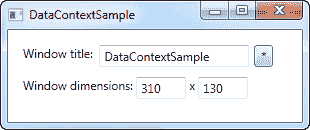

# `UpdateSourceTrigger`属性

> 原文：<https://wpf-tutorial.com/data-binding/the-update-source-trigger-property/>

在上一篇文章中，我们看到了文本框中的更改没有立即发送回源。相反，只有在文本框上失去焦点后，才会更新源。此行为由绑定上名为 **UpdateSourceTrigger** 的属性控制。它默认为值 “默认”，这基本上意味着源代码是根据您绑定到的属性更新的。在编写本文时，除了文本属性 之外的所有属性都在属性改变时被更新(PropertyChanged)，而文本属性在目标元素上的焦点丢失时被更新 (LostFocus)。

显然，Default 是 UpdateSourceTrigger 的默认值。其他选项有**属性改变**、**丢失焦点**和**显式**。前两个已经描述过了，而最后一个仅仅意味着更新必须手动推送至 发生，使用绑定上的 UpdateSource 调用。

为了了解所有这些选项是如何工作的，我更新了上一章的示例，向您展示了所有这些选项:

```
<Window x:Class="WpfTutorialSamples.DataBinding.DataContextSample"

        xmlns:x="http://schemas.microsoft.com/winfx/2006/xaml"
        Title="DataContextSample" Height="130" Width="310">
	<StackPanel Margin="15">
		<WrapPanel>
			<TextBlock Text="Window title:  " />
			<TextBox Name="txtWindowTitle" Text="{Binding Title, UpdateSourceTrigger=Explicit}" Width="150" />
			<Button Name="btnUpdateSource" Click="btnUpdateSource_Click" Margin="5,0" Padding="5,0">*</Button>
		</WrapPanel>
		<WrapPanel Margin="0,10,0,0">
			<TextBlock Text="Window dimensions: " />
			<TextBox Text="{Binding Width, UpdateSourceTrigger=LostFocus}" Width="50" />
			<TextBlock Text=" x " />
			<TextBox Text="{Binding Height, UpdateSourceTrigger=PropertyChanged}" Width="50" />
		</WrapPanel>
	</StackPanel>
</Window>
```

```
using System;
using System.Windows;
using System.Windows.Controls;
using System.Windows.Data;

namespace WpfTutorialSamples.DataBinding
{
	public partial class DataContextSample : Window
	{
		public DataContextSample()
		{
			InitializeComponent();
			this.DataContext = this;
		}

		private void btnUpdateSource_Click(object sender, RoutedEventArgs e)
		{
			BindingExpression binding = txtWindowTitle.GetBindingExpression(TextBox.TextProperty);
			binding.UpdateSource();
		}
	}
}
```

 <input type="hidden" name="IL_IN_ARTICLE">

如您所见，三个文本框现在都使用不同的 **UpdateSourceTrigger** 。

第一个设置为 **Explicit** ，基本意思是除非你手动做，否则源码不会更新。出于这个原因，我 在文本框旁边添加了一个按钮，它将按需更新源值。在代码隐藏中，您将找到 Click 处理程序，其中我们使用了几行代码从目标控件获取绑定，然后对其调用`UpdateSource()`方法。

第二个文本框使用了 **LostFocus** 值，这实际上是文本绑定的默认值。这意味着每次目标控件失去焦点时，源值将被更新 。

第三个也是最后一个文本框使用了 **PropertyChanged** 值，这意味着每次绑定属性 改变时，源值都会更新，在本例中，文本一改变，源值就会更新。

试着在你自己的机器上运行这个例子，看看这三个文本框的行为是如何完全不同的:第一个值在你点击按钮之前不会更新，第二个值在你离开文本框之前不会更新，而第三个值会在每次击键、文本改变等时自动更新。

## 摘要

绑定的 `UpdateSourceTrigger`属性控制如何以及何时将更改的值发送回源。然而，由于 WPF 很擅长控制这一点，缺省值在大多数情况下应该足够了，在这种情况下，您将获得不断更新的 UI 和良好的性能的最佳组合。

对于那些需要对过程进行更多控制的情况，这个属性肯定会有所帮助。只要确保更新源值的频率不超过实际需要的频率。如果你想要完全的控制，你可以使用**显式的**值，然后手动更新， ，但是这确实会减少数据绑定的乐趣。

* * *