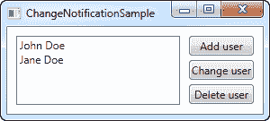
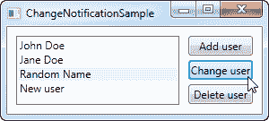

# 应对变化

> 原文：<https://wpf-tutorial.com/data-binding/responding-to-changes/>

到目前为止，在本教程中，我们主要创建了 UI 元素和现有类之间的绑定，但是在现实生活的应用程序中，您显然会绑定到自己的数据对象。这同样简单，但是一旦你开始做，你可能会发现一些让你失望的事情:变化不会自动反映出来，就像在前面的例子中一样。正如您将在本文中了解到的，您只需要做一点额外的工作就可以实现这一点，但幸运的是，WPF 让这变得非常容易。

## 响应数据源更改

在处理数据源更改时，有两种不同的情况需要处理:项目列表的更改和每个数据对象中绑定属性的更改。如何处理它们可能会有所不同，这取决于你正在做什么和你希望完成什么，但是 WPF 提供了两个非常简单的解决方案供你使用:一个是 **ObservableCollection** 接口，另一个是**INotifyPropertyChanged** 接口。

下面的例子将告诉你为什么我们需要这两样东西

```
<Window x:Class="WpfTutorialSamples.DataBinding.ChangeNotificationSample"

        xmlns:x="http://schemas.microsoft.com/winfx/2006/xaml"
        Title="ChangeNotificationSample" Height="150" Width="300">
	<DockPanel Margin="10">
		<StackPanel DockPanel.Dock="Right" Margin="10,0,0,0">
			<Button Name="btnAddUser" Click="btnAddUser_Click">Add user</Button>
			<Button Name="btnChangeUser" Click="btnChangeUser_Click" Margin="0,5">Change user</Button>
			<Button Name="btnDeleteUser" Click="btnDeleteUser_Click">Delete user</Button>
		</StackPanel>
		<ListBox Name="lbUsers" DisplayMemberPath="Name"></ListBox>
	</DockPanel>
</Window>
```

```
using System;
using System.Collections.Generic;
using System.Windows;

namespace WpfTutorialSamples.DataBinding
{
	public partial class ChangeNotificationSample : Window
	{
		private List<User> users = new List<User>();

		public ChangeNotificationSample()
		{
			InitializeComponent();

			users.Add(new User() { Name = "John Doe" });
			users.Add(new User() { Name = "Jane Doe" });

			lbUsers.ItemsSource = users;
		}

		private void btnAddUser_Click(object sender, RoutedEventArgs e)
		{
			users.Add(new User() { Name = "New user" });
		}

		private void btnChangeUser_Click(object sender, RoutedEventArgs e)
		{
			if(lbUsers.SelectedItem != null)
				(lbUsers.SelectedItem as User).Name = "Random Name";
		}

		private void btnDeleteUser_Click(object sender, RoutedEventArgs e)
		{
			if(lbUsers.SelectedItem != null)
				users.Remove(lbUsers.SelectedItem as User);
		}
	}

	public class User
	{
		public string Name { get; set; }
	}
}
```

<input type="hidden" name="IL_IN_ARTICLE"> 

试着自己运行一下，看看即使您向列表中添加了一些内容或者更改了某个用户的名字，UI 中的内容也不会更新。这个例子非常简单，有一个保存用户名的用户类，一个显示用户 的列表框和一些操作列表及其内容的按钮。列表的 ItemsSource 被分配给我们 在窗口构造器中创建的一对用户的快速列表。问题是这些按钮似乎都不起作用。让我们用两个简单的步骤来解决这个问题。

## 反映列表数据源中的更改

第一步是让 UI 响应列表源(ItemsSource)中的更改，比如当我们添加或删除用户时。我们需要的是一个列表，通知任何目的地其内容的变化，幸运的是，WPF 提供了一种类型的列表，将做到这一点。它叫做 ObservableCollection，你使用它很像一个普通的列表<t>，只有一些不同。</t>

在下面的最后一个例子中，我们简单地用一个 ObservableCollection <user>替换了 List<user>——这就是全部！这将使 Add 和 Delete 按钮工作，但它不会对“Change name”按钮做任何事情，因为更改将发生在绑定数据对象本身上，而不是源列表上——不过第二步将处理这种情况。</user></user>

## 反映数据对象的变化

第二步是让我们的自定义用户类实现 INotifyPropertyChanged 接口。通过这样做，我们的用户对象能够提醒 UI 层对其属性的更改。这比仅仅改变列表类型要麻烦一些，就像我们上面做的那样，但是这仍然是完成这些自动更新的最简单的方法之一。

## 最后一个工作示例

有了上面描述的两个变化，我们现在有了一个反映数据源变化的例子。看起来是这样的:

```
<Window x:Class="WpfTutorialSamples.DataBinding.ChangeNotificationSample"

        xmlns:x="http://schemas.microsoft.com/winfx/2006/xaml"
        Title="ChangeNotificationSample" Height="135" Width="300">
	<DockPanel Margin="10">
		<StackPanel DockPanel.Dock="Right" Margin="10,0,0,0">
			<Button Name="btnAddUser" Click="btnAddUser_Click">Add user</Button>
			<Button Name="btnChangeUser" Click="btnChangeUser_Click" Margin="0,5">Change user</Button>
			<Button Name="btnDeleteUser" Click="btnDeleteUser_Click">Delete user</Button>
		</StackPanel>
		<ListBox Name="lbUsers" DisplayMemberPath="Name"></ListBox>
	</DockPanel>
</Window>
```

```
using System;
using System.Collections.Generic;
using System.Windows;
using System.ComponentModel;
using System.Collections.ObjectModel;

namespace WpfTutorialSamples.DataBinding
{
	public partial class ChangeNotificationSample : Window
	{
		private ObservableCollection<User> users = new ObservableCollection<User>();

		public ChangeNotificationSample()
		{
			InitializeComponent();

			users.Add(new User() { Name = "John Doe" });
			users.Add(new User() { Name = "Jane Doe" });

			lbUsers.ItemsSource = users;
		}

		private void btnAddUser_Click(object sender, RoutedEventArgs e)
		{
			users.Add(new User() { Name = "New user" });
		}

		private void btnChangeUser_Click(object sender, RoutedEventArgs e)
		{
			if(lbUsers.SelectedItem != null)
				(lbUsers.SelectedItem as User).Name = "Random Name";
		}

		private void btnDeleteUser_Click(object sender, RoutedEventArgs e)
		{
			if(lbUsers.SelectedItem != null)
				users.Remove(lbUsers.SelectedItem as User);
		}
	}

	public class User : INotifyPropertyChanged
	{
		private string name;
		public string Name {
			get { return this.name; }
			set
			{
				if(this.name != value)
				{
					this.name = value;
					this.NotifyPropertyChanged("Name");
				}
			}
		}

		public event PropertyChangedEventHandler PropertyChanged;

		public void NotifyPropertyChanged(string propName)
		{
			if(this.PropertyChanged != null)
				this.PropertyChanged(this, new PropertyChangedEventArgs(propName));
		}
	}
}
```



## 摘要

正如您所看到的，实现 INotifyPropertyChanged 非常容易，但是它确实在您的类上创建了一些额外的代码，并且为您的属性添加了一些额外的逻辑。如果您想绑定到自己的类并让更改立即反映在 UI 中，这是您必须付出的代价。显然，您只需要在您绑定到的属性的 setter 中调用 NotifyPropertyChanged 其余的可以保持原样。

另一方面，ObservableCollection 非常容易处理——它只需要您在希望源列表的更改反映在绑定目标中的情况下使用这个特定的列表类型。

* * *