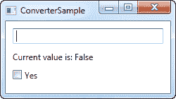
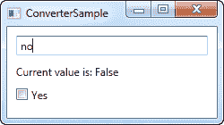
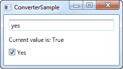

# 使用`IValueConverter`进行值转换

> 原文：<https://wpf-tutorial.com/data-binding/value-conversion-with-ivalueconverter/>

到目前为止，我们已经使用了一些简单的数据绑定，其中发送和接收属性总是兼容的。但是，您很快就会遇到这样的情况，您希望使用一种类型的绑定值，然后以稍微不同的方式呈现它。

## 何时使用值转换器

值转换器经常与数据绑定一起使用。以下是一些基本的例子:

*   您有一个数值，但您想以一种方式显示零值，以另一种方式显示正数
*   您希望基于某个值来选中复选框，但该值是一个字符串，如“yes”或“no ”,而不是布尔值
*   您有一个以字节为单位的文件大小，但您希望根据它的大小显示为字节、千字节、兆字节或千兆字节

这些是一些简单的例子，但还有更多。例如，您可能希望基于布尔值来选中复选框，但您希望将其反转，这样，如果值为 false，则复选框会被选中，如果值为 true，则不会被选中。您甚至可以使用转换器根据值为 ImageSource 生成图像，比如绿色符号表示真，红色符号表示假——可能性几乎是无限的！

对于这种情况，您可以使用值转换器。这些实现 IValueConverter 接口的小类将充当中间人，在源和目的地之间转换值。因此，在任何情况下，如果您需要在值到达目的地或返回到源之前对其进行转换，您可能需要一个转换器。

<input type="hidden" name="IL_IN_ARTICLE">

## 实现简单的值转换器

如前所述，WPF 值转换器需要实现 IValueConverter 接口，或者 IMultiValueConverter 接口(稍后将详细介绍)。这两个接口只需要您实现两个方法:Convert()和 ConvertBack()。顾名思义，这些方法将用于将值转换为目标格式，然后再转换回来。

让我们实现一个简单的转换器，它接受一个字符串作为输入，然后返回一个布尔值，反之亦然。如果您是 WPF 的新手，并且由于您正在阅读本教程，您可能不知道示例中使用的所有概念，但是不要担心，它们将在代码清单后得到解释:

```
<Window x:Class="WpfTutorialSamples.DataBinding.ConverterSample"

        xmlns:x="http://schemas.microsoft.com/winfx/2006/xaml"
		xmlns:local="clr-namespace:WpfTutorialSamples.DataBinding"
        Title="ConverterSample" Height="140" Width="250">
	<Window.Resources>
		<local:YesNoToBooleanConverter x:Key="YesNoToBooleanConverter" />
	</Window.Resources>
	<StackPanel Margin="10">
		<TextBox Name="txtValue" />
		<WrapPanel Margin="0,10">
			<TextBlock Text="Current value is: " />
			<TextBlock Text="{Binding ElementName=txtValue, Path=Text, Converter={StaticResource YesNoToBooleanConverter}}"></TextBlock>
		</WrapPanel>
		<CheckBox IsChecked="{Binding ElementName=txtValue, Path=Text, Converter={StaticResource YesNoToBooleanConverter}}" Content="Yes" />
	</StackPanel>
</Window>
```

```
using System;
using System.Windows;
using System.Windows.Data;

namespace WpfTutorialSamples.DataBinding
{
	public partial class ConverterSample : Window
	{
		public ConverterSample()
		{
			InitializeComponent();
		}
	}

	public class YesNoToBooleanConverter : IValueConverter
	{
		public object Convert(object value, Type targetType, object parameter, System.Globalization.CultureInfo culture)
		{
			switch(value.ToString().ToLower())
			{
				case "yes":
				case "oui":
					return true;
				case "no":
				case "non":
					return false;
			}
			return false;
		}

		public object ConvertBack(object value, Type targetType, object parameter, System.Globalization.CultureInfo culture)
		{
			if(value is bool)
			{
				if((bool)value == true)
					return "yes";
				else
					return "no";
			}
			return "no";
		}
	}
}
```



## 代码隐藏

因此，让我们从后面开始，然后按照我们的方式来完成这个示例。我们在代码隐藏文件中实现了一个名为 YesNoToBooleanConverter 的转换器。正如宣传的那样，它只实现了两个必需的方法，称为 Convert()和 ConvertBack()。`Convert()`方法假设它接收一个字符串作为输入(*值*参数)，然后将其转换为布尔值 true 或 false，回退值为 false。为了 的乐趣，我也增加了从法语单词转换的可能性。

`ConvertBack()`方法显然做了相反的事情:它假设一个布尔类型的输入值，然后返回英文单词“yes”或“no”，回退值为“no”。

您可能想知道这两种方法需要哪些额外的参数，但是在这个例子中并不需要。我们将在下一章中用到它们，在那里我们会解释它们。

## XAML

在程序的 XAML 部分，我们首先声明一个转换器实例作为窗口的资源。然后我们有一个 TextBox，几个 TextBlock 和一个 CheckBox 控件，这就是有趣的事情发生的地方:我们将 TextBox 的值绑定到 text block 和 CheckBox 控件，并使用 converter 属性和我们自己的 Converter 引用，我们根据需要在字符串和布尔值之间来回变换值。

如果您尝试运行此示例，您将能够在两个地方更改该值:通过在文本框中写“yes”(或任何其他值，如果您想要 false)或通过选中复选框。无论您做什么，更改都会反映在其他控件和 TextBlock 中。

## 摘要

这是一个简单的值转换器的例子，出于说明的目的，做得比需要的要长一点。在下一章中，我们将研究一个更高级的例子，但是在你开始编写自己的转换器之前，你可能想检查一下 WPF 是否已经包含了一个这样的例子。在撰写本文时，有 20 多个内置转换器可供您使用，但是您需要知道它们的名称。我发现下面这个列表可能会对你有用: [http://stack overflow . com/questions/505397/built-in-wpf-ivalue converters](http://stackoverflow.com/questions/505397/built-in-wpf-ivalueconverters)

* * *