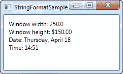
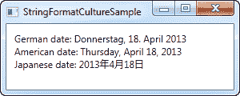

# `StringFormat`属性

> 原文：<https://wpf-tutorial.com/data-binding/the-stringformat-property/>

正如我们在前面的章节中所看到的，在显示绑定的输出之前处理它的方法通常是通过使用转换器。转换器很酷的一点是，它们允许你将任何数据类型转换成完全不同的数据类型。然而，对于更简单的使用场景，您只想改变某个值的显示方式，而不一定要将其转换为不同的类型， **StringFormat** 属性可能非常 就足够了。

使用绑定的 `StringFormat`属性，您会失去使用转换器时获得的一些灵活性，但反过来，它的使用要简单得多，并且不涉及在新文件中创建新类。

`StringFormat`属性正如其名称所暗示的那样:它通过调用字符串来格式化输出字符串。格式方法。有时一个例子会超过一千个单词，所以在我达到字数之前，让我们直接跳到一个例子:

```
<Window x:Class="WpfTutorialSamples.DataBinding.StringFormatSample"

        xmlns:x="http://schemas.microsoft.com/winfx/2006/xaml"
		xmlns:system="clr-namespace:System;assembly=mscorlib"
        Title="StringFormatSample" Height="150" Width="250"
		Name="wnd">
	<StackPanel Margin="10">
		<TextBlock Text="{Binding ElementName=wnd, Path=ActualWidth, StringFormat=Window width: {0:#,#.0}}" />
		<TextBlock Text="{Binding ElementName=wnd, Path=ActualHeight, StringFormat=Window height: {0:C}}" />
		<TextBlock Text="{Binding Source={x:Static system:DateTime.Now}, StringFormat=Date: {0:dddd, MMMM dd}}" />
		<TextBlock Text="{Binding Source={x:Static system:DateTime.Now}, StringFormat=Time: {0:HH:mm}}" />
	</StackPanel>
</Window>
```



第一对 TextBlock 通过绑定到父窗口并获取其宽度和高度来获取值。通过 `StringFormat`属性，值被格式化。对于宽度，我们指定一个定制的格式字符串，对于高度，我们要求它使用货币格式，只是为了好玩。该值保存为 double 类型，因此我们可以使用所有相同的格式说明符，就像我们调用 double 一样。ToString()。你可以在这里找到他们的名单:[http://msdn.microsoft.com/en-us/library/dwhawy9k.aspx](http://msdn.microsoft.com/en-us/library/dwhawy9k.aspx)

<input type="hidden" name="IL_IN_ARTICLE">

还要注意我是如何在 StringFormat 中包含自定义文本的——这允许您根据需要用文本来预先/后期固定绑定值。当引用格式字符串中的实际值时，我们用一组花括号将它括起来，花括号包括两个值:对我们要格式化的值的引用(数值 0，这是第一个可能的值)和格式字符串，用冒号分隔。

对于最后两个值，我们只需绑定到当前日期(DateTime。现在)并以特定的格式首先输出为日期，然后输出为时间(小时和分钟)，同样使用我们自己的预定义格式。你可以在这里阅读更多关于日期时间格式的信息:[http://msdn.microsoft.com/en-us/library/az4se3k1.aspx](http://msdn.microsoft.com/en-us/library/az4se3k1.aspx)

## 不带额外文本的格式

请注意，如果你指定了一个不包含任何自定义文本的格式字符串，上面所有的例子都是这样，那么当你在 XAML 定义它的时候，你需要额外添加一组花括号。原因是 WPF 可能会将语法与用于标签扩展的语法混淆。这里有一个例子:

```
<Window x:Class="WpfTutorialSamples.DataBinding.StringFormatSample"

        xmlns:x="http://schemas.microsoft.com/winfx/2006/xaml"
		xmlns:system="clr-namespace:System;assembly=mscorlib"
        Title="StringFormatSample" Height="150" Width="250"
		Name="wnd">
	<WrapPanel Margin="10">
		<TextBlock Text="Width: " />
		<TextBlock Text="{Binding ElementName=wnd, Path=ActualWidth, StringFormat={}{0:#,#.0}}" />
	</WrapPanel>
</Window>
```

## 使用特定的区域性

如果您需要根据特定的文化输出绑定值，这没有问题。绑定将使用为父元素指定的语言，或者您可以使用 ConverterCulture 属性直接为绑定指定语言。这里有一个例子:

```
<Window x:Class="WpfTutorialSamples.DataBinding.StringFormatCultureSample"

        xmlns:x="http://schemas.microsoft.com/winfx/2006/xaml"
		xmlns:system="clr-namespace:System;assembly=mscorlib"
        Title="StringFormatCultureSample" Height="120" Width="300">
	<StackPanel Margin="10">
		<TextBlock Text="{Binding Source={x:Static system:DateTime.Now}, ConverterCulture='de-DE', StringFormat=German date: {0:D}}" />
		<TextBlock Text="{Binding Source={x:Static system:DateTime.Now}, ConverterCulture='en-US', StringFormat=American date: {0:D}}" />
		<TextBlock Text="{Binding Source={x:Static system:DateTime.Now}, ConverterCulture='ja-JP', StringFormat=Japanese date: {0:D}}" />
	</StackPanel>
</Window>
```



非常简单:通过组合使用 D 说明符(长日期模式)的 `StringFormat`属性和 ConverterCulture 属性，我们可以根据特定的区域性输出绑定值。相当漂亮！

* * *