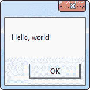
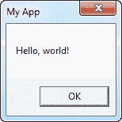
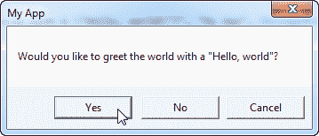
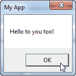
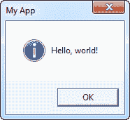
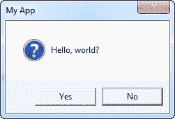

# MessageBox

> 原文：<https://wpf-tutorial.com/dialogs/the-messagebox/>

WPF 为你的应用程序提供了几个对话框，但是最简单的无疑是 MessageBox。它的唯一目的是向用户显示一条消息，然后为用户提供一种或几种方式来响应这条消息。

MessageBox 是通过调用静态 Show()方法来使用的，该方法可以接受一系列不同的参数，以便能够按照您希望的方式进行查看和操作。我们将在本文中浏览所有不同的表单，每个变体都由 MessageBox 表示。显示()行和结果的屏幕截图。在文章的最后，你可以找到一个完整的例子，让你测试所有的变化。

最简单的形式是，MessageBox 只接受一个参数，即要显示的消息:

```
MessageBox.Show("Hello, world!");
```



## 带有标题的 MessageBox

<input type="hidden" name="IL_IN_ARTICLE">

上面的例子可能有点太简单了——显示消息的窗口上的标题可能会有所帮助。幸运的是，第二个可选参数允许我们指定标题:

```
MessageBox.Show("Hello, world!", "My App");
```



## 带有额外按钮的 MessageBox

默认情况下，MessageBox 只有一个 Ok 按钮，但这是可以改变的，如果你想问用户一个问题，而不只是显示一条信息。还要注意我是如何在这个消息中使用多行的，通过使用换行符(\n):

```
MessageBox.Show("This MessageBox has extra options.\n\nHello, world?", "My App", MessageBoxButton.YesNoCancel);
```

您可以使用 MessageBoxButton 枚举中的一个值来控制显示哪些按钮——在本例中，包括一个 Yes、No 和 Cancel 按钮。可以使用下列值，这些值应该是不言自明的:

*   好
*   癌症
*   耶斯诺坎塞
*   是否

现在有了多种选择，你需要一种方法来看到用户选择了什么，幸运的是，MessageBox。Show()方法总是从您可以使用的 **MessageBoxResult** 枚举中返回一个值。这里有一个例子:

```
MessageBoxResult result = MessageBox.Show("Would you like to greet the world with a \"Hello, world\"?", "My App", MessageBoxButton.YesNoCancel);
switch(result)
{
	case MessageBoxResult.Yes:
		MessageBox.Show("Hello to you too!", "My App");
		break;
	case MessageBoxResult.No:
		MessageBox.Show("Oh well, too bad!", "My App");
		break;
	case MessageBoxResult.Cancel:
		MessageBox.Show("Nevermind then...", "My App");
		break;
}
```



通过检查 MessageBox 的结果值。Show()方法，您现在可以对用户的选择做出反应，如代码示例和屏幕截图所示。

## 带有图标的消息框

MessageBox 能够通过使用第四个参数在文本消息的左侧显示预定义的图标:

```
MessageBox.Show("Hello, world!", "My App", MessageBoxButton.OK, MessageBoxImage.Information);
```



使用 **MessageBoxImage** 枚举，您可以在一系列图标中选择不同的情况。以下是完整的列表:

*   星号
*   错误
*   感叹
*   手
*   信息
*   没有人
*   问题
*   停止
*   警告

这些名字很能说明它们看起来是什么样的，但是你可以随意试验各种不同的值，或者看看这篇 MSDN 的文章，文章中对每个值都进行了解释甚至举例说明:[](http://msdn.microsoft.com/en-us/library/system.windows.messageboximage.aspx)

## 带有默认选项的 MessageBox

MessageBox 将选择一个按钮作为默认选项，当对话框显示后，如果用户只需按 Enter 键，就会调用这个按钮。例如，如果您显示一个带有“是”和“否”按钮的消息框，“是”将是默认答案。您可以使用 MessageBox 的第五个参数来更改这种行为。Show()方法虽然:

```
MessageBox.Show("Hello, world?", "My App", MessageBoxButton.YesNo, MessageBoxImage.Question, MessageBoxResult.No);
```



请注意屏幕截图上的“否”按钮是如何稍微抬高的，以直观地表明它被选中，并且如果按下**回车**或**空格**按钮，它将被调用。

## 完整的例子

正如所承诺的，下面是本文中使用的完整示例:

```
<Window x:Class="WpfTutorialSamples.Dialogs.MessageBoxSample"

        xmlns:x="http://schemas.microsoft.com/winfx/2006/xaml"
        Title="MessageBoxSample" Height="250" Width="300">
    <StackPanel HorizontalAlignment="Center" VerticalAlignment="Center">
        <StackPanel.Resources>
            <Style TargetType="Button">
                <Setter Property="Margin" Value="0,0,0,10" />
            </Style>
        </StackPanel.Resources>
        <Button Name="btnSimpleMessageBox" Click="btnSimpleMessageBox_Click">Simple MessageBox</Button>
        <Button Name="btnMessageBoxWithTitle" Click="btnMessageBoxWithTitle_Click">MessageBox with title</Button>
        <Button Name="btnMessageBoxWithButtons" Click="btnMessageBoxWithButtons_Click">MessageBox with buttons</Button>
        <Button Name="btnMessageBoxWithResponse" Click="btnMessageBoxWithResponse_Click">MessageBox with response</Button>
        <Button Name="btnMessageBoxWithIcon" Click="btnMessageBoxWithIcon_Click">MessageBox with icon</Button>
        <Button Name="btnMessageBoxWithDefaultChoice" Click="btnMessageBoxWithDefaultChoice_Click">MessageBox with default choice</Button>
    </StackPanel>
</Window>
```

```
using System;
using System.Windows;

namespace WpfTutorialSamples.Dialogs
{
	public partial class MessageBoxSample : Window
	{
		public MessageBoxSample()
		{
			InitializeComponent();
		}

		private void btnSimpleMessageBox_Click(object sender, RoutedEventArgs e)
		{
			MessageBox.Show("Hello, world!");
		}

		private void btnMessageBoxWithTitle_Click(object sender, RoutedEventArgs e)
		{
			MessageBox.Show("Hello, world!", "My App");
		}

		private void btnMessageBoxWithButtons_Click(object sender, RoutedEventArgs e)
		{
			MessageBox.Show("This MessageBox has extra options.\n\nHello, world?", "My App", MessageBoxButton.YesNoCancel);
		}

		private void btnMessageBoxWithResponse_Click(object sender, RoutedEventArgs e)
		{
			MessageBoxResult result = MessageBox.Show("Would you like to greet the world with a \"Hello, world\"?", "My App", MessageBoxButton.YesNoCancel);
			switch(result)
			{
				case MessageBoxResult.Yes:
					MessageBox.Show("Hello to you too!", "My App");
					break;
				case MessageBoxResult.No:
					MessageBox.Show("Oh well, too bad!", "My App");
					break;
				case MessageBoxResult.Cancel:
					MessageBox.Show("Nevermind then...", "My App");
					break;
			}
		}

		private void btnMessageBoxWithIcon_Click(object sender, RoutedEventArgs e)
		{
			MessageBox.Show("Hello, world!", "My App", MessageBoxButton.OK, MessageBoxImage.Information);
		}

		private void btnMessageBoxWithDefaultChoice_Click(object sender, RoutedEventArgs e)
		{
			MessageBox.Show("Hello, world?", "My App", MessageBoxButton.YesNo, MessageBoxImage.Question, MessageBoxResult.No);
		}
	}
}
```

* * *