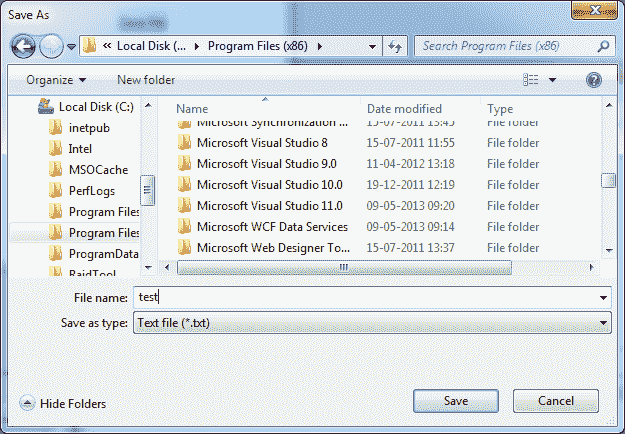

# 保存文件对话框

> 原文：<https://wpf-tutorial.com/dialogs/the-savefiledialog/>

当你想保存一个文件时，保存文件对话框将帮助你选择一个位置和一个文件名。它的工作方式和外观很像我们在上一篇文章中使用的 OpenFileDialog，只是有一些细微的差别。就像 OpenFileDialog 一样，SaveFileDialog 是一个通用 Windows 对话框的包装器，这意味着无论用户是在应用程序中还是在记事本中启动它，他们都会看到大致相同的对话框。

## 简单的 SaveFileDialog 示例

首先，让我们从一个非常简单的使用 SaveFileDialog 的例子开始:

```
<Window x:Class="WpfTutorialSamples.Dialogs.SaveFileDialogSample"

        xmlns:x="http://schemas.microsoft.com/winfx/2006/xaml"
        Title="SaveFileDialogSample" Height="300" Width="300">
    <DockPanel Margin="10">
        <WrapPanel HorizontalAlignment="Center" DockPanel.Dock="Top" Margin="0,0,0,10">
            <Button Name="btnSaveFile" Click="btnSaveFile_Click">Save file</Button>
        </WrapPanel>
        <TextBox Name="txtEditor" TextWrapping="Wrap" AcceptsReturn="True" ScrollViewer.VerticalScrollBarVisibility="Auto" />
    </DockPanel>
</Window>
```

```
using System;
using System.IO;
using System.Windows;
using Microsoft.Win32;

namespace WpfTutorialSamples.Dialogs
{
	public partial class SaveFileDialogSample : Window
	{
		public SaveFileDialogSample()
		{
			InitializeComponent();
		}

		private void btnSaveFile_Click(object sender, RoutedEventArgs e)
		{
			SaveFileDialog saveFileDialog = new SaveFileDialog();
			if(saveFileDialog.ShowDialog() == true)
				File.WriteAllText(saveFileDialog.FileName, txtEditor.Text);
		}
	}
}
```

") <input type="hidden" name="IL_IN_ARTICLE">

如你所见，它主要是实例化 **SaveFileDialog** ，然后调用 **ShowDialog()** 方法。如果它 返回 true，我们使用**文件名**属性(将包含选择的路径以及用户输入的文件名)作为路径 写入我们的内容。

如果您单击“保存”按钮，根据您使用的 Windows 版本，您应该会看到如下对话框:

")

## 过滤器

正如你在第一个例子中看到的，我手工添加了一个. txt 扩展名到我想要的文件名，主要是因为“保存类型”组合框是空的。就像 OpenFileDialog 一样，这个框是通过 **Filter** 属性控制的，它的使用方式也完全相同。

```
saveFileDialog.Filter = "Text file (*.txt)|*.txt|C# file (*.cs)|*.cs";
```

***关于 Filter 属性格式的更多细节，请参见之前关于 OpenFileDialog 的文章，在那里有详细的解释。* T3】**

使用类似上面的过滤器，结果 SaveFileDialog 将看起来像这样:



有了这些，你就可以在不指定扩展名的情况下编写文件名了——它将从过滤器组合框中选择的文件类型中获取。这也向用户表明了你的应用程序支持哪种文件格式，这当然很重要。

## 设置初始目录

SaveFileDialog 使用的初始目录由 Windows 决定，但是通过使用 **InitialDirectory** 属性，您可以覆盖它。 你通常会把这个值设置到一个用户指定的目录，应用程序目录或者仅仅是上次使用的目录。您可以将其设置为字符串格式的 路径，如下所示:

```
saveFileDialog.InitialDirectory = @"c:\temp\";
```

如果您想使用 Windows 上的某个特殊文件夹，如桌面、我的文档或程序文件目录，您必须特别小心，因为这些文件夹可能因 Windows 的不同版本而异，并且还取决于登录的用户。的。NET framework 可以帮助您，只需使用 Environment 类及其成员来处理特殊文件夹:

```
saveFileDialog.InitialDirectory = Environment.GetFolderPath(Environment.SpecialFolder.MyDocuments);
```

在本例中，我得到了 My Documents 文件夹的路径，但是看一下 SpecialFolder 枚举——它包含许多有趣路径的值。完整列表请见这篇 [MSDN 文章](http://msdn.microsoft.com/en-us/library/system.environment.specialfolder.aspx)。

## 选择

除了本文中已经提到的选项之外，我想提醒您注意以下属性，它们将帮助您根据需要定制 SaveFileDialog:

**AddExtension** -默认为 true，并确定如果用户省略扩展名，SaveFileDialog 是否应该自动在文件名后添加扩展名。扩展 将基于选择的过滤器，除非那是不可能的，在这种情况下，它将退回到**默认文本**属性(如果指定)。如果你希望你的应用程序能够保存没有文件扩展名的文件，你可能需要禁用这个选项。

**OverwritePrompt** -默认为 true，确定如果用户输入的文件名会导致现有文件 被覆盖，SaveFileDialog 是否需要确认。除非在非常特殊的情况下，否则您通常希望启用此选项。

如果你想在你的对话框上自定义一个标题，你可以覆盖这个属性。它默认为“另存为”或本地化的等效文件，并且该属性对 OpenFileDialog 也是 有效的。

**ValidateNames**

 *** * ***