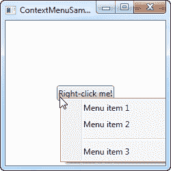
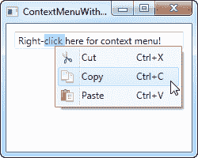
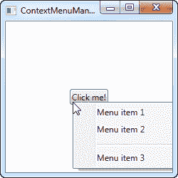

# WPF 上下文菜单

> 原文：<https://wpf-tutorial.com/common-interface-controls/contextmenu/>

上下文菜单通常被称为弹出菜单，是在特定用户动作时显示的菜单，通常是在特定控件或窗口上用鼠标右键单击。上下文菜单通常用于提供与单个控件相关的功能。

WPF 附带了一个上下文菜单控件，因为它几乎总是绑定到一个特定的控件，这也是你通常将它添加到界面的方式。这是通过所有控件都公开的 ContextProperty 完成的(它来自大多数 WPF 控件继承的 FrameworkElement)。考虑下一个例子，看看它是如何做到的:

```
<Window x:Class="WpfTutorialSamples.Common_interface_controls.ContextMenuSample"

        xmlns:x="http://schemas.microsoft.com/winfx/2006/xaml"
        Title="ContextMenuSample" Height="250" Width="250">
    <Grid>
        <Button Content="Right-click me!" VerticalAlignment="Center" HorizontalAlignment="Center">
            <Button.ContextMenu>
                <ContextMenu>
                    <MenuItem Header="Menu item 1" />
                    <MenuItem Header="Menu item 2" />
                    <Separator />
                    <MenuItem Header="Menu item 3" />
                </ContextMenu>
            </Button.ContextMenu>
        </Button>
    </Grid>
</Window>
```



如果您已经阅读了关于常规菜单的章节，您将很快意识到 ContextMenu 的工作方式完全相同，这并不奇怪，因为它们都继承了 MenuBase 类。就像我们在使用常规菜单的例子中看到的，你当然可以添加点击事件到这些项目中，当用户点击它们时进行处理，但是更适合 WPF 的方式是使用命令。

## 带有命令和图标的上下文菜单

<input type="hidden" name="IL_IN_ARTICLE">

在下一个示例中，我将向您展示使用上下文菜单时的两个关键概念:WPF 命令的用法，这将为我们提供许多功能，包括单击事件处理程序、文本和快捷文本，只需将某些内容分配给命令属性即可。我还将向你展示如何在你的上下文菜单项中使用图标。看一看:

```
<Window x:Class="WpfTutorialSamples.Common_interface_controls.ContextMenuWithCommandsSample"

        xmlns:x="http://schemas.microsoft.com/winfx/2006/xaml"
        Title="ContextMenuWithCommandsSample" Height="200" Width="250">
    <StackPanel Margin="10">
        <TextBox Text="Right-click here for context menu!">
            <TextBox.ContextMenu>
                <ContextMenu>
                    <MenuItem Command="Cut">
                        <MenuItem.Icon>
                            <Image Source="/WpfTutorialSamples;componeimg/cut.png" />
                        </MenuItem.Icon>
                    </MenuItem>
                    <MenuItem Command="Copy">
                        <MenuItem.Icon>
                            <Image Source="/WpfTutorialSamples;componeimg/copy.png" />
                        </MenuItem.Icon>
                    </MenuItem>
                    <MenuItem Command="Paste">
                        <MenuItem.Icon>
                            <Image Source="/WpfTutorialSamples;componeimg/paste.png" />
                        </MenuItem.Icon>
                    </MenuItem>
                </ContextMenu>
            </TextBox.ContextMenu>
        </TextBox>
    </StackPanel>
</Window>
```



试着运行这个例子，自己看看通过给项目分配命令，我们可以免费获得多少功能。还要注意在 ContextMenu 的菜单项上使用图标是多么简单。

## 从代码隐藏中调用上下文菜单

到目前为止，右键单击它所属的控件时会调用 ContextMenu。当我们将它分配给 **ContextMenu** 属性时，WPF 会自动为我们做这件事。然而，在某些情况下，您可能非常希望从代码中手动调用它。这和 一样简单，所以让我们重复使用第一个例子来演示它:

```
<Window x:Class="WpfTutorialSamples.Common_interface_controls.ContextMenuManuallyInvokedSample"

        xmlns:x="http://schemas.microsoft.com/winfx/2006/xaml"
        Title="ContextMenuManuallyInvokedSample" Height="250" Width="250">
    <Window.Resources>
        <ContextMenu x:Key="cmButton">
            <MenuItem Header="Menu item 1" />
            <MenuItem Header="Menu item 2" />
            <Separator />
            <MenuItem Header="Menu item 3" />
        </ContextMenu>
    </Window.Resources>
    <Grid>
        <Button Content="Click me!" VerticalAlignment="Center" HorizontalAlignment="Center" Click="Button_Click" />
    </Grid>
</Window>
```

```
using System;
using System.Windows;
using System.Windows.Controls;

namespace WpfTutorialSamples.Common_interface_controls
{
	public partial class ContextMenuManuallyInvokedSample : Window
	{
		public ContextMenuManuallyInvokedSample()
		{
			InitializeComponent();
		}

		private void Button_Click(object sender, RoutedEventArgs e)
		{
			ContextMenu cm = this.FindResource("cmButton") as ContextMenu;
			cm.PlacementTarget = sender as Button;
			cm.IsOpen = true;
		}
	}
}
```



您应该注意到的第一件事是，我已经将上下文菜单从按钮上移开了。相反，我把它添加为窗口的一个资源，使它在窗口的任何地方都可用。这也让我们在需要展示的时候更容易找到。

该按钮现在有一个 Click 事件处理程序，我用代码隐藏来处理它。从那里，我只需在窗口资源中找到 ContextMenu 实例，然后我做两件事:我设置它的 PlacementTarget 属性，该属性告诉 WPF 它应该基于哪个元素计算位置，然后我将 IsOpen 设置为 true，以打开菜单。这就是你所需要的！

* * *