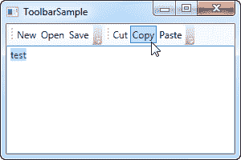
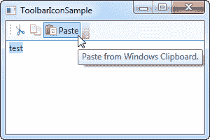
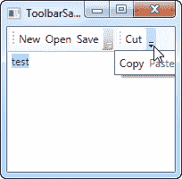
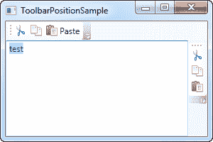
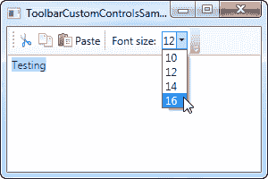

# WPF 工具栏控件

> 原文：<https://wpf-tutorial.com/common-interface-controls/toolbar-control/>

工具栏是一排命令，通常位于标准 Windows 应用程序主菜单的正下方。这实际上可能是一个简单的面板，上面有按钮，但是通过使用 WPF 工具栏控件，你可以得到一些额外的好处，比如自动溢出处理和最终用户重新定位工具栏的可能性。

WPF 工具栏通常放置在 ToolBarTray 控件内部。ToolBarTray 将处理诸如位置和大小之类的事情，并且在 ToolBarTray 元素中可以有多个工具栏控件。让我们尝试一个非常基本的例子，看看它看起来像什么:

```
<Window x:Class="WpfTutorialSamples.Common_interface_controls.ToolbarSample"

        xmlns:x="http://schemas.microsoft.com/winfx/2006/xaml"
        Title="ToolbarSample" Height="200" Width="300">
    <Window.CommandBindings>
        <CommandBinding Command="New" CanExecute="CommonCommandBinding_CanExecute" />
        <CommandBinding Command="Open" CanExecute="CommonCommandBinding_CanExecute" />
        <CommandBinding Command="Save" CanExecute="CommonCommandBinding_CanExecute" />
    </Window.CommandBindings>
    <DockPanel>
        <ToolBarTray DockPanel.Dock="Top">
            <ToolBar>
                <Button Command="New" Content="New" />
                <Button Command="Open" Content="Open" />
                <Button Command="Save" Content="Save" />
            </ToolBar>
            <ToolBar>
                <Button Command="Cut" Content="Cut" />
                <Button Command="Copy" Content="Copy" />
                <Button Command="Paste" Content="Paste" />
            </ToolBar>
        </ToolBarTray>
        <TextBox AcceptsReturn="True" />
    </DockPanel>
</Window>
```

```
using System;
using System.Windows;
using System.Windows.Input;

namespace WpfTutorialSamples.Common_interface_controls
{
	public partial class ToolbarSample : Window
	{
		public ToolbarSample()
		{
			InitializeComponent();
		}

		private void CommonCommandBinding_CanExecute(object sender, CanExecuteRoutedEventArgs e)
		{
			e.CanExecute = true;
		}
	}
}
```



请注意我是如何使用所有按钮的命令的。我们在前一章已经讨论过了，使用命令肯定会给我们带来一些好处。有关更多信息，请查看菜单章节或关于命令的文章。

<input type="hidden" name="IL_IN_ARTICLE">

在这个例子中，我在屏幕的顶部添加了一个 ToolBarTray，在它的内部有两个工具栏控件。每一个都包含一些按钮，我们用命令来赋予它们行为。在代码隐藏中，我确保处理前三个按钮的 CanExecute 事件，因为这不是由 WPF 自动完成的，与剪切、复制和粘贴命令相反，WPF 能够完全为我们处理这些命令。

尝试运行该示例，并将光标放在其中一个工具栏的左侧部分(虚线区域)。如果您点击并按住鼠标左键，您现在可以重新定位工具栏，例如，在另一个工具栏的下方，或者甚至让它们交换位置。

## 形象

虽然工具栏按钮上的文本完全没问题，但通常的方法是使用图标，或者至少是图标和文本的组合。因为 WPF 使用常规的按钮控件，所以给工具栏项目添加图标非常容易。请看下一个例子，我们两个都做了:

```
<Window x:Class="WpfTutorialSamples.Common_interface_controls.ToolbarIconSample"

        xmlns:x="http://schemas.microsoft.com/winfx/2006/xaml"
        Title="ToolbarIconSample" Height="200" Width="300">
    <DockPanel>
        <ToolBarTray DockPanel.Dock="Top">
            <ToolBar>
                <Button Command="Cut" ToolTip="Cut selection to Windows Clipboard.">
                    <Image Source="/WpfTutorialSamples;componeimg/cut.png" />
                </Button>
                <Button Command="Copy" ToolTip="Copy selection to Windows Clipboard.">
                    <Image Source="/WpfTutorialSamples;componeimg/copy.png" />
                </Button>
                <Button Command="Paste" ToolTip="Paste from Windows Clipboard.">
                    <StackPanel Orientation="Horizontal">
                        <Image Source="/WpfTutorialSamples;componeimg/paste.png" />
                        <TextBlock Margin="3,0,0,0">Paste</TextBlock>
                    </StackPanel>
                </Button>
            </ToolBar>
        </ToolBarTray>
        <TextBox AcceptsReturn="True" />
    </DockPanel>
</Window>
```



通过指定一个**图像**控件作为前两个按钮的内容，它们将基于图标而不是基于文本。在第三个 按钮上，我将一个**图像**控件和一个**文本块**控件组合在一个 **StackPanel** 中，以实现按钮上的图标 和文本，这是一种常用于特别重要或图标不太明显的按钮的技术。

注意我是如何在每个按钮上使用 **ToolTip** 属性来添加解释文本的。这对于那些只有一个图标的 按钮来说尤其重要，因为只看图标可能看不清按钮的用途。通过 ToolTip 属性，用户可以 将鼠标悬停在按钮上来获得它的功能描述，如屏幕截图所示。

## 泛滥

正如已经提到的，使用工具栏控件而不仅仅是一个按钮面板的一个很好的理由是自动溢出处理。这意味着，如果没有足够的空间来显示工具栏上的所有按钮，WPF 将把它们放在一个菜单中，通过点击工具栏右边的箭头可以访问它们。您可以在这个屏幕截图中看到它是如何工作的，它显示了第一个示例，但是窗口更小，因此留给工具栏的空间更少:



WPF 甚至允许你决定哪些项目适合溢出隐藏，哪些应该总是可见的。通常，在设计工具栏时，有些项目没有其他项目重要，有些项目你甚至想一直放在溢出菜单中，不管空间是否足够。

这就是附加属性**工具栏的地方。溢出模式**开始发挥作用。默认值是按需，这仅仅意味着如果没有足够的空间，工具栏 项将被放入溢出菜单。你可以使用 **Always** 或者 **Never** 来代替，这样做 正如名字所暗示的:将项目一直放在溢出菜单中或者阻止项目被移动到溢出菜单中。下面是一个关于如何分配该属性的 示例:

```
<ToolBar>
    <Button Command="Cut" Content="Cut" ToolBar.OverflowMode="Always" />
    <Button Command="Copy" Content="Copy" ToolBar.OverflowMode="AsNeeded" />
    <Button Command="Paste" Content="Paste" ToolBar.OverflowMode="Never" />
</ToolBar>
```

## 位置

虽然工具栏最常见的位置是在屏幕的顶部，但是工具栏也可以出现在应用程序窗口的底部，甚至是侧面。WPF 工具栏当然支持所有这些，虽然底部放置的工具栏只是停靠在面板的底部而不是顶部，但是垂直工具栏需要使用工具栏托盘的 **Orientation** 属性。请允许我用一个例子来演示 :

```
<Window x:Class="WpfTutorialSamples.Common_interface_controls.ToolbarPositionSample"

        xmlns:x="http://schemas.microsoft.com/winfx/2006/xaml"
        Title="ToolbarPositionSample" Height="200" Width="300">
	<DockPanel>
		<ToolBarTray DockPanel.Dock="Top">
			<ToolBar>
				<Button Command="Cut" ToolTip="Cut selection to Windows Clipboard.">
					<Image Source="/WpfTutorialSamples;componeimg/cut.png" />
				</Button>
				<Button Command="Copy" ToolTip="Copy selection to Windows Clipboard.">
					<Image Source="/WpfTutorialSamples;componeimg/copy.png" />
				</Button>
				<Button Command="Paste" ToolTip="Paste from Windows Clipboard.">
					<StackPanel Orientation="Horizontal">
						<Image Source="/WpfTutorialSamples;componeimg/paste.png" />
						<TextBlock Margin="3,0,0,0">Paste</TextBlock>
					</StackPanel>
				</Button>
			</ToolBar>
		</ToolBarTray>
		<ToolBarTray DockPanel.Dock="Right" Orientation="Vertical">
			<ToolBar>
				<Button Command="Cut" ToolTip="Cut selection to Windows Clipboard.">
					<Image Source="/WpfTutorialSamples;componeimg/cut.png" />
				</Button>
				<Button Command="Copy" ToolTip="Copy selection to Windows Clipboard.">
					<Image Source="/WpfTutorialSamples;componeimg/copy.png" />
				</Button>
				<Button Command="Paste" ToolTip="Paste from Windows Clipboard.">
					<Image Source="/WpfTutorialSamples;componeimg/paste.png" />
				</Button>
			</ToolBar>
		</ToolBarTray>
		<TextBox AcceptsReturn="True" />
	</DockPanel>
</Window>
```



这里的诀窍在于 **DockPanel 的组合。Dock** 属性，将 ToolBarTray 放在应用程序的右边，以及 **Orientation** 属性，将方向从水平改为垂直。这使得工具栏几乎可以放置在你能想到的任何地方 。

## 工具栏上的自定义控件

正如你在前面的例子中看到的，我们在工具栏上使用常规的 WPF 按钮控件。这也意味着你可以在工具栏上放置几乎任何其他的 WPF 控件，而不需要额外的努力。当然，有些控件在工具栏上比其他控件工作得更好，但是像 ComboBox 和 TextBox 这样的控件通常用在旧版本的 Microsoft Office 的工具栏上，你可以在你自己的 WPF 工具栏上做同样的事情。

本例中引入的另一个元素是 Separator 元素，它只是在两组工具栏项之间创建一个分隔符。从例子中可以看出，它非常容易使用！

```
<Window x:Class="WpfTutorialSamples.Common_interface_controls.ToolbarCustomControlsSample"

        xmlns:x="http://schemas.microsoft.com/winfx/2006/xaml"
        Title="ToolbarCustomControlsSample" Height="200" Width="300">
	<DockPanel>
		<ToolBarTray DockPanel.Dock="Top">
			<ToolBar>
				<Button Command="Cut" ToolTip="Cut selection to Windows Clipboard.">
					<Image Source="/WpfTutorialSamples;componeimg/cut.png" />
				</Button>
				<Button Command="Copy" ToolTip="Copy selection to Windows Clipboard.">
					<Image Source="/WpfTutorialSamples;componeimg/copy.png" />
				</Button>
				<Button Command="Paste" ToolTip="Paste from Windows Clipboard.">
					<StackPanel Orientation="Horizontal">
						<Image Source="/WpfTutorialSamples;componeimg/paste.png" />
						<TextBlock Margin="3,0,0,0">Paste</TextBlock>
					</StackPanel>
				</Button>
				<Separator />
				<Label>Font size:</Label>
				<ComboBox>
					<ComboBoxItem>10</ComboBoxItem>
					<ComboBoxItem IsSelected="True">12</ComboBoxItem>
					<ComboBoxItem>14</ComboBoxItem>
					<ComboBoxItem>16</ComboBoxItem>
				</ComboBox>
			</ToolBar>
		</ToolBarTray>
		<TextBox AcceptsReturn="True" />
	</DockPanel>
</Window>
```



## 摘要

通过灵活的工具栏控件，在 WPF 创建带有工具栏的界面非常容易。你可以做以前需要第三方工具栏控制的事情，甚至不需要太多额外的努力。

* * *