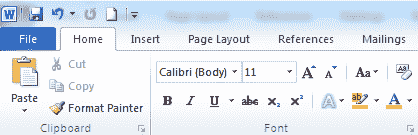

# 功能区（`Ribbon`）控件

> 原文：<https://wpf-tutorial.com/common-interface-controls/ribbon-control/>

Ribbon 界面是微软发明的，最早在 Office 2007 中使用。它将原来的菜单和工具栏合并到一个控件中，并将各种功能分组到选项卡和组中。最重要的目的是让用户更容易发现所有的功能，而不是隐藏在长长的菜单中。功能区还允许对功能进行优先排序，能够使用不同大小的按钮。

WPF 没有内置的 Ribbon 控件，但微软发布了一个可以免费下载和使用的控件，只要你承诺在使用它时遵循他们的实现指南。你可以在 [MSDN](http://msdn.microsoft.com/en-us/library/ff799534.aspx) 了解更多信息，在那里你还可以找到一个[的下载链接](http://go.microsoft.com/fwlink/?LinkId=196621)用于功能区控制。

## 摘要

您可以下载并使用 Microsoft 创建的 Ribbon 控件，但它还不是。默认情况下是. NET framework。一旦它成为框架的一个集成部分，我们将在本教程中深入研究它。与此同时，如果你正在寻找一个更完整的 Ribbon 实现，你可能会想看看一些第三方的替代品-有很多这样的替代品，来自一些大的 WPF 控制供应商。

* * *