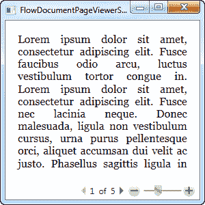
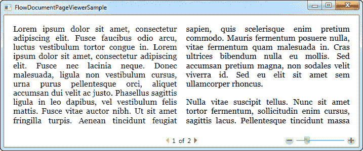
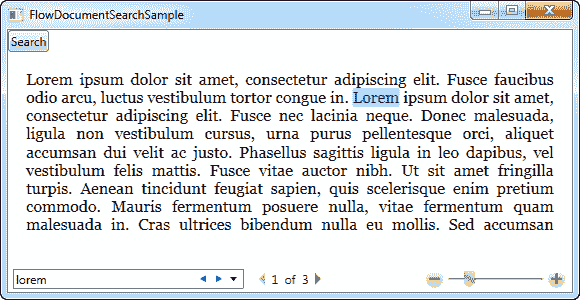

# FlowDocumentPageViewer 控件

> 原文：<https://wpf-tutorial.com/rich-text-controls/flowdocumentpageviewer-control/>

在上一篇文章中，我们讨论了 FlowDocumentScrollViewer，以及一些更通用的与 FlowDocument 相关的技术。在本文中，我们将重点关注 **FlowDocumentPageViewer** ，当文本长度超过可用空间时， 不仅仅提供滚动文本，而是将整个文档分成页面。这允许你从一页导航到另一页，给你一种更像书的阅读体验。

我们将从一个简单的示例开始，在这里我们可以看到 FlowDocumentPageViewer 控件如何处理我们的 Lorem Ipsum 测试文本:

```
<Window x:Class="WpfTutorialSamples.Rich_text_controls.FlowDocumentPageViewerSample"

        xmlns:x="http://schemas.microsoft.com/winfx/2006/xaml"
        Title="FlowDocumentPageViewerSample" Height="300" Width="300">
    <Grid>
        <FlowDocumentPageViewer>
            <FlowDocument>
                <Paragraph>Lorem ipsum dolor sit amet, consectetur adipiscing elit. Fusce faucibus odio arcu, luctus vestibulum tortor congue in. Lorem ipsum dolor sit amet, consectetur adipiscing elit. Fusce nec lacinia neque. Donec malesuada, ligula non vestibulum cursus, urna purus pellentesque orci, aliquet accumsan dui velit ac justo. Phasellus sagittis ligula in leo dapibus, vel vestibulum felis mattis. Fusce vitae auctor nibh. Ut sit amet fringilla turpis. Aenean tincidunt feugiat sapien, quis scelerisque enim pretium commodo. Mauris fermentum posuere nulla, vitae fermentum quam malesuada in. Cras ultrices bibendum nulla eu mollis. Sed accumsan pretium magna, non sodales velit viverra id. Sed eu elit sit amet sem ullamcorper rhoncus.</Paragraph>
                <Paragraph>Nulla vitae suscipit tellus. Nunc sit amet tortor fermentum, sollicitudin enim cursus, sagittis lacus. Pellentesque tincidunt massa nisl, nec tempor nulla consequat a. Proin pharetra neque vel dolor congue, at condimentum arcu varius. Sed vel luctus enim. Curabitur eleifend dui et arcu faucibus, sit amet vulputate libero suscipit. Vestibulum ultrices nisi id metus ultrices, eu ultricies ligula rutrum. Phasellus rhoncus aliquam pretium. Quisque in nunc erat. Etiam mollis turpis cursus, sagittis felis vel, dignissim risus. Ut at est nec tellus lobortis venenatis. Fusce elit mi, gravida sed tortor at, faucibus interdum felis. Phasellus porttitor dolor in nunc pellentesque, eu hendrerit nulla porta. Vestibulum cursus placerat elit. Nullam malesuada dictum venenatis. Interdum et malesuada fames ac ante ipsum primis in faucibus.</Paragraph>
            </FlowDocument>
        </FlowDocumentPageViewer>
    </Grid>
</Window>
```



请注意长文本是如何被截断的，在底部，您可以在页面之间导航。不过，这并不是 FlowDocumentPageViewer 将为您做的全部工作——看看当我们将窗口变宽时会发生什么:

 <input type="hidden" name="IL_IN_ARTICLE">

FlowDocumentPageViewer 现在将文本分成几列，以防止行变得太长，而不是无限地拉伸文本。除了好看之外，这也增加了可读性，因为很长的文本更难阅读。页数当然会自动调整，将页数从 5 页减少到 2 页。

FlowDocument 类有一系列属性，允许您控制如何以及何时使用它们。使用它们很简单，但是完整的例子超出了本教程的范围。相反，看看这篇 MSDN 的文章，在一个很好的例子中使用了几个属性:[如何:使用 FlowDocument 列分隔属性](http://msdn.microsoft.com/en-us/library/ms752350.aspx)。

## 搜索

正如您将在下一章中看到的，FlowDocumentReader 包装器支持开箱即用的搜索，在工具栏中有搜索控件和一切。然而，本教程中将要讨论的所有三个只读 FlowDocument 包装器实际上都支持搜索，只是必须手动调用前两个包装器(FlowDocumentScrollViewer 和 FlowDocumentPageViewer)。

所有三个查看器都支持启动搜索的 **Ctrl+F** 键盘快捷键，但是如果你也想通过按钮 访问这个快捷键，你只需要调用 Find()方法。这里有一个例子:

```
<Window x:Class="WpfTutorialSamples.Rich_text_controls.FlowDocumentSearchSample"

        xmlns:x="http://schemas.microsoft.com/winfx/2006/xaml"
        Title="FlowDocumentSearchSample" Height="300" Width="580">
    <DockPanel>
        <WrapPanel DockPanel.Dock="Top">
            <Button Name="btnSearch" Click="btnSearch_Click">Search</Button>
        </WrapPanel>
        <FlowDocumentPageViewer Name="fdViewer">
            <FlowDocument>
                <Paragraph>Lorem ipsum dolor sit amet, consectetur adipiscing elit. Fusce faucibus odio arcu, luctus vestibulum tortor congue in. Lorem ipsum dolor sit amet, consectetur adipiscing elit. Fusce nec lacinia neque. Donec malesuada, ligula non vestibulum cursus, urna purus pellentesque orci, aliquet accumsan dui velit ac justo. Phasellus sagittis ligula in leo dapibus, vel vestibulum felis mattis. Fusce vitae auctor nibh. Ut sit amet fringilla turpis. Aenean tincidunt feugiat sapien, quis scelerisque enim pretium commodo. Mauris fermentum posuere nulla, vitae fermentum quam malesuada in. Cras ultrices bibendum nulla eu mollis. Sed accumsan pretium magna, non sodales velit viverra id. Sed eu elit sit amet sem ullamcorper rhoncus.</Paragraph>
                <Paragraph>Nulla vitae suscipit tellus. Nunc sit amet tortor fermentum, sollicitudin enim cursus, sagittis lacus. Pellentesque tincidunt massa nisl, nec tempor nulla consequat a. Proin pharetra neque vel dolor congue, at condimentum arcu varius. Sed vel luctus enim. Curabitur eleifend dui et arcu faucibus, sit amet vulputate libero suscipit. Vestibulum ultrices nisi id metus ultrices, eu ultricies ligula rutrum. Phasellus rhoncus aliquam pretium. Quisque in nunc erat. Etiam mollis turpis cursus, sagittis felis vel, dignissim risus. Ut at est nec tellus lobortis venenatis. Fusce elit mi, gravida sed tortor at, faucibus interdum felis. Phasellus porttitor dolor in nunc pellentesque, eu hendrerit nulla porta. Vestibulum cursus placerat elit. Nullam malesuada dictum venenatis. Interdum et malesuada fames ac ante ipsum primis in faucibus.</Paragraph>
            </FlowDocument>
        </FlowDocumentPageViewer>
    </DockPanel>
</Window>
```

```
using System;
using System.Windows;

namespace WpfTutorialSamples.Rich_text_controls
{
	public partial class FlowDocumentSearchSample : Window
	{
		public FlowDocumentSearchSample()
		{
			InitializeComponent();
		}

		private void btnSearch_Click(object sender, RoutedEventArgs e)
		{
			fdViewer.Find();
		}
	}
}
```



只需按下我们专用的**搜索**按钮或键盘快捷键(Ctrl+F ),您就可以在 流程文档页面查看器中使用搜索功能。如上所述，这适用于 FlowDocumentScrollViewer 和 FlowDocumentPageViewer(默认情况下，FlowDocumentPageReader 有一个搜索按钮 ，**，但要确保搜索框在工具栏**上有足够的水平空间——否则当你调用 Find()命令时，你将看不到它！

* * *