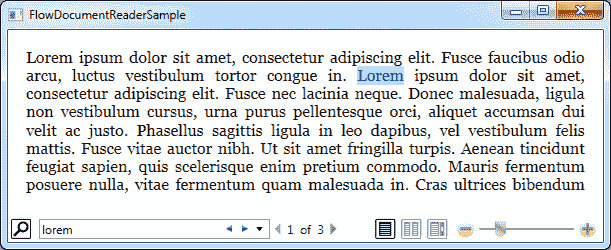
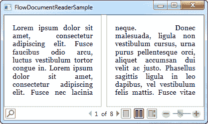

# FlowDocumentReader 控件

> 原文：<https://wpf-tutorial.com/rich-text-controls/flowdocumentreader-control/>

**FlowDocumentReader** 绝对是您可以放在 FlowDocument 周围的最高级的只读包装器。它提供的按钮 允许最终用户在 FlowDocumentScrollViewer 和 FlowDocumentPageViewer 提供的渲染模式之间切换，以及开箱即用的 文档搜索，当然还有缩放控件。

所有这些功能也使得 FlowDocumentReader 成为三个只读包装器中最重的一个，但是对于大多数常规大小的文档来说，这应该不是问题。以下是 FlowDocumentReader 的外观示例:



这个截图是在基于页面的视图中拍摄的，这是默认的。您可以使用缩放控制左侧的按钮在视图模式之间切换。在工具栏的左边，你有搜索文档的控件，就像我在屏幕截图上做的那样。

下面的代码将给出上述结果:

```
<Window x:Class="WpfTutorialSamples.Rich_text_controls.FlowDocumentReaderSample"

        xmlns:x="http://schemas.microsoft.com/winfx/2006/xaml"
        Title="FlowDocumentReaderSample" Height="250" Width="550">
    <Grid>
        <FlowDocumentReader>
            <FlowDocument>
                <Paragraph>Lorem ipsum dolor sit amet, consectetur adipiscing elit. Fusce faucibus odio arcu, luctus vestibulum tortor congue in. Lorem ipsum dolor sit amet, consectetur adipiscing elit. Fusce nec lacinia neque. Donec malesuada, ligula non vestibulum cursus, urna purus pellentesque orci, aliquet accumsan dui velit ac justo. Phasellus sagittis ligula in leo dapibus, vel vestibulum felis mattis. Fusce vitae auctor nibh. Ut sit amet fringilla turpis. Aenean tincidunt feugiat sapien, quis scelerisque enim pretium commodo. Mauris fermentum posuere nulla, vitae fermentum quam malesuada in. Cras ultrices bibendum nulla eu mollis. Sed accumsan pretium magna, non sodales velit viverra id. Sed eu elit sit amet sem ullamcorper rhoncus.</Paragraph>
                <Paragraph>Nulla vitae suscipit tellus. Nunc sit amet tortor fermentum, sollicitudin enim cursus, sagittis lacus. Pellentesque tincidunt massa nisl, nec tempor nulla consequat a. Proin pharetra neque vel dolor congue, at condimentum arcu varius. Sed vel luctus enim. Curabitur eleifend dui et arcu faucibus, sit amet vulputate libero suscipit. Vestibulum ultrices nisi id metus ultrices, eu ultricies ligula rutrum. Phasellus rhoncus aliquam pretium. Quisque in nunc erat. Etiam mollis turpis cursus, sagittis felis vel, dignissim risus. Ut at est nec tellus lobortis venenatis. Fusce elit mi, gravida sed tortor at, faucibus interdum felis. Phasellus porttitor dolor in nunc pellentesque, eu hendrerit nulla porta. Vestibulum cursus placerat elit. Nullam malesuada dictum venenatis. Interdum et malesuada fames ac ante ipsum primis in faucibus.</Paragraph>
            </FlowDocument>
        </FlowDocumentReader>
    </Grid>
</Window>
```

<input type="hidden" name="IL_IN_ARTICLE">

这个标记将产生一个窗口，如上面的截图所示。这里有一个截图，我们进入了两页模式，并稍微缩小了缩放比例:



FlowDocumentReader 有一系列属性可以帮助您控制它的工作方式。以下是一些最重要的不完整列表:

**查看模式** -控制初始查看模式。默认是**页面**，但是如果你想要另一个默认视图，你可以把它改成**滚动**或者**两页** 。除非明确禁用，否则用户仍可更改。

**is indenabled** -让你能够在文档中禁用搜索。如果禁用，搜索按钮将从工具栏中删除。

**istwopagevievabled** ，**ispagevievabled**和**IsScrollViewEnabled**——允许您关闭阅读器的特定查看模式。当设置为 false 时，该模式对阅读器不再可用，按钮从工具栏中移除。

**缩放** -允许您设置默认缩放级别。标准值为 100%，但您可以使用 Zoom 属性更改此值。

## 摘要

我们现在已经完成了对只读 FlowDocument 包装器的所有选择，正如您可能看到的，选择哪一个实际上取决于手头的任务。

如果你只是想要简单的带有滚动条的 FlowDocument 渲染，你应该选择 FlowDocumentScrollViewer——它很简单，是三者中占用空间和资源最少的。如果您想要分页视图，请使用 FlowDocumentPageViewer，除非您希望您的用户能够在各种模式之间切换并能够快速搜索，在这种情况下，您应该使用 FlowDocumentReader。

* * *