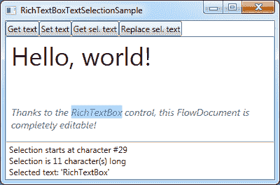

# `RichTextBox`控件

> 原文：<https://wpf-tutorial.com/rich-text-controls/richtextbox-control/>

到目前为止，我们只看了 FlowDocument 的只读包装，但是 WPF 还包含了一个使 FlowDocument 可编辑的控件:`RichTextBox`控件。

您可以将 RichTextBox 直接添加到窗口中，不包含任何内容——在这种情况下，它将自动创建一个您将要编辑的 FlowDocument 实例。或者，可以用 RichTextBox 包装 FlowDocument 实例，从而控制初始内容。它可能看起来像这样:

```
<Window x:Class="WpfTutorialSamples.Rich_text_controls.RichTextBoxSample"

        xmlns:x="http://schemas.microsoft.com/winfx/2006/xaml"
        Title="RichTextBoxSample" Height="200" Width="300">
    <Grid>
        <RichTextBox Margin="10">
            <FlowDocument>
                <Paragraph FontSize="36">Hello, world!</Paragraph>
                <Paragraph FontStyle="Italic" TextAlignment="Left" FontSize="14" Foreground="Gray">Thanks to the RichTextBox control, this FlowDocument is completely editable!</Paragraph>
            </FlowDocument>
        </RichTextBox>
    </Grid>
</Window>
```


有了这个例子，您可以直接开始编辑富文本内容。然而，现在内容不再是只读的，如何操作文本以及处理选择内容显然很有趣。我们现在就去调查。

另一个有趣的方面当然是处理各种格式化的可能性——我们将在下一篇文章中研究这一点，我们实际上实现了一个小而全功能的富文本编辑器。

<input type="hidden" name="IL_IN_ARTICLE">

## 使用文本和选择

因为 RichTextBox 在内部使用 FlowDocument，并且因为富文本格式显然比纯文本更复杂，所以处理文本和选择不像 WPF TextBox 控件那样容易。

下一个示例将展示一系列处理 `RichTextBox`控件中的文本和/或选择的功能:

```
<Window x:Class="WpfTutorialSamples.Rich_text_controls.RichTextBoxTextSelectionSample"

        xmlns:x="http://schemas.microsoft.com/winfx/2006/xaml"
        Title="RichTextBoxTextSelectionSample" Height="300" Width="400">
    <DockPanel>
        <WrapPanel DockPanel.Dock="Top">
            <Button Name="btnGetText" Click="btnGetText_Click">Get text</Button>
            <Button Name="btnSetText" Click="btnSetText_Click">Set text</Button>
            <Button Name="btnGetSelectedText" Click="btnGetSelectedText_Click">Get sel. text</Button>
            <Button Name="btnSetSelectedText" Click="btnSetSelectedText_Click">Replace sel. text</Button>
        </WrapPanel>
        <TextBox DockPanel.Dock="Bottom" Name="txtStatus" />
        <RichTextBox Name="rtbEditor" SelectionChanged="rtbEditor_SelectionChanged">
            <FlowDocument>
                <Paragraph FontSize="36">Hello, world!</Paragraph>
                <Paragraph FontStyle="Italic" TextAlignment="Left" FontSize="14" Foreground="Gray">Thanks to the RichTextBox control, this FlowDocument is completely editable!</Paragraph>
            </FlowDocument>
        </RichTextBox>
    </DockPanel>
</Window>
```

```
using System;
using System.Windows;
using System.Windows.Controls;
using System.Windows.Documents;

namespace WpfTutorialSamples.Rich_text_controls
{
	public partial class RichTextBoxTextSelectionSample : Window
	{
		public RichTextBoxTextSelectionSample()
		{
			InitializeComponent();
		}

		private void btnGetText_Click(object sender, RoutedEventArgs e)
		{
			TextRange textRange = new TextRange(rtbEditor.Document.ContentStart, rtbEditor.Document.ContentEnd);
			MessageBox.Show(textRange.Text);
		}

		private void btnSetText_Click(object sender, RoutedEventArgs e)
		{
			TextRange textRange = new TextRange(rtbEditor.Document.ContentStart, rtbEditor.Document.ContentEnd);
			textRange.Text = "Another world, another text!";
		}

		private void btnGetSelectedText_Click(object sender, RoutedEventArgs e)
		{
			MessageBox.Show(rtbEditor.Selection.Text);
		}

		private void btnSetSelectedText_Click(object sender, RoutedEventArgs e)
		{
			rtbEditor.Selection.Text = "[Replaced text]";
		}

		private void rtbEditor_SelectionChanged(object sender, RoutedEventArgs e)
		{
			TextRange tempRange = new TextRange(rtbEditor.Document.ContentStart, rtbEditor.Selection.Start);
			txtStatus.Text = "Selection starts at character #" + tempRange.Text.Length + Environment.NewLine;
			txtStatus.Text += "Selection is " + rtbEditor.Selection.Text.Length + " character(s) long" + Environment.NewLine;
			txtStatus.Text += "Selected text: '" + rtbEditor.Selection.Text + "'";
		}
	}
}
```



如您所见，标签由一个按钮面板、一个 RichTextBox 和底部的一个 TextBox 组成，以显示当前的选择状态。四个可用按钮中的每一个都将通过获取或设置/替换文本来与 RichTextBox 一起工作，向您展示这是如何完成的。

在代码隐藏中，我们处理四个按钮的 click 事件，以及 RichTextBox 的 SelectionChanged 事件，这允许我们显示关于当前选择的统计信息。

请特别注意，我们不是像使用常规 TextBox 那样直接访问 RichTextBox 上的 text 属性，而是使用 TextRange 对象和来自 RichTextBox 的 TextPointer 从控件或控件中的选择获取文本。这就是它与 RichTextBox 的工作方式，正如已经提到的，它在几个方面不像常规的 TextBox 那样工作。

## 段落间距

使用 RichTextBox 时，您可能注意到的另一件事是，当您按 Enter 开始一个新段落时，该段落将在新旧段落之间留下一个空行。请允许我用一个屏幕截图来说明，我输入了三行文本，每一行都用一次 Enter 键隔开:


对于在段落中工作的文本编辑器来说，这是正常的行为，但是根据您使用 RichTextBox 的方式和位置，一次按 Enter 键会导致如此大的行间距，这可能会让您的用户感到困惑。

幸运的是，这很容易解决。额外的空格是因为段落的默认边距大于零，所以修改它就像修改这个属性一样简单，我们可以用一个样式来实现，就像这样:

```
<Window x:Class="WpfTutorialSamples.Rich_text_controls.RichTextBoxParagraphSpacingSample"

        xmlns:x="http://schemas.microsoft.com/winfx/2006/xaml"
        Title="RichTextBoxParagraphSpacingSample" Height="150" Width="300">
    <Grid>
        <RichTextBox Margin="10">
            <RichTextBox.Resources>
                <Style TargetType="{x:Type Paragraph}">
                    <Setter Property="Margin" Value="0" />
                </Style>
            </RichTextBox.Resources>
        </RichTextBox>
    </Grid>
</Window>
```


现在，这些行周围没有额外的空间，如果您愿意，您可以将该样式放在窗口中，甚至放在 App.xaml 中，如果您希望它不仅仅适用于单个 RichTextBox 的话。

## 摘要

RichTextBox 易于使用，具有许多开箱即用的特性，如果您希望创建一个功能全面的富文本编辑器，可以很容易地使用它。在下一篇文章中，我们将看看如何做！这也将使我们了解一些重要的主题，如从 RichTextBox 加载和保存文本，以及如何影响控件中文本的格式。

* * *