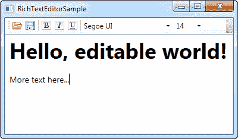
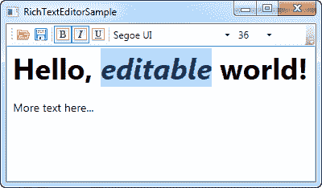

# 如何:创建富文本编辑器

> 原文：<https://wpf-tutorial.com/rich-text-controls/how-to-creating-a-rich-text-editor/>

这是另一篇如何操作的文章，灵感来自于 `RichTextBox`控件是多么酷，它使创建一个小但非常强大的富文本编辑器变得多么容易——想想 Windows 写字板！虽然 WPF 让我们很容易做到这一点，但会比平时多一点 XAML 和 C#代码，但没关系。我们将一次浏览一个有趣的部分，然后在最后，我将向您展示整个代码清单。

在这篇文章中，我们将使用大量的控件和技术，我们已经在教程的其他部分使用，所以解释不会太详细。如果你需要对它的某些部分进行更新，你可以随时回头查看完整详细的描述。

首先，让我们看看我们要做什么。这应该是最终的结果:



## 连接

该界面由一个带有按钮和组合框的工具栏（`ToolBar`）控件组成。有用于加载和保存文档的按钮，用于控制各种字体粗细和样式属性的按钮，还有两个用于控制字体系列和大小的组合框。

<input type="hidden" name="IL_IN_ARTICLE">

工具栏下面是 `RichTextBox`控件，所有的编辑都将在这里完成。

## 命令

您可能注意到的第一件事是 WPF 命令的使用，我们在本文前面已经讨论过了。我们使用 ApplicationCommands 类中的**打开**和**保存**命令来加载和保存文档，我们使用 EditingCommands 类中的 ToggleBold、ToggleItalic 和 ToggleUnderline 命令来创建样式相关的按钮。

使用命令的优势再一次显而易见，因为 `RichTextBox`控件已经实现了 ToggleBold、ToggleItalic 和 ToggleUnderline 命令。这意味着我们不需要写任何代码来让它们工作。只要把它们挂在指定的按钮上，它就能工作了:

```
<ToggleButton Command="EditingCommands.ToggleBold" Name="btnBold">
    <Image Source="/WpfTutorialSamples;componeimg/text_bold.png" Width="16" Height="16" />
</ToggleButton>
```

我们还免费得到键盘快捷键——按 Ctrl+B 激活 ToggleBold，Ctrl+I 激活 ToggleItalic，Ctrl+U 激活 ToggleUnderline。

请注意，我使用的是一个**切换按钮**而不是常规的**按钮**控件。我希望按钮是可检查的，如果 选择当前是粗体的，并且通过 ToggleButton 的 IsChecked 属性支持。不幸的是，WPF 没有办法为我们处理这个部分 ，所以我们需要一些代码来更新各种按钮和组合框的状态。稍后会详细介绍。

“打开”和“保存”命令不能自动处理，所以我们必须像往常一样，对窗口使用 CommandBinding，然后在代码隐藏中使用事件处理程序:

```
<Window.CommandBindings>
    <CommandBinding Command="ApplicationCommands.Open" Executed="Open_Executed" />
    <CommandBinding Command="ApplicationCommands.Save" Executed="Save_Executed" />
</Window.CommandBindings>
```

我将在本文的后面向您展示这个实现。

## 字体系列和大小

为了显示和改变字体系列和大小，我们有几个组合框。它们由系统字体系列以及窗口构造器中可能的大小选项填充，如下所示:

```
public RichTextEditorSample()
{
	InitializeComponent();
	cmbFontFamily.ItemsSource = Fonts.SystemFontFamilies.OrderBy(f => f.Source);
	cmbFontSize.ItemsSource = new List<double>() { 8, 9, 10, 11, 12, 14, 16, 18, 20, 22, 24, 26, 28, 36, 48, 72 };
}
```

再一次，WPF 通过使用 SystemFontFamilies 属性，让我们很容易地得到一个可能的字体列表。由于尺寸列表更多的是一个建议，我们使 组合框（`ComboBox`）控件可编辑，这样用户可以输入自定义尺寸:

```
<ComboBox Name="cmbFontFamily" Width="150" SelectionChanged="cmbFontFamily_SelectionChanged" />
<ComboBox Name="cmbFontSize" Width="50" IsEditable="True" TextBoxBase.TextChanged="cmbFontSize_TextChanged" />
```

这也意味着我们将以不同的方式处理变更。对于字体系列 ComboBox，我们可以只处理 SelectionChanged 事件，同时挂钩到 TextBoxBase。size ComboBox 的 TextChanged 事件，用于处理用户可以选择和手动输入大小的情况。

WPF 为我们处理粗体、斜体和下划线命令的实现，但是对于字体系列和大小，我们必须手动更改这些值。幸运的是，这很容易做到，使用`ApplyPropertyValue()`方法。上面提到的事件处理程序是这样的。

```
private void cmbFontFamily_SelectionChanged(object sender, SelectionChangedEventArgs e)
{
	if(cmbFontFamily.SelectedItem != null)
		rtbEditor.Selection.ApplyPropertyValue(Inline.FontFamilyProperty, cmbFontFamily.SelectedItem);
}

private void cmbFontSize_TextChanged(object sender, TextChangedEventArgs e)
{
	rtbEditor.Selection.ApplyPropertyValue(Inline.FontSizeProperty, cmbFontSize.Text);
}
```

这里没有什么特别的——我们只是将选择/输入的值传递给`ApplyPropertyValue()`方法，以及我们希望更改的属性。

## 更新状态

如前所述，WPF 为我们处理粗体、斜体和下划线命令，但我们必须手动更新它们按钮的状态，因为这不是命令功能的一部分。不过，这没关系，因为我们还必须更新两个组合框，以反映当前的字体系列和大小。

我们希望在光标移动和/或选择改变时更新状态，为此， RichTextBox 的 **SelectionChanged** 事件非常合适。我们是这样处理的:

```
private void rtbEditor_SelectionChanged(object sender, RoutedEventArgs e)
{
	object temp = rtbEditor.Selection.GetPropertyValue(Inline.FontWeightProperty);
	btnBold.IsChecked = (temp != DependencyProperty.UnsetValue) && (temp.Equals(FontWeights.Bold));
	temp = rtbEditor.Selection.GetPropertyValue(Inline.FontStyleProperty);
	btnItalic.IsChecked = (temp != DependencyProperty.UnsetValue) && (temp.Equals(FontStyles.Italic));
	temp = rtbEditor.Selection.GetPropertyValue(Inline.TextDecorationsProperty);
	btnUnderline.IsChecked = (temp != DependencyProperty.UnsetValue) && (temp.Equals(TextDecorations.Underline));

	temp = rtbEditor.Selection.GetPropertyValue(Inline.FontFamilyProperty);
	cmbFontFamily.SelectedItem = temp;
	temp = rtbEditor.Selection.GetPropertyValue(Inline.FontSizeProperty);
	cmbFontSize.Text = temp.ToString();
}
```

相当多的代码行，但是实际的工作只需要几行代码——我们只是重复它们，做一些小的变化来更新三个按钮和两个组合框中的每一个。

原理很简单。对于按钮，我们使用`GetPropertyValue()`方法来获取给定文本属性的当前值，例如 FontWeight，然后我们根据返回值是否与我们正在寻找的值相同来更新 IsChecked 属性。

对于组合框，我们做同样的事情，但不是设置 IsChecked 属性，而是直接用返回值设置 SelectedItem 或 Text 属性。

## 加载和保存文件

当处理打开和保存命令时，我们使用一些非常相似的代码:

```
private void Open_Executed(object sender, ExecutedRoutedEventArgs e)
{
	OpenFileDialog dlg = new OpenFileDialog();
	dlg.Filter = "Rich Text Format (*.rtf)|*.rtf|All files (*.*)|*.*";
	if(dlg.ShowDialog() == true)
	{
		FileStream fileStream = new FileStream(dlg.FileName, FileMode.Open);
		TextRange range = new TextRange(rtbEditor.Document.ContentStart, rtbEditor.Document.ContentEnd);
		range.Load(fileStream, DataFormats.Rtf);
	}
}

private void Save_Executed(object sender, ExecutedRoutedEventArgs e)
{
	SaveFileDialog dlg = new SaveFileDialog();
	dlg.Filter = "Rich Text Format (*.rtf)|*.rtf|All files (*.*)|*.*";
	if(dlg.ShowDialog() == true)
	{
		FileStream fileStream = new FileStream(dlg.FileName, FileMode.Create);
		TextRange range = new TextRange(rtbEditor.Document.ContentStart, rtbEditor.Document.ContentEnd);
		range.Save(fileStream, DataFormats.Rtf);
	}
}
```

OpenFileDialog 或 SaveFileDialog 用于指定位置和文件名，然后通过使用 TextRange 对象(我们直接从 RichTextBox 获得)和 FileStream(提供对物理文件的访问)来加载或保存文本。文件以 RTF 格式加载和保存，但是如果您希望编辑器支持其他格式，例如纯文本，您可以指定其他格式类型之一。

## 完整的例子

下面是整个应用的代码——首先是 XAML，然后是 C#代码——在后面:

```
<Window x:Class="WpfTutorialSamples.Rich_text_controls.RichTextEditorSample"

        xmlns:x="http://schemas.microsoft.com/winfx/2006/xaml"
        Title="RichTextEditorSample" Height="300" Width="400">
    <Window.CommandBindings>
        <CommandBinding Command="ApplicationCommands.Open" Executed="Open_Executed" />
        <CommandBinding Command="ApplicationCommands.Save" Executed="Save_Executed" />
    </Window.CommandBindings>
    <DockPanel>
        <ToolBar DockPanel.Dock="Top">
            <Button Command="ApplicationCommands.Open">
                <Image Source="/WpfTutorialSamples;componeimg/folder.png" Width="16" Height="16" />
            </Button>
            <Button Command="ApplicationCommands.Save">
                <Image Source="/WpfTutorialSamples;componeimg/disk.png" Width="16" Height="16" />
            </Button>
            <Separator />
            <ToggleButton Command="EditingCommands.ToggleBold" Name="btnBold">
                <Image Source="/WpfTutorialSamples;componeimg/text_bold.png" Width="16" Height="16" />
            </ToggleButton>
            <ToggleButton Command="EditingCommands.ToggleItalic" Name="btnItalic">
                <Image Source="/WpfTutorialSamples;componeimg/text_italic.png" Width="16" Height="16" />
            </ToggleButton>
            <ToggleButton Command="EditingCommands.ToggleUnderline" Name="btnUnderline">
                <Image Source="/WpfTutorialSamples;componeimg/text_underline.png" Width="16" Height="16" />
            </ToggleButton>
            <Separator />
            <ComboBox Name="cmbFontFamily" Width="150" SelectionChanged="cmbFontFamily_SelectionChanged" />
            <ComboBox Name="cmbFontSize" Width="50" IsEditable="True" TextBoxBase.TextChanged="cmbFontSize_TextChanged" />
        </ToolBar>
        <RichTextBox Name="rtbEditor" SelectionChanged="rtbEditor_SelectionChanged" />
    </DockPanel>
</Window>
```

```
using System;
using System.Linq;
using System.Collections.Generic;
using System.IO;
using System.Windows;
using System.Windows.Documents;
using System.Windows.Input;
using System.Windows.Media;
using Microsoft.Win32;
using System.Windows.Controls;

namespace WpfTutorialSamples.Rich_text_controls
{
	public partial class RichTextEditorSample : Window
	{
		public RichTextEditorSample()
		{
			InitializeComponent();
			cmbFontFamily.ItemsSource = Fonts.SystemFontFamilies.OrderBy(f => f.Source);
			cmbFontSize.ItemsSource = new List<double>() { 8, 9, 10, 11, 12, 14, 16, 18, 20, 22, 24, 26, 28, 36, 48, 72 };
		}

		private void rtbEditor_SelectionChanged(object sender, RoutedEventArgs e)
		{
			object temp = rtbEditor.Selection.GetPropertyValue(Inline.FontWeightProperty);
			btnBold.IsChecked = (temp != DependencyProperty.UnsetValue) && (temp.Equals(FontWeights.Bold));
			temp = rtbEditor.Selection.GetPropertyValue(Inline.FontStyleProperty);
			btnItalic.IsChecked = (temp != DependencyProperty.UnsetValue) && (temp.Equals(FontStyles.Italic));
			temp = rtbEditor.Selection.GetPropertyValue(Inline.TextDecorationsProperty);
			btnUnderline.IsChecked = (temp != DependencyProperty.UnsetValue) && (temp.Equals(TextDecorations.Underline));

			temp = rtbEditor.Selection.GetPropertyValue(Inline.FontFamilyProperty);
			cmbFontFamily.SelectedItem = temp;
			temp = rtbEditor.Selection.GetPropertyValue(Inline.FontSizeProperty);
			cmbFontSize.Text = temp.ToString();
		}

		private void Open_Executed(object sender, ExecutedRoutedEventArgs e)
		{
			OpenFileDialog dlg = new OpenFileDialog();
			dlg.Filter = "Rich Text Format (*.rtf)|*.rtf|All files (*.*)|*.*";
			if(dlg.ShowDialog() == true)
			{
				FileStream fileStream = new FileStream(dlg.FileName, FileMode.Open);
				TextRange range = new TextRange(rtbEditor.Document.ContentStart, rtbEditor.Document.ContentEnd);
				range.Load(fileStream, DataFormats.Rtf);
			}
		}

		private void Save_Executed(object sender, ExecutedRoutedEventArgs e)
		{
			SaveFileDialog dlg = new SaveFileDialog();
			dlg.Filter = "Rich Text Format (*.rtf)|*.rtf|All files (*.*)|*.*";
			if(dlg.ShowDialog() == true)
			{
				FileStream fileStream = new FileStream(dlg.FileName, FileMode.Create);
				TextRange range = new TextRange(rtbEditor.Document.ContentStart, rtbEditor.Document.ContentEnd);
				range.Save(fileStream, DataFormats.Rtf);
			}
		}

		private void cmbFontFamily_SelectionChanged(object sender, SelectionChangedEventArgs e)
		{
			if(cmbFontFamily.SelectedItem != null)
				rtbEditor.Selection.ApplyPropertyValue(Inline.FontFamilyProperty, cmbFontFamily.SelectedItem);
		}

		private void cmbFontSize_TextChanged(object sender, TextChangedEventArgs e)
		{
			rtbEditor.Selection.ApplyPropertyValue(Inline.FontSizeProperty, cmbFontSize.Text);
		}
	}
}
```

这是另一个截图，我们选择了一些文本。请注意工具栏（`ToolBar`）控件如何反映当前选择的状态:



## 摘要

正如您所看到的，在 WPF 实现一个富文本编辑器非常简单，尤其是因为有了出色的 `RichTextBox`控件。如果你愿意，你可以很容易地用文本对齐、颜色、列表甚至表格来扩展这个例子。

请注意，虽然上面的例子应该工作得很好，但绝对没有异常处理或检查，以保持代码量最少。有几个地方很容易抛出异常，比如字体大小组合框，在那里输入一个非数字值就可能导致异常。当然，如果您希望在工作中扩展这个示例，您应该检查所有这些并处理可能的异常。

* * *