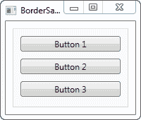
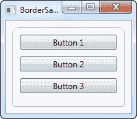
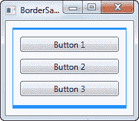
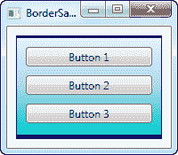

# 边界（`Border`）控件

> 原文：<https://wpf-tutorial.com/misc-controls/the-border-control/>

Border 控件是一个装饰控件，可以用来在另一个元素周围绘制边框和/或背景。由于 WPF 面板不支持在其边缘绘制边框，边框控件可以帮助您实现这一点，只需用边框控件包围面板即可。

如上所述使用边框的简单示例如下所示:

```
<Window x:Class="WpfTutorialSamples.Misc_controls.BorderSample"

        xmlns:x="http://schemas.microsoft.com/winfx/2006/xaml"
        Title="BorderSample" Height="170" Width="200">
    <Grid Margin="10">
		<Border Background="GhostWhite" BorderBrush="Gainsboro" BorderThickness="1">
			<StackPanel Margin="10">
				<Button>Button 1</Button>
				<Button Margin="0,10">Button 2</Button>
				<Button>Button 3</Button>
			</StackPanel>
		</Border>
	</Grid>
</Window>
```



在你定义背景或者边框笔刷和粗细之前，边框是完全看不见的，所以这就是我在这里所做的，使用**背景**、**边框笔刷**和**边框厚度**属性。

## 圆角边框

<input type="hidden" name="IL_IN_ARTICLE">

我非常欣赏 Border 的一个特点是它很容易转弯。请看这个稍加修改的例子，这里的角现在是圆形的:

```
<Window x:Class="WpfTutorialSamples.Misc_controls.BorderSample"

        xmlns:x="http://schemas.microsoft.com/winfx/2006/xaml"
        Title="BorderSample" Height="175" Width="200">
    <Grid Margin="10">
		<Border Background="GhostWhite" BorderBrush="Silver" BorderThickness="1" CornerRadius="8,8,3,3">
			<StackPanel Margin="10">
				<Button>Button 1</Button>
				<Button Margin="0,10">Button 2</Button>
				<Button>Button 3</Button>
			</StackPanel>
		</Border>
	</Grid>
</Window>
```



我所做的只是添加了 **CornerRadius** 属性。它可以用一个值来指定，这个值将用于所有的四个角，或者像我在这里的例子中所做的 ,我为右上和左上指定单独的值，然后是右下和左下。

## 边框颜色/粗细

上面的边界非常不连续，但是可以通过调整颜色和/或厚度来轻松改变。因为 BorderThickness 属性属于**粗细**类型，所以您甚至可以单独操作每个边框宽度，或者通过为左右边框和 上下边框各给一个值来操作。

```
<Window x:Class="WpfTutorialSamples.Misc_controls.BorderSample"

        xmlns:x="http://schemas.microsoft.com/winfx/2006/xaml"
        Title="BorderSample" Height="175" Width="200">
    <Grid Margin="10">
		<Border Background="GhostWhite" BorderBrush="DodgerBlue" BorderThickness="1,3,1,5">
			<StackPanel Margin="10">
				<Button>Button 1</Button>
				<Button Margin="0,10">Button 2</Button>
				<Button>Button 3</Button>
			</StackPanel>
		</Border>
	</Grid>
</Window>
```



## 边框背景

背景属性是 Brush 类型的，它提供了很多很酷的可能性。正如在最初的例子中所看到的，只使用简单的颜色作为背景是非常容易的，但是你实际上也可以使用渐变，而且这并不难做到:

```
<Window x:Class="WpfTutorialSamples.Misc_controls.BorderSample"

        xmlns:x="http://schemas.microsoft.com/winfx/2006/xaml"
        Title="BorderSample" Height="175" Width="200">
    <Grid Margin="10">
		<Border BorderBrush="Navy" BorderThickness="1,3,1,5">
			<Border.Background>
				<LinearGradientBrush StartPoint="0.5,0" EndPoint="0.5,1">
					<GradientStop Color="LightCyan" Offset="0.0" />
					<GradientStop Color="LightBlue" Offset="0.5" />
					<GradientStop Color="DarkTurquoise" Offset="1.0" />
				</LinearGradientBrush>
			</Border.Background>
			<StackPanel Margin="10">
				<Button>Button 1</Button>
				<Button Margin="0,10">Button 2</Button>
				<Button>Button 3</Button>
			</StackPanel>
		</Border>
	</Grid>
</Window>
```



在这种情况下，我指定了一个 **LinearGradientBrush** 用于边框的背景，然后是一个更合适的边框颜色。 LinearGradientBrush 可能没有最显而易见的语法，所以我将在后面的章节中解释，包括其他类型的笔刷，但是现在，你可以 试试我的例子，改变值来看看结果。

* * *